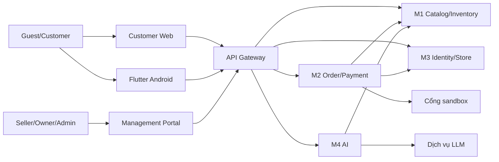

# Kiến trúc hệ thống 2.1 Draft

**Khung 2.2:** [phân công 4 service](implementation/service-ownership.md), [ADR](implementation/scaffold-decisions.md). Runtime hiện gateway định tuyến; service kiểm JWT/quyền và rate limit. M1–M4 độc lập DB; luồng nghiệp vụ trong sơ đồ là đích cần member hoàn thiện.

Tài liệu này giải thích **vì sao** các thành phần tách ra và dữ liệu đi qua chúng thế nào. Hành vi người dùng ở [SRS](srs.md) và [Use Case](use-cases.md); chi tiết lệnh/event ở [integration contract](integration-contract.md).

Web Customer, Flutter Android và Management Portal truy cập API Gateway. Gateway xác thực token, định tuyến và giới hạn tần suất; từng service vẫn tự kiểm tra quyền và ownership. Cổng thanh toán sandbox và LLM API là hệ thống ngoài. PostgreSQL là hạ tầng dùng chung nhưng M1–M4 có database/schema sở hữu độc lập, không query trực tiếp bảng của nhau.

| Service | Sở hữu dữ liệu | API chính | Giao tiếp đi/đến |
| --- | --- | --- | --- |
| M1 Catalog & Inventory | Category, ProductType, Product, Variant, Review, Inventory, Reservation, StockMovement | Catalog, Seller Product, kho, review; command reserve/consume/release | M3 Store status; M2 eligibility review; phát ProductChanged/InventoryChanged đến M4 |
| M2 Order & Payment | Cart, Order/OrderItem, Payment từng Order, Voucher, Refund, COD, IdempotencyRecord có TTL, report giao dịch | Cart, quote, tạo nhóm Order, Payment theo Order, callback, voucher, report | M1 quote/kho; M3 identity/Store; phát OrderCompleted và interaction đến M4 |
| M3 Identity & Store | User, CustomerProfile, Address, Role/Permission, StoreApplication, StoreMembership, Store | Auth, hồ sơ, địa chỉ, mở/duyệt Store, staff, RBAC | Phát UserLocked/StoreStatusChanged/MembershipChanged; cung cấp quyền hiệu lực |
| M4 AI | ChatSession/Message, hành vi, preference, ProductEmbedding, training/model/evaluation | Chat, recommendation, tracking, admin AI monitor | Nhận dữ liệu M1/M2/M3 qua event; kiểm tra Product hiện hành qua M1 trước khi trả card |

## Luồng quan trọng

M2 thực hiện quote rồi cấp purchase_group_id/Order ID dự kiến, M1 reserve nguyên tập Variant. M2 tạo tất cả Order, Payment riêng Order, snapshot, voucher redemption, idempotency result và outbox trong một transaction. Không có bảng CheckoutSession hoặc distributed transaction. Order sandbox bắt đầu AWAITING_PAYMENT, COD PREPARING rồi PENDING sau consume tồn. Payment Success nhưng consume lỗi chỉ đưa Order tương ứng vào RECOVERING; command ID và worker retry, không thu thêm. COD không yêu cầu gateway trước tạo Order.

M2 tính giá từ M1 quote (giá Variant, trạng thái Product/Store), fee snapshot từ M3 và voucher tại M2. M2 không chấp nhận giá hay store_id do client tự khai. Quote có hạn ngắn và được tính lại khi tạo Order. Mỗi Payment.payable_vnd bằng Order.payable_vnd; không còn PaymentAllocation. Báo cáo Store lấy Order/Payment/Refund của đúng Store.

M4 nhận event đổi Product, giá, trạng thái và Store để cập nhật index; event có thể trễ nên khi trả Product card/chat phải đối chiếu khả năng hiển thị và giá hiện hành với M1. Product ẩn hoặc Store bị khóa bị loại ngay cả khi embedding cũ còn. Chat không gửi secret hay thông tin cá nhân không cần thiết đến LLM.

## Vận hành và failure mode

Mỗi service có health/readiness, DB riêng, migration, outbox và inbox. Event có `event_id`, version, xảy ra lúc nào, entity ID/version, correlation ID. Consumer xử lý at-least-once và deduplicate. Worker retry có backoff; lỗi quá 5 lần vào hàng đối soát/cảnh báo, không mất trạng thái. Contract chi tiết ở [integration-contract.md](integration-contract.md). Kịch bản triển khai và biến môi trường ở [deployment.md](deployment.md).

Các entity và khóa logic trong [từ điển dữ liệu](data-dictionary.md), giao diện REST ở [api-spec.md](api-spec.md), sequence ở [diagrams/sequence](diagrams/sequence/).

## Context và container

Gateway định tuyến, xác thực token và giới hạn tần suất; **service đích** vẫn tự kiểm tra ownership, membership và version. Client chỉ gọi contract công khai, không truy cập DB hoặc event bus. M1–M4 dùng schema/database sở hữu riêng trên PostgreSQL; liên kết `user_id`, `store_id`, `product_id`, `order_id` xuyên miền là tham chiếu logic. Có thể dùng một PostgreSQL instance cho demo, nhưng không cho service query bảng của nhau.

| Quyết định tách miền | Lý do và hệ quả |
| --- | --- |
| M1 sở hữu Product/Variant/Review/Inventory | Giá và khả năng bán lấy từ một nguồn; M2 giữ snapshot, M4 chỉ lưu index suy ra. |
| M2 sở hữu giỏ, Order, Payment, voucher | Transaction tạo nguyên tập Order chỉ nằm trong M2; reserve ở M1 và callback gateway phải xử lý bù/đối soát. |
| M3 sở hữu User/Store/RBAC | Không tin role cũ trong JWT; các request nhạy cảm cần quyền hiện hành. |
| M4 sở hữu chat/hành vi/model | AI lỗi hoặc index chậm không được chặn mua hàng; Product card xác minh lại với M1. |

## Dòng dữ liệu chính và ranh giới nhất quán

1. Customer xem Product từ M1 và giỏ từ M2. Quote là phép tính tạm có TTL; M2 lấy giá/tồn M1 và tình trạng Store/quyền M3, áp voucher của M2 rồi trả tổng từng Store.
2. Khi xác nhận, M2 cấp `purchase_group_id` và Order ID dự kiến, M1 reserve đủ toàn bộ SKU. Sau đó M2 transaction tạo một Order/Payment mỗi Store, OrderItem snapshot, voucher redemption, idempotency result và outbox. Transaction lỗi thì release các reservation/lượt giữ theo operation ID; không để lộ Order một phần.
3. COD consume sau tạo; Order chỉ sẵn sàng Seller xử lý khi PENDING. Sandbox giữ hàng trong hạn riêng Order, Customer tạo PaymentAttempt khi muốn trả. Callback hợp lệ làm consume; nếu lỗi tạm Order RECOVERING và worker retry. Hết hạn phải đối soát Attempt trước release; Success muộn sau EXPIRED tạo Refund riêng.
4. Product/Store/Order event đi vào M4 bất đồng bộ. Event trễ hoặc thiếu không đổi dữ liệu nguồn. M4 kiểm tra Product còn công khai và giá hiện hành với M1 trước khi hiển thị card.

Không có distributed transaction giữa M1/M2/gateway. Các bất biến kiểm chứng được: `quantity >= reserved_quantity >= 0`, mỗi `(purchase_group_id, store_id)` tối đa một Order, `Payment.payable_vnd = Order.payable_vnd`, một Payment sandbox tối đa một Attempt Success. Xem [Business Rules](business-rules.md) và [state diagrams](diagrams/state/README.md).

## Triển khai và quan sát

Mỗi service có API process, worker cần thiết, migration riêng, outbox/inbox và health/readiness. Demo cần gateway, PostgreSQL, event transport, mock mailbox, mock payment và LLM/index theo cấu hình. Secret chỉ nằm trong biến môi trường/secret store; log mang correlation ID, không chứa token/password/PII không cần thiết. Alert/đối soát ưu tiên `RECOVERING`, `PREPARING` quá hạn, Refund FAILED, callback chưa xử lý, outbox tồn và AI index chậm. [Deployment](deployment.md) ghi thứ tự chạy, seed và checklist; [Security/Privacy](security-privacy.md) ghi giới hạn dữ liệu.
