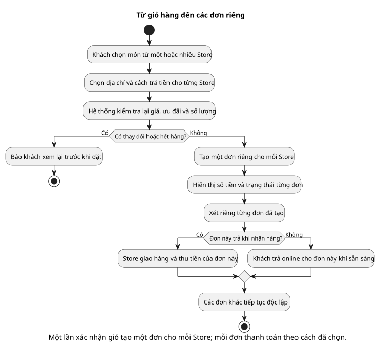

# Activity 01 — Xác nhận giỏ và thanh toán riêng từng Order

[Sơ đồ dễ đọc](01-checkout.puml) · [Bản kỹ thuật](../technical/activity/01-checkout.puml) · [Mục lục activity](README.md) · [Sequence tạo Order](../sequence/01-sandbox-checkout.md)

## Hiểu nhanh

Khách chọn hàng của một hoặc nhiều Store, địa chỉ và cách trả tiền cho từng Store. Hệ thống kiểm tra lại giá, voucher và còn hàng. **Nếu có gì thay đổi, khách xem lại giá; chưa có đơn nào.** Nếu mọi thứ hợp lệ, hệ thống tạo một đơn cho mỗi Store cùng lúc. Đơn COD đi tiếp để Store giao và thu tiền; đơn sandbox chờ khách trả online riêng. Một đơn xong trước không bắt đơn kia phải xong theo.

Bạn có thể đọc hình bằng ba câu hỏi: **giá còn đúng không? giữ đủ hàng không? mỗi đơn sẽ trả bằng cách nào?** Sau khi tạo các đơn, sơ đồ xét cách thanh toán **của từng đơn**; khách không phải dùng cả hai cách trả tiền.

## Đối chiếu khi triển khai

Reserve, transaction và các trạng thái kỹ thuật nằm ở [bản activity kỹ thuật](../technical/activity/01-checkout.puml). Phần dưới đối chiếu với bản đó.

**Câu hỏi sơ đồ trả lời:** từ lúc Customer chọn item nhiều Store đến lúc các Order sẵn sàng xử lý, hệ thống phải quyết định những gì? “Checkout” ở đây là **hoạt động**, không phải bảng dữ liệu.

| Giai đoạn | Ý nghĩa | Nếu không đạt |
| --- | --- | --- |
| Chọn item, địa chỉ, phương thức | Customer có thể chọn SANDBOX/COD **theo từng Store** nhưng dùng một địa chỉ cho lần xác nhận. | Thiếu item/địa chỉ/phương thức: không tiếp tục. |
| Tính lại quote | M2 lấy giá Variant, trạng thái Store, tồn, voucher và phí hiện hành; tổng hiển thị chỉ là tổng tham khảo. | Giá/điều kiện đổi: trả quote mới để Customer xác nhận, chưa tạo Order. |
| Reserve nguyên tập | Cấp trước `purchase_group_id`/Order ID; M1 giữ SKU mọi Store và M2 giữ lượt voucher. | Một SKU không đủ: release mọi phần đã giữ, không có Order một phần. |
| Tạo Order/Payment | M2 ghi một Order và Payment riêng cho mỗi Store trong **một transaction**; chốt snapshot và voucher, chỉ xóa CartItem đã mua. | Transaction lỗi: release reservation/lượt voucher; retry qua Idempotency-Key. |
| Sau tạo | COD consume tồn rồi PENDING; sandbox AWAITING_PAYMENT đến khi Customer trả riêng Order đó. | COD consume lỗi giữ PREPARING; sandbox Payment Success nhưng consume lỗi vào RECOVERING; hết hạn đối soát rồi release/hoàn nếu Success muộn. |

Ở bản dễ đọc, nhánh COD hoặc online là lựa chọn cho **một Order đang xét**. Các Order khác tiếp tục độc lập: A có thể PENDING trong khi B vẫn AWAITING_PAYMENT. Bản kỹ thuật mô tả rõ hơn ranh giới transaction trong M2.

Đối chiếu [BR-01/17/18/21/22/23/41](../../business-rules.md), [TC-CHK-01/02/05 và TC-COD-02](../../test-plan.md), [state Order](../state/01-order-payment.puml).
