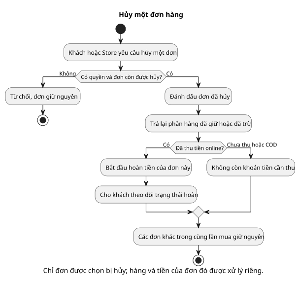

# Activity 02 — Hủy một Order

[Sơ đồ dễ đọc](02-cancel-order.puml) · [Bản kỹ thuật](../technical/activity/02-cancel-order.puml) · [Mục lục activity](README.md) · [Sequence hủy/hoàn](../sequence/04-cancel-refund.md)

## Hiểu nhanh

Khi có yêu cầu hủy một đơn, hệ thống trước hết hỏi: **người này có được hủy và đơn còn ở giai đoạn cho phép không?** Nếu không, đơn giữ nguyên và người dùng nhận lý do từ chối. Nếu có, đơn chuyển sang “Đã hủy”. Sau đó hệ thống trả lại phần hàng đã giữ hoặc đã trừ, rồi xử lý tiền: đơn trả online rồi thì hoàn tiền; đơn chưa trả/COD thì bỏ nghĩa vụ thu. Các đơn khác trong cùng lần mua không đổi.

Hai hình thoi phía sau “Đã hủy” trả lời hai câu hỏi rất đời thường: **hàng đã bị trừ khỏi kho chưa?** và **tiền đã thu chưa?** “Đã hủy đơn” không đồng nghĩa “đã hoàn tiền xong”.

## Đối chiếu khi triển khai

Version, operation ID và trạng thái Refund nằm ở [bản activity kỹ thuật](../technical/activity/02-cancel-order.puml). Phần dưới đối chiếu với bản đó.

**Câu hỏi sơ đồ trả lời:** khi Customer hoặc Seller/Owner yêu cầu hủy Order A, hệ thống phải kiểm gì và xử lý kho/tiền thế nào? Order B cùng `purchase_group_id` luôn giữ nguyên.

| Điểm quyết định | Nhánh và tác động |
| --- | --- |
| Có quyền và trạng thái còn hủy được? | Customer chỉ hủy Order của mình; Seller/Owner chỉ đúng Store và có lý do. Cho phép AWAITING_PAYMENT/PENDING/CONFIRMED với `expected_version` hiện hành. Sai quyền/trạng thái/version trả 403/404/409, không đổi dữ liệu. |
| Tồn đã consume chưa? | **Chưa:** release reservation của riêng A. **Đã:** M1 restock Order A bằng `order_id` và `operation_id` chống cộng kho lặp. |
| Sandbox đã thu tiền chưa? | **Đã thu:** M2 tạo Refund bằng `Order.payable_vnd` snapshot và worker hoàn mock; Order CANCELLED không đồng nghĩa Refund đã SUCCEEDED. **Chưa thu hoặc COD:** hủy Payment/nghĩa vụ COD, không tạo Refund. |

Trước các nhánh kho/tiền, M2 chuyển A sang CANCELLED và ghi `OrderStatusHistory`. Phần xử lý ngoài M2 có thể cần retry, nên release/restock và Refund đều dùng mã thao tác chống lặp. Từ PROCESSING trở đi MVP không hỗ trợ hủy; một Order khác trong cùng lần xác nhận không bị tính lại voucher, phí hay payable.

Xem [BR-24/25/26/39](../../business-rules.md), [TC-ORD-01/02/03](../../test-plan.md), [ERD Order](../erd/06-order-shipping.md) và [ERD Payment](../erd/07-payment-voucher.md).
