# ERD 00 — Tổng quan marketplace

[Xem mã sơ đồ](00-overview.mmd) · [Mục lục ERD](README.md) · [Từ điển dữ liệu](../../data-dictionary.md)

Sơ đồ này trả lời câu hỏi: **ai mở Store, Store bán gì, Customer mua thế nào và tiền được ghi ở đâu?** Nó chỉ giữ các entity nghiệp vụ chính, không đưa token, audit, reservation hoặc bảng kỹ thuật lên hình.

## Ý nghĩa từng entity

| Entity | Là gì | Dùng để làm gì |
| --- | --- | --- |
| `User` | Tài khoản của một người. | Xác định người mua, người mở Store và người dùng AI. |
| `StoreApplication` | Đơn xin mở Store. | Cho Admin duyệt/từ chối trước khi tạo Store. |
| `Store` | Gian hàng trên marketplace. | Gắn sản phẩm, nhân viên và các Order do Store xử lý. |
| `StoreMembership` | Tư cách Owner/Seller của User tại Store. | Giới hạn quyền quản trị vào đúng Store. |
| `Product` | Mặt hàng được giới thiệu/bán. | Chứa thông tin hiển thị và trạng thái bán/kiểm duyệt. |
| `ProductVariant` | Một lựa chọn bán cụ thể, có SKU và giá. | Là đơn vị Customer thêm vào giỏ và kiểm tra tồn. |
| `Inventory` | Tồn của một Variant. | Tính số còn bán được và bảo vệ khi nhiều người mua cùng lúc. |
| `Cart` | Giỏ của một Customer. | Gom các item dự định mua trước khi xác nhận. |
| `CartItem` | Một Variant và số lượng trong giỏ. | Chọn đúng item cần tạo Order; không là lịch sử mua. |
| `Order` | Đơn hàng của đúng một Store. | Lưu giao dịch mua và trạng thái xử lý lâu dài. |
| `OrderItem` | Dòng hàng đã mua trong Order. | Giữ snapshot SKU, thuộc tính, giá và số lượng lúc đặt. |
| `Payment` | Nghĩa vụ tiền của một Order. | Theo dõi phương thức, số phải trả, đã thu và hoàn. |
| `Refund` | Yêu cầu/tiến trình hoàn tiền đã trả. | Theo dõi tiền hoàn độc lập với trạng thái hủy Order. |
| `CODCollection` | Khoản tiền cần thu khi giao Order COD. | Ghi số đã thu riêng cho từng Order. |
| `Voucher` | Mã và điều kiện ưu đãi. | Định nghĩa giảm giá Store hoặc toàn sàn. |
| `VoucherRedemption` | Lượt dùng voucher đã chốt. | Lưu phần giảm thực tế trên từng Order. |
| `Review` | Đánh giá của Customer đã mua. | Hiển thị điểm/nội dung hợp lệ của Product. |
| `ChatSession` | Một phiên hội thoại. | Gom các câu hỏi và câu trả lời của chatbot. |
| `RecommendationInteraction` | Sự kiện xem/thêm giỏ/mua. | Làm tín hiệu cho gợi ý cá nhân hóa khi được phép. |

## Đọc quan hệ chính

| Cụm | Cách đọc |
| --- | --- |
| Tài khoản và Store | Một `User` có thể gửi nhiều `StoreApplication`; đơn được duyệt có thể tạo một `Store`. `StoreMembership` nối User với Store và xác định Owner/Seller. |
| Catalog | Một Store bán nhiều `Product`; mỗi Product có một hoặc nhiều `ProductVariant` (SKU). Mỗi Variant bán được có bản ghi `Inventory`. |
| Mua hàng | User sở hữu giỏ `Cart`; giỏ có nhiều `CartItem`. Khi xác nhận item của nhiều Store, M2 tạo **một `Order` cho mỗi Store**. Mỗi Order có ít nhất một `OrderItem`. |
| Tiền | Mỗi Order có đúng một `Payment` riêng. Order sandbox có thể được trả sau khi tạo; Order COD có khoản `CODCollection` của chính nó. Payment trả trước có thể có `Refund` khi hủy/hết hạn. |
| Nội dung và AI | `Review` gắn với Product và giao dịch mua hợp lệ; User có thể có `ChatSession` và `RecommendationInteraction`. |

**Ví dụ:** Customer chọn áo của Store A và giày của Store B. Lần xác nhận tạo Order A và Order B, cùng `purchase_group_id` nhưng có Payment, trạng thái và thời điểm trả tiền riêng. `purchase_group_id` là UUID trên Order, **không có bảng Purchase/Checkout**. Tổng hiển thị trên màn hình chỉ là tổng của hai Order, không phải một Payment chung.

Nét chấm cho các cạnh như `Store → Product`, `User → Order` và `User → ChatSession` vì dữ liệu nằm ở service khác nhau. Nét liền như `Order → Payment` là quan hệ trong M2. Không suy ra FK xuyên database từ cạnh nét chấm. Đọc [Order](06-order-shipping.md) và [Payment](07-payment-voucher.md) để thấy chi tiết mà hình tổng quan đã lược.
