# ERD 02 — Store và thành viên (M3)

[Xem mã sơ đồ](02-store-membership.mmd) · [Mục lục ERD](README.md) · [Từ điển dữ liệu](../../data-dictionary.md)

Sơ đồ theo dõi vòng đời từ **đơn xin mở Store** đến Store đang hoạt động và người vận hành nó. Các bảng ở đây cùng M3; `User` và `Permission` thuộc [ERD 01](01-identity-access.md), nên các cạnh tới chúng được giải thích trong từ điển thay vì lặp entity lên hình.

## Ý nghĩa từng entity

| Entity | Là gì | Dùng để làm gì |
| --- | --- | --- |
| `StoreApplication` | Hồ sơ Customer gửi để xin mở Store. | Lưu thông tin đề nghị, trạng thái duyệt, Admin xử lý và lý do từ chối. |
| `Store` | Gian hàng đã được duyệt. | Lưu tên, trạng thái, liên hệ và phí giao cố định; là phạm vi quản trị/bán hàng. |
| `StoreMembership` | Quan hệ User–Store với vai trò Owner/Seller. | Xác định ai đang được vận hành Store; khóa Seller bằng trạng thái membership. |
| `StaffInvitation` | Lời mời một người tham gia Store. | Cho đăng ký/xác minh email rồi chấp nhận; theo dõi hạn và thu hồi. |
| `MembershipPermission` | Quyền cụ thể trên một membership. | Cho Owner cấp/thu hồi quyền Seller trong giới hạn, không cấp Admin/Owner. |

## Đọc quan hệ và luồng

| Quan hệ | Cách hiểu |
| --- | --- |
| `StoreApplication → Store` (1 → 0..1) | Đơn bị từ chối không tạo Store; đơn được duyệt tạo tối đa một Store. `application_id` lưu nguồn gốc của Store. |
| `Store → StoreMembership` (1 → 0..n) | Membership nối Store với User, mang `role` Owner/Seller và `status`. Khi Store được duyệt phải có đúng một Owner active. |
| `Store → StaffInvitation` (1 → 0..n) | Owner có thể gửi nhiều lời mời Seller; lời mời có hạn và trạng thái PENDING/ACCEPTED/REVOKED/EXPIRED. |
| `StoreMembership → MembershipPermission` (1 → 0..n) | Quyền nhân viên được cấp theo membership; `permission_id` trỏ bảng Permission của M3. Owner chỉ cấp tập quyền Seller cho Store mình. |

**Ví dụ:** Customer gửi StoreApplication. Admin duyệt thì M3 tạo Store và Owner membership trong cùng giao dịch. Owner gửi lời mời; người nhận đăng ký/xác minh email nếu cần rồi chấp nhận, khi đó mới có Seller membership. Lời mời hết hạn hoặc đã thu hồi không tạo membership.

MVP giới hạn **mỗi User tối đa một StoreMembership active** và **mỗi Store đúng một Owner active**. Khóa membership Seller làm mất quyền vận hành Store nhưng không khóa User mua hàng. `version` trên đơn mở Store, Store, membership, lời mời và quyền giúp từ chối cập nhật dựa trên bản cũ. Không có `ended_at` vì MVP chưa hỗ trợ rời Store/chuyển Owner; [RBAC](../../rbac.md) là nguồn quyền thao tác.
