# ERD 03 — Catalog và đánh giá (M1)

[Xem mã sơ đồ](03-catalog-review.mmd) · [Mục lục ERD](README.md) · [Từ điển dữ liệu](../../data-dictionary.md)

M1 lưu cách phân loại sản phẩm, dữ liệu bán và đánh giá. `Category` phân loại nhiều `ProductType`; mỗi ProductType có bộ `AttributeDefinition` và nhiều `Product`. Các thuộc tính định nghĩa kiểu dữ liệu, bắt buộc/tùy chọn và có tạo biến thể hay không.

## Ý nghĩa từng entity

| Entity | Là gì | Dùng để làm gì |
| --- | --- | --- |
| `Category` | Danh mục sản phẩm, có thể có danh mục cha. | Cho duyệt/lọc và tổ chức ProductType. |
| `ProductType` | Kiểu sản phẩm thuộc Category. | Xác định bộ thuộc tính nào áp dụng cho Product. |
| `AttributeDefinition` | Định nghĩa một thuộc tính động. | Kiểm tra kiểu, tập giá trị, bắt buộc và việc thuộc tính có tạo Variant. |
| `Product` | Trang thông tin một mặt hàng của Store. | Lưu tên/mô tả/trạng thái bán và kiểm duyệt; liên kết các Variant. |
| `ProductVariant` | SKU bán được, gồm giá và lựa chọn thuộc tính. | Là đơn vị thêm vào giỏ, giữ tồn và chụp giá trong OrderItem. |
| `ProductImage` | Ảnh chung Product hoặc ảnh riêng Variant. | Hiển thị đúng ảnh và thứ tự trên Web/Mobile. |
| `Review` | Điểm 1–5 và nội dung do Customer đã mua ghi. | Hiển thị phản hồi và tính điểm tổng hợp khi còn VISIBLE. |
| `ReviewAudit` | Lịch sử sửa/ẩn/hiện Review. | Truy nguyên thao tác kiểm duyệt và lý do, không làm mất lịch sử. |
| `M1Audit` | Nhật ký kiểm duyệt Product và thay đổi nhạy cảm. | Lưu lý do ẩn/hiện Product, actor, request ID và bản trước/sau. |

## Đọc quan hệ và luồng

| Entity/quan hệ | Cách đọc |
| --- | --- |
| `Product → ProductVariant` (1 → 0..n trong hình) | Variant là SKU thực sự có giá và tồn. **Quy tắc bán hàng** yêu cầu Product đang bán có ít nhất một Variant, kể cả SKU mặc định. Product nháp có thể chưa có. |
| `Product → ProductImage`, `ProductVariant → ProductImage` | Ảnh luôn thuộc Product; `variant_id` có thể rỗng khi là ảnh chung hoặc trỏ Variant khi là ảnh riêng. |
| `Product → Review` (1 → 0..n) | Review gắn Product để hiển thị. `order_item_id` tham chiếu logic sang M2; M1 phải xác minh Customer sở hữu OrderItem thuộc Order Completed trước khi ghi. |
| `Review → ReviewAudit` (1 → 0..n) | Lưu lịch sử sửa/ẩn/hiện lại đánh giá; chỉ Review VISIBLE góp vào điểm tổng hợp. |
| `M1Audit` | Ghi kiểm duyệt Product, lý do ẩn/hiện, actor và bản trước/sau. Bảng audit đa đối tượng nên không vẽ cạnh FK đến Product. |

**Ví dụ:** loại “Áo” có thuộc tính màu và kích cỡ tạo biến thể. Product có SKU đỏ/M và đỏ/L, mỗi SKU lấy giá từ `ProductVariant.price_vnd` và tồn từ [ERD 04](04-inventory.md). Nếu áo không có lựa chọn màu/size, vẫn tạo một Variant mặc định để bán. SKU duy nhất trong Store; tổ hợp thuộc tính Variant duy nhất trong Product.

`Product.store_id` là tham chiếu logic tới Store của M3; không tạo FK xuyên database. Product chỉ hiện công khai khi trạng thái bán, kiểm duyệt và Store đều cho phép. Điểm trung bình/số đánh giá là **dữ liệu suy ra** từ Review VISIBLE, có thể tính khi đọc hoặc cache; Product không có cột rating nguồn. OrderItem lưu snapshot sản phẩm nên sửa/ngừng Product không thay đổi đơn cũ.
