# ERD 04 — Tồn kho và reservation (M1)

[Xem mã sơ đồ](04-inventory.mmd) · [Mục lục ERD](README.md) · [Từ điển dữ liệu](../../data-dictionary.md)

Sơ đồ tách **tồn vật lý** khỏi phần đang giữ cho Order chưa hoàn tất. Mỗi `ProductVariant` bán được có một `Inventory`; Variant nằm ở [ERD 03](03-catalog-review.md), nên cạnh này chỉ hiện ở ERD tổng quan.

## Ý nghĩa từng entity

| Entity | Là gì | Dùng để làm gì |
| --- | --- | --- |
| `Inventory` | Số lượng vật lý và số đang giữ của một Variant. | Tính số còn bán được; `version` bảo vệ cập nhật đồng thời. |
| `InventoryReservation` | Phiếu giữ tồn cho một Order dự kiến. | Theo dõi thời hạn và trạng thái ACTIVE/CONSUMED/RELEASED/EXPIRED. |
| `ReservationItem` | Một dòng SKU và số lượng trong phiếu giữ. | Biết chính xác phần nào phải consume hoặc release. |
| `StockMovement` | Bút toán biến động tồn/đang giữ. | Giải thích vì sao số lượng đổi, nối Order khi hoàn kho và chống lặp bằng operation ID. |

## Đọc quan hệ và luồng

| Entity/quan hệ | Cách đọc |
| --- | --- |
| `Inventory` | `quantity` là tồn vật lý; `reserved_quantity` là phần đã giữ. Số có thể bán = `quantity − reserved_quantity`, luôn không âm. `version` giúp xử lý hai Customer tranh SKU cuối. |
| `InventoryReservation → ReservationItem` (1 → 1..n) | Một reservation theo `order_id` dự kiến chứa ít nhất một dòng SKU cần giữ. Mỗi dòng trỏ `Inventory` tương ứng và ghi số lượng. |
| `Inventory → StockMovement` (1 → 0..n) | Mọi reserve, consume, release, nhập/xuất/điều chỉnh và hoàn kho tạo bút toán có `operation_id` chống lặp. |
| `ReservationItem → StockMovement` (1 → 0..n) | Bút toán do reservation gây ra có thể trỏ dòng giữ; điều chỉnh kho độc lập thì liên kết này có thể rỗng. |

**Ví dụ:** SKU còn 3 chiếc (`quantity=3`, `reserved_quantity=0`). Customer A tạo Order sandbox mua 2 chiếc: giữ tồn làm `reserved_quantity=2`, còn bán được 1. A trả tiền thành công: consume giữ làm `quantity=1`, `reserved_quantity=0`. Nếu A không trả đến hạn, release làm `reserved_quantity=0`, còn nguyên `quantity=3`.

M2 cấp trước `order_id` rồi M1 reserve nguyên tập SKU; `InventoryReservation.order_id` là **tham chiếu logic sang M2**, không phải FK vật lý. Order COD consume sau khi được tạo; lỗi consume giữ Order ở PREPARING để retry. Hủy Order đã consume thì hoàn kho qua StockMovement mang `order_id` và operation ID, bảo đảm retry không cộng kho hai lần. Các chuyển trạng thái chi tiết ở [vòng đời Order và tồn](../../state-transitions.md).
