# ERD 05 — Giỏ hàng và bước xác nhận mua (M2)

[Xem mã sơ đồ](05-cart-checkout.mmd) · [Mục lục ERD](README.md) · [Từ điển dữ liệu](../../data-dictionary.md)

Hình này **không có entity Checkout/Purchase**. “Checkout” chỉ là quy trình: chọn CartItem, xem quote, xác nhận, rồi tạo Order. Lịch sử mua được quản lý bằng [Order](06-order-shipping.md), không bằng một phiên mua lưu lâu dài.

## Ý nghĩa từng entity

| Entity | Là gì | Dùng để làm gì |
| --- | --- | --- |
| `Cart` | Giỏ hiện tại của một Customer. | Gom các item định mua; thay đổi được trước khi xác nhận. |
| `CartItem` | Một Variant và số lượng trong Cart. | Cho chọn một phần giỏ, kể cả item từ nhiều Store, để tạo Order. |
| `IdempotencyRecord` | Bản ghi chống gửi lặp có TTL. | Nhớ key, hash yêu cầu và nhóm Order đã trả để retry không đặt trùng. |

## Đọc quan hệ và luồng

| Entity | Ý nghĩa |
| --- | --- |
| `Cart` | Mỗi Customer có tối đa một giỏ; `customer_user_id` là `User.id` của M3. |
| `CartItem` | Một dòng Variant và số lượng, thuộc đúng một Cart. `variant_id` sang M1, `store_id` sang M3 đều là tham chiếu logic. |
| `IdempotencyRecord` | Bản ghi kỹ thuật theo `(customer_user_id, key)` giữ hash yêu cầu, `purchase_group_id` và kết quả trả về để retry không tạo nhóm Order mới. Có TTL tối thiểu 24 giờ, không phải lịch sử mua. |

**Ví dụ:** giỏ có áo Store A và giày Store B. Customer chọn cả hai, một địa chỉ, SANDBOX cho A và COD cho B. M2 trả quote theo Store và tổng tham khảo; `quote_id` nằm trong cache ngắn hạn, không có bảng quote trong ERD. Khi xác nhận, M2 tính lại giá/tồn/voucher, giữ SKU rồi tạo hai Order trong cùng transaction. Hai Order chia sẻ `purchase_group_id` nhưng thanh toán riêng.

Chỉ xóa CartItem đã mua sau khi tạo Order thành công; những item không chọn vẫn trong giỏ. `OrderItem` **không FK đến CartItem** vì giỏ có thể thay đổi/xóa, còn snapshot Order phải bất biến. Retry cùng key và cùng payload trả lại nhóm Order cũ; cùng key với payload khác trả 409. Nếu không đủ tồn hoặc quote đổi, không tạo Order nào. Xem [quy tắc nghiệp vụ](../../business-rules.md) và [API](../../api-spec.md).
