# ERD 06 — Đơn hàng và giao hàng (M2)

[Xem mã sơ đồ](06-order-shipping.mmd) · [Mục lục ERD](README.md) · [Từ điển dữ liệu](../../data-dictionary.md)

`Order` là **bản ghi lịch sử mua hàng chính**. Khi Customer xác nhận giỏ gồm nhiều Store, M2 tạo một Order cho mỗi Store trong cùng transaction. Chúng cùng `purchase_group_id` để nhóm khi hiển thị; không có bảng Purchase/Checkout cha.

## Ý nghĩa từng entity

| Entity | Là gì | Dùng để làm gì |
| --- | --- | --- |
| `Order` | Đơn hàng của một Customer tại đúng một Store. | Lưu tiền/địa chỉ snapshot, phương thức, trạng thái và nhóm lần mua. |
| `OrderItem` | Một dòng sản phẩm đã đặt. | Giữ SKU, giá, thuộc tính và số lượng đúng thời điểm mua. |
| `OrderStatusHistory` | Nhật ký chuyển trạng thái Order. | Truy nguyên ai xác nhận, xử lý, giao hoặc hủy và lý do của thao tác. |
| `Shipment` | Bản ghi giao hàng mô phỏng. | Theo dõi mã/trạng thái/thời điểm giao cho một Order. |

## Đọc quan hệ và luồng

| Quan hệ | Cách hiểu |
| --- | --- |
| `Order → OrderItem` (1 → 1..n) | Mỗi Order có ít nhất một dòng hàng. OrderItem giữ tên/thuộc tính/SKU/giá tại lúc mua; Product/Variant đổi sau này không sửa lịch sử. |
| `Order → OrderStatusHistory` (1 → 0..n) | Ghi các lần chuyển trạng thái, actor, lý do và `operation_id` để kiểm tra tranh chấp/lặp. |
| `Order → Shipment` (1 → 0..1) | Shipment mô phỏng chỉ xuất hiện khi xử lý giao hàng; MVP chưa tích hợp hãng vận chuyển thật. |

`Order` cũng giữ snapshot địa chỉ và các khoản `goods_vnd`, giảm Store, giảm sàn phân bổ, `shipping_vnd`, `payable_vnd`. Công thức là **payable = tiền hàng − hai khoản giảm + phí giao**. Một Order thuộc đúng một `store_id` và một `customer_user_id`; hai ID này là tham chiếu logic sang M3. Ràng buộc `unique (purchase_group_id, store_id)` ngăn tạo hai Order cho cùng Store trong một lần xác nhận.

**Ví dụ:** Order A sandbox bắt đầu `AWAITING_PAYMENT` và giữ tồn có hạn. Order B COD có thể vào `PREPARING`, rồi `PENDING` sau khi consume tồn. A trả tiền sau B hoặc hết hạn mà không đổi tiền/trạng thái B. Khi Seller xử lý, Order đi `PENDING → CONFIRMED → PROCESSING → SHIPPED → COMPLETED`. Hủy được ở `AWAITING_PAYMENT`, `PENDING`, `CONFIRMED`; từ `PROCESSING` trở đi MVP không hỗ trợ hủy.

`version` bảo vệ Order trước hai thao tác cập nhật cùng lúc. `Payment`, `Refund`, `CODCollection` nằm ở [ERD 07](07-payment-voucher.md) nhưng cùng database M2 và liên kết vật lý với Order. Trạng thái Order **khác** trạng thái Payment/Refund: `CANCELLED` không có nghĩa đã hoàn tiền. Xem [bảng chuyển trạng thái](../../state-transitions.md).
