# ERD 07 — Thanh toán và voucher (M2)

[Xem mã sơ đồ](07-payment-voucher.mmd) · [Mục lục ERD](README.md) · [Từ điển dữ liệu](../../data-dictionary.md)

Mỗi [Order](06-order-shipping.md) có **một `Payment` riêng** với phương thức SANDBOX hoặc COD. `Payment.order_id` là duy nhất và là FK nội bộ M2; không có Payment chung cho `purchase_group_id` và không có `PaymentAllocation`. Sơ đồ này lược entity Order để dễ đọc, nên một số cạnh FK được diễn giải bên dưới.

## Ý nghĩa từng entity

| Entity | Là gì | Dùng để làm gì |
| --- | --- | --- |
| `Payment` | Nghĩa vụ tiền của đúng một Order. | Theo dõi phương thức, phải trả, đã thu, đã hoàn và trạng thái tiền. |
| `PaymentAttempt` | Một lần thử trả qua gateway sandbox. | Cho thử lại an toàn và giới hạn tối đa một lần thành công/Payment. |
| `PaymentEvent` | Callback/sự kiện gateway đã nhận. | Xác minh, lưu dấu và chống xử lý callback trùng. |
| `Refund` | Yêu cầu hoàn tiền đã trả của một Order. | Theo dõi REQUESTED/PROCESSING/SUCCEEDED/FAILED độc lập với Order. |
| `CODCollection` | Nghĩa vụ thu tiền khi giao một Order COD. | Ghi số phải thu, số đã thu và xác nhận thu đủ. |
| `Voucher` | Mã ưu đãi và cấu hình hiệu lực/hạn mức. | Định nghĩa voucher Store hoặc toàn sàn, giảm cố định hoặc %. |
| `VoucherReservation` | Lượt voucher đang giữ trước khi tạo Order. | Ngăn vượt lượt dùng; release nếu tạo nhóm Order thất bại. |
| `VoucherRedemption` | Lượt voucher đã dùng và phần giảm chốt trên Order. | Bảo toàn số tiền lịch sử khi Voucher bị sửa/hết hạn hoặc một Order hủy. |
| `M2Audit` | Nhật ký thao tác nhạy cảm của M2. | Truy nguyên đổi voucher, Payment/Refund và đơn theo actor/request. |

## Đọc quan hệ và luồng

| Nhóm | Quan hệ và ý nghĩa |
| --- | --- |
| Sandbox | `Payment → PaymentAttempt` là 1 → 0..n: Customer có thể thử lại thanh toán một Order, nhưng tối đa một Attempt thành công. `PaymentAttempt → PaymentEvent` lưu callback, chống xử lý trùng qua `provider_event_id`. |
| Hoàn tiền | `Payment → Refund` là 1 → 0..n trên hình; Refund phải có cả `payment_id` và `order_id` trùng với Payment.order_id. Không được hoàn vượt số đã thu. Hủy Order đã trả trước tạo Refund theo `Order.payable_vnd` đã chụp. |
| COD | `CODCollection.order_id` nối đúng một Order COD và ghi số cần thu/đã thu. Thu đủ khi giao mới hoàn tất Payment/Order đó; Order khác không bị ảnh hưởng. |
| Voucher | `Voucher → VoucherReservation` giữ lượt trong lúc tạo nhóm Order; thành công chuyển sang `VoucherRedemption` gắn từng Order. Voucher Store áp một lần/Order, voucher sàn tối đa một mã/nhóm và được phân bổ xuống các Order. |
| Audit | `M2Audit` ghi thay đổi voucher, Payment, Refund và đơn cùng actor, lý do, request ID, trước/sau; tham chiếu target đa loại nên không vẽ FK từ audit đến từng bảng. |

**Ví dụ:** đơn Store A phải trả 95.690 VND bằng sandbox, đơn Store B phải trả 194.310 VND bằng COD. Hai Payment độc lập. Voucher sàn được tính một lần lúc tạo nhóm rồi chụp phần giảm của từng Order; A thanh toán hay hủy không tính lại giá B. Nếu A trả thành công nhưng consume tồn lỗi, chỉ A ở RECOVERING; nếu A bị hủy sau khi đã trả, Refund của A xử lý độc lập với trạng thái Order.

`Payment.payable_vnd` lặp `Order.payable_vnd` có chủ đích để lưu nghĩa vụ tiền của Payment; **Order là nguồn số tiền chốt**, hai giá trị phải bằng nhau tại tạo Order và được đối soát. `VoucherRedemption.discount_vnd` là snapshot phân bổ, không tính lại từ cấu hình Voucher hiện hành. Voucher sàn đếm lượt theo `DISTINCT purchase_group_id`, dù có redemption ở nhiều Order. Xem [quy tắc tính tiền](../../business-rules.md).
