# ERD 08 — Hội thoại và recommendation (M4)

[Xem mã sơ đồ](08-ai.mmd) · [Mục lục ERD](README.md) · [Từ điển dữ liệu](../../data-dictionary.md)

M4 sở hữu dữ liệu hội thoại, tín hiệu hành vi và kết quả huấn luyện offline. Nhiều entity không nối bằng FK trong hình vì `user_id` thuộc M3, `product_id` thuộc M1; đây là **tham chiếu logic xuyên service**.

## Ý nghĩa từng entity

| Entity | Là gì | Dùng để làm gì |
| --- | --- | --- |
| `ChatSession` | Một cuộc hội thoại của Guest hoặc Customer. | Gom ngữ cảnh và lịch sử chat; Guest dùng anonymous key. |
| `ChatMessage` | Một lượt hỏi/đáp trong phiên. | Lưu nội dung, vai trò người nói và card Product liên quan. |
| `SearchHistory` | Lịch sử truy vấn tìm kiếm của User. | Cung cấp tín hiệu nhu cầu cho phân tích và gợi ý khi được phép. |
| `RecommendationInteraction` | Sự kiện view/cart/purchase của User với Product. | Làm dữ liệu hành vi có event ID chống lặp; không lưu bảng view riêng. |
| `PersonalizationConsent` | Trạng thái đồng ý/rút đồng ý cá nhân hóa. | Quyết định có được dùng hành vi User cho gợi ý hay không. |
| `UserPreference` | Hồ sơ sở thích suy ra của User. | Giúp xếp hạng gợi ý; không phải dữ liệu do User trực tiếp nhập. |
| `ProductEmbedding` | Vector biểu diễn Product và phiên bản nguồn. | Tìm ngữ nghĩa/RAG; cần kiểm tra Product và giá hiện hành trước khi trả. |
| `ModelVersion` | Phiên bản thuật toán/artifact gợi ý. | Biết model nào đang được phục vụ hoặc làm fallback. |
| `TrainingRun` | Một lần huấn luyện trên bộ dữ liệu/split cụ thể. | Ghi trạng thái và khả năng tái lập kết quả offline. |
| `ModelEvaluation` | Metric của một run theo baseline và K. | So chất lượng Top-K trước khi quyết định dùng model. |

## Đọc quan hệ và luồng

| Nhóm entity | Cách hiểu |
| --- | --- |
| `ChatSession → ChatMessage` (1 → 0..n) | Một phiên có nhiều lượt hội thoại. Guest có thể dùng `anonymous_key`; User đăng nhập dùng `user_id`. `product_refs` là các card/ID gợi ý, cần kiểm tra lại Product hiện hành trước khi trả. |
| `SearchHistory`, `RecommendationInteraction` | Lưu tín hiệu tìm kiếm và tương tác view/cart/purchase của User. `event_id` chống ghi lặp; không có ProductViewHistory riêng trùng event view. |
| `PersonalizationConsent`, `UserPreference` | Consent ghi opt-in/withdrawal; Preference là hồ sơ **suy ra** từ hành vi được phép. Không dùng hành vi cá nhân để gợi ý khi chưa có consent phù hợp. |
| `ProductEmbedding` | Vector gắn `product_id` và `source_version` của Product. Embedding có thể cũ; M4 vẫn hỏi M1 để loại Product bị ẩn/ngừng bán và lấy giá hiện hành. |
| `ModelVersion → TrainingRun → ModelEvaluation` | Một phiên bản model có nhiều lần train; mỗi run có các kết quả đánh giá theo baseline và K. Đây là bằng chứng thiết kế cho recommendation offline, không tự chứng minh chất lượng đã đạt. |

**Ví dụ:** Customer đồng ý cá nhân hóa, xem một Product rồi mua. M4 nhận sự kiện view/purchase chống lặp, cập nhật Preference và dùng tín hiệu cho lần huấn luyện sau. Khi phục vụ gợi ý, M4 dùng model hoặc fallback nhưng luôn kiểm tra Product còn công khai qua M1. Nếu Customer rút consent, các luồng cá nhân hóa phải ngừng dùng hành vi của họ theo [thiết kế AI](../../ai-design.md).

Hình chỉ vẽ ba chuỗi quan hệ FK nội bộ rõ ràng: hội thoại, huấn luyện và đánh giá. Các bảng hành vi, consent, preference và embedding liên kết với User/Product bằng ID logic, không tạo FK xuyên database. Xem [kế hoạch kiểm thử AI](../../test-plan.md) để phân biệt test dự kiến với kết quả thực thi.
