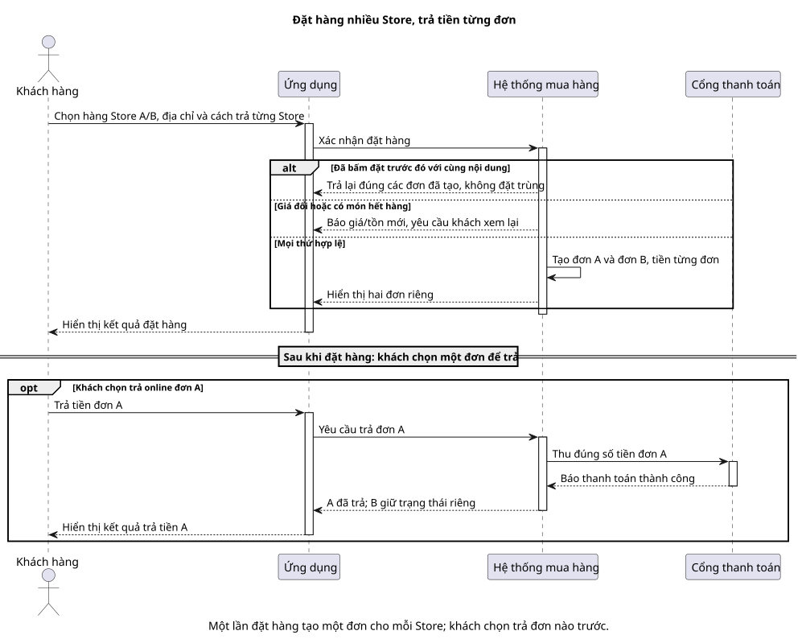

# Sequence 01 — Tạo Order nhiều Store và thanh toán sandbox

[Sơ đồ dễ đọc](01-sandbox-checkout.puml) · [Bản kỹ thuật](../technical/sequence/01-sandbox-checkout.puml) · [Mục lục sequence](README.md) · [Activity checkout](../activity/01-checkout.md)

## Hiểu nhanh

Bạn mua hàng của hai Store A và B trong cùng giỏ. Khi bấm đặt hàng, hệ thống kiểm tra lại giá và số lượng rồi tạo **hai đơn riêng**. Bạn có thể trả tiền đơn A ngay; đơn B vẫn chờ, không bị ép thanh toán cùng A. Nếu bạn bấm lại vì mạng chậm, hệ thống trả đúng hai đơn cũ thay vì đặt trùng. Nếu giá đổi hoặc hết hàng trước lúc đặt, hệ thống yêu cầu bạn xem giá mới và chưa tạo đơn nào.

Trên hình, hãy theo đường `Khách hàng → Ứng dụng → Hệ thống mua hàng`. Các khung `alt` là ba khả năng của nút “Đặt hàng”: đã đặt rồi, giá/hàng thay đổi, hoặc đặt thành công. Đoạn sau khi trả về hai đơn là **lần trả tiền riêng của A**, không phải bước bắt buộc để tạo B.

## Đối chiếu khi triển khai

Các chi tiết M1–M3, Idempotency-Key và giữ tồn nằm ở [bản kỹ thuật](../technical/sequence/01-sandbox-checkout.puml). Phần dưới đối chiếu với bản đó.

**Mục đích:** diễn tả một lần xác nhận giỏ có Store A/B. M2 tạo một Order và một Payment **cho mỗi Store trước khi Customer trả tiền**. Order A được thanh toán sandbox trong hình; B có thể tiếp tục chờ hoặc dùng COD.

| Bên tham gia | Vai trò |
| --- | --- |
| Customer, Web/Mobile | Chọn item, địa chỉ, phương thức từng Store; xác nhận quote và chọn Order để trả. |
| M2 | Điều phối xác nhận giỏ, voucher, idempotency, tạo Order/Payment và xử lý callback. |
| M3, M1 | M3 kiểm tra User/Store/phí; M1 báo giá và giữ/consume tồn. |
| Gateway sandbox | Thu tiền của **Order A**, không thu tổng hai Order. |

**Đọc từ trên xuống:** (1) M2 khóa cặp `(customer_user_id, Idempotency-Key)` và so hash payload. (2) Nếu key đã hoàn tất với cùng payload, trả lại cùng nhóm Order; khác payload trả 409. (3) Với key mới, M2 kiểm tra giá/tồn/Store/voucher hiện hành, cấp ID dự kiến rồi M1 reserve đủ mọi SKU. (4) Chỉ khi reserve đủ, M2 tạo nguyên tập Order/Payment, snapshot và `IdempotencyRecord` trong một transaction. (5) Customer chọn trả Order A; callback hợp lệ làm consume reservation của A và chuyển A sang PENDING. B không bị bắt trả cùng lúc.

**Nhánh lỗi:** một SKU hết hàng hoặc giá đổi thì release phần đã giữ, trả quote mới/lỗi và không có Order nào. Retry cùng key/payload không tạo thêm Order. Payment Success nhưng consume lỗi thuộc [Sequence 02](02-sandbox-recovery.md).

**Sau luồng:** `purchase_group_id` chỉ nối các Order để hiển thị; mỗi `Payment.order_id` gắn đúng một Order. Đối chiếu [BR-18/19/21/22](../../business-rules.md), [TC-CHK-01/02/04](../../test-plan.md) và [API](../../api-spec.md).
