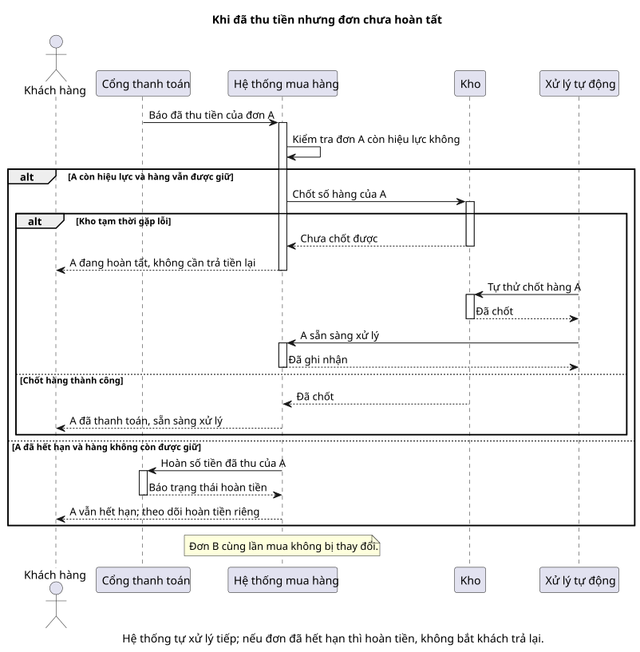

# Sequence 02 — Phục hồi thanh toán sandbox

[Sơ đồ dễ đọc](02-sandbox-recovery.puml) · [Bản kỹ thuật](../technical/sequence/02-sandbox-recovery.puml) · [Mục lục sequence](README.md) · [Vòng đời trạng thái](../../state-transitions.md)

## Hiểu nhanh

Sơ đồ này chỉ nói về **đơn A khi tiền đã được báo trả thành công nhưng phần hàng chưa chốt xong**. Nếu lỗi chỉ tạm thời, hệ thống tự thử lại; A hiện “đang xử lý”, khách **không trả tiền lần hai**. Nếu kết quả trả tiền đến quá muộn, sau khi A đã hết hạn và hàng giữ đã trả về kho, hệ thống không mở lại đơn; tiền của A được hoàn.

Nhìn khung `alt`: nhánh trên là **vẫn còn giữ được hàng**, nhánh dưới là **đơn đã hết hạn**. “Xử lý tự động” nghĩa là hệ thống tự thử lại khi gặp lỗi. Mọi chuyện ở đây chỉ áp dụng cho A; đơn B cùng lần mua không đổi.

## Đối chiếu khi triển khai

Trạng thái RECOVERING, EXPIRED, Payment và operation ID được giữ ở [bản kỹ thuật](../technical/sequence/02-sandbox-recovery.puml). Phần dưới đối chiếu với bản đó.

**Mục đích:** xử lý callback Success cho **một Order A** trong hai tình huống nguy hiểm: Payment đã thu nhưng M1 tạm lỗi khi consume, hoặc callback đến sau khi Order hết hạn và reservation đã release.

| Bên tham gia | Vai trò |
| --- | --- |
| Gateway sandbox | Gửi callback có `event_id` và trả kết quả hoàn mock. |
| M2 | Xác thực/dedup callback; giữ trạng thái Order, Payment và Refund. |
| M1 Inventory | Consume reservation đúng một lần theo `operation_id`. |
| Recovery worker | Retry command lỗi mà không tạo Attempt/thu tiền mới. |

**Nhánh reservation còn ACTIVE:** M2 ghi Payment A SUCCEEDED rồi yêu cầu M1 consume. Nếu M1 thành công, A chuyển PENDING. Nếu M1 tạm lỗi, A ở RECOVERING; worker retry **cùng operation ID**, thành công mới chuyển PENDING. Customer không bị yêu cầu trả lần nữa.

**Nhánh callback muộn:** trước callback, worker hết hạn đã đối soát và chuyển A từ AWAITING_PAYMENT sang **EXPIRED**, release reservation. Callback Success được ghi nhận nhưng không mở lại A và không tạo Order mới. Payment chuyển sang xử lý hoàn, Refund A được tạo và gọi hoàn mock. Trạng thái Refund có thể còn REQUESTED/PROCESSING/FAILED dù Order đã EXPIRED.

Order B cùng `purchase_group_id` không đổi. Cần đối chiếu [BR-22/23/40](../../business-rules.md), [TC-CHK-05/06](../../test-plan.md) và [Payment state](../state/02-payment.puml). Mũi tên retry không phải distributed transaction: M1 và M2 lưu trạng thái riêng để đối soát.
