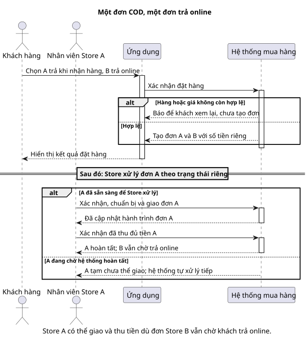

# Sequence 03 — COD của một Order, sandbox của Order khác

[Sơ đồ dễ đọc](03-cod-checkout.puml) · [Bản kỹ thuật](../technical/sequence/03-cod-checkout.puml) · [Mục lục sequence](README.md) · [Activity checkout](../activity/01-checkout.md)

## Hiểu nhanh

Bạn đặt hai món: Store A chọn **trả tiền khi nhận hàng (COD)**, Store B chọn **trả online sau**. Hệ thống tạo hai đơn cùng lúc nhưng mỗi đơn đi đường riêng. A có thể được Seller giao và thu tiền dù B vẫn chưa thanh toán. Tiền thu của A không được tính sang B.

Trong hình, Khách hàng đi qua Ứng dụng để đặt hàng; sau đó Nhân viên Store A xử lý **chỉ đơn A**. Nếu giá/hàng không hợp lệ, không có đơn nào. Nếu A đã tạo nhưng hệ thống chưa hoàn tất phần hàng, A chờ xử lý tiếp; Seller chưa được giao A trong lúc đó.

## Đối chiếu khi triển khai

Việc reserve/consume, trạng thái PREPARING và operation ID nằm ở [bản kỹ thuật](../technical/sequence/03-cod-checkout.puml). Phần dưới đối chiếu với bản đó.

**Mục đích:** cho thấy Customer có thể xác nhận một lần giỏ A/B nhưng chọn **A=COD, B=SANDBOX**. Hai Order và hai Payment độc lập; Seller có thể giao và thu tiền A khi B còn chưa trả.

| Bên tham gia | Vai trò |
| --- | --- |
| Customer, Web/Mobile | Gửi lựa chọn phương thức từng Store và xem trạng thái từng Order. |
| M2, M1 | M2 tạo nguyên tập Order/Payment; M1 reserve rồi consume riêng A COD. |
| Seller, Seller Portal | Chuyển trạng thái A và xác nhận đã giao/thu đủ COD. |

**Luồng chính:** M2 cấp Order ID dự kiến và M1 reserve SKU A/B. Khi reserve đủ, transaction M2 tạo Order A/B và Payment A/B. A COD bắt đầu PREPARING; sau consume tồn thành công mới PENDING. B sandbox vẫn AWAITING_PAYMENT và giữ tồn có hạn. Seller chỉ được chuyển A `CONFIRMED → PROCESSING → SHIPPED` sau khi A sẵn sàng, rồi ghi thu đủ COD để A COMPLETED/Payment A SUCCEEDED.

**Nhánh lỗi:** reserve không đủ thì release toàn bộ, không tạo Order. Nếu consume COD lỗi **sau khi** Order đã tạo, A giữ PREPARING để worker retry cùng `operation_id`; không cho Seller xử lý A lúc này. B vẫn là Order đã tạo và có vòng đời thanh toán riêng.

`CODCollection` ghi nghĩa vụ/tiền đã thu của A, không có tiền COD chung theo `purchase_group_id`. Xem [BR-17/21/41](../../business-rules.md), [TC-COD-01/02](../../test-plan.md) và [ERD Payment/COD](../erd/07-payment-voucher.md).
