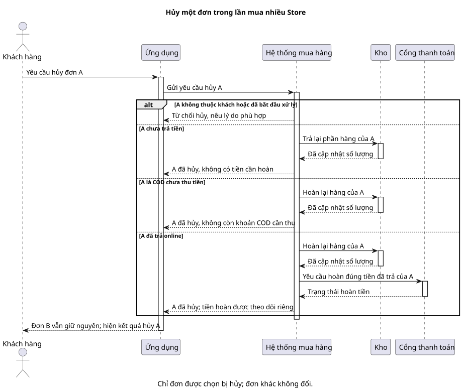

# Sequence 04 — Hủy một Order và hoàn tiền nếu đã trả

[Sơ đồ dễ đọc](04-cancel-refund.puml) · [Bản kỹ thuật](../technical/sequence/04-cancel-refund.puml) · [Mục lục sequence](README.md) · [Activity hủy Order](../activity/02-cancel-order.md)

## Hiểu nhanh

Khách muốn hủy **đơn A**, không phải hủy cả lần mua gồm A và B. Hệ thống kiểm tra A còn ở giai đoạn được hủy hay không. Nếu A chưa trả tiền, hệ thống bỏ số tiền cần thu và trả hàng đã giữ. Nếu A là COD, bỏ nghĩa vụ thu tiền và hoàn kho. Nếu A đã trả online, hệ thống hoàn kho **và** bắt đầu hoàn đúng số tiền đã trả cho A. Đơn B giữ nguyên.

Ba phần trong `alt` tương ứng ba tình huống trên. “Đơn đã hủy” và “tiền đã hoàn xong” là **hai kết quả khác nhau**; khách có thể thấy đơn đã hủy trong khi hoàn tiền còn đang xử lý.

## Đối chiếu khi triển khai

Chi tiết version, release/restock và Refund nằm ở [bản kỹ thuật](../technical/sequence/04-cancel-refund.puml). Phần dưới đối chiếu với bản đó.

**Mục đích:** hủy **Order A** trong một nhóm mua mà không hủy hay tính lại Order B. Sơ đồ chia nhánh theo A đã thu tiền/chưa thu và tồn đã consume/chưa consume.

| Bên tham gia | Vai trò |
| --- | --- |
| Customer | Gửi yêu cầu hủy kèm `expected_version`. Seller/Owner cũng được hủy ở trạng thái cho phép nhưng phải ghi lý do. |
| M2 | Kiểm tra ownership/trạng thái/version; chuyển CANCELLED, ghi lịch sử, tạo Refund nếu cần. |
| M1 | Release tồn đang giữ hoặc restock tồn đã bán theo operation ID. |
| Gateway sandbox | Hoàn mock khoản đã trả của A. |

**Ba nhánh:** A sandbox **chưa trả**: hủy Order/Payment và release reservation, không Refund. A **COD chưa thu**: hủy nghĩa vụ `CODCollection`, hoàn kho nếu đã consume, không Refund. A sandbox **đã trả**: hủy Order, hoàn kho và tạo Refund bằng `Order.payable_vnd` đã chụp (gồm phí giao); kết quả hoàn tiền có trạng thái riêng.

Chỉ hủy ở AWAITING_PAYMENT/PENDING/CONFIRMED; từ PROCESSING trở đi trả lỗi. Cùng `expected_version` chỉ một thao tác cạnh tranh được chấp nhận; M1 restock/release và Refund chống lặp bằng operation ID. Sơ đồ tập trung vào nhánh hợp lệ; nhánh 403/404/409 xem [Activity 02](../activity/02-cancel-order.md) và [BR-24/25/26/39](../../business-rules.md).
