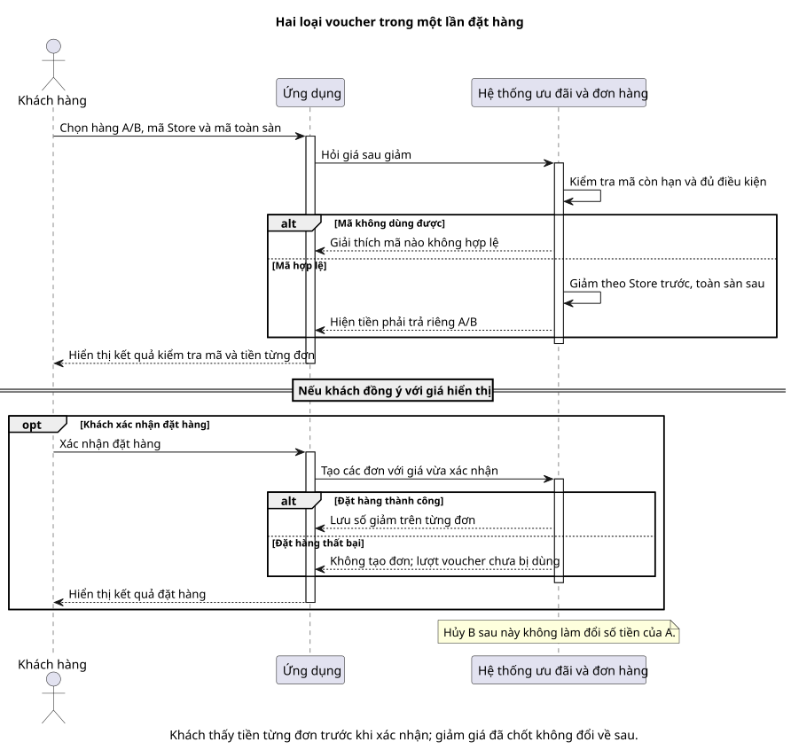

# Sequence 05 — Áp voucher Store và toàn sàn

[Sơ đồ dễ đọc](05-voucher.puml) · [Bản kỹ thuật](../technical/sequence/05-voucher.puml) · [Mục lục sequence](README.md) · [Quy tắc tính tiền](../../business-rules.md)

## Hiểu nhanh

Khách dùng mã giảm của Store A và một mã toàn sàn khi mua ở A/B. Hệ thống giảm tiền hàng của Store trước, rồi giảm thêm tiền hàng còn lại bằng mã toàn sàn; **phí giao không được giảm**. Trước khi đặt, khách thấy rõ phải trả bao nhiêu cho A, bao nhiêu cho B. Khi đặt thành công, những con số đó được giữ cố định trên từng đơn.

Trong hình, đoạn trước khi Customer xác nhận là **xem giá**; đoạn sau là **giữ rồi chốt lượt dùng voucher**. Nếu đặt hàng thất bại, lượt đã giữ được trả lại. Nếu đã đặt thành công rồi B bị hủy/hết hạn, tiền giảm của A không bị tính lại.

## Đối chiếu khi triển khai

Giữ lượt, phân bổ giảm sàn và redemption nằm ở [bản kỹ thuật](../technical/sequence/05-voucher.puml). Phần dưới đối chiếu với bản đó.

**Mục đích:** cho thấy voucher được **tính ở quote**, **giữ lượt lúc tạo Order** và **chốt số giảm trên từng Order**. Mã Store và mã toàn sàn được cộng dồn có thứ tự; không giảm phí giao.

| Bên tham gia | Vai trò |
| --- | --- |
| Customer | Chọn CartItem của Store A/B và nhập mã voucher hợp lệ. |
| M2 Voucher & Order | Kiểm tra điều kiện, tính tiền, giữ/chốt lượt dùng và lưu phần giảm snapshot. |

**Đọc từ trên xuống:** M2 kiểm tra thời hạn, mức hàng tối thiểu, trần giảm và hạn mức sử dụng. M2 áp voucher Store trên tiền hàng từng Store trước, rồi áp voucher sàn trên tổng tiền hàng còn lại. Giảm sàn được phân bổ theo tỷ lệ và phần dư cố định để tổng giảm khớp đến từng đồng VND. Customer thấy `payable` A/B và tổng tham khảo trước khi xác nhận.

Sau xác nhận, M2 giữ lượt trong lúc reserve tồn/tạo nguyên tập Order. Nếu transaction Order thành công, `VoucherRedemption` lưu phần giảm của từng Order; voucher sàn **đếm một lượt cho cả `purchase_group_id`**, dù có redemption trên A/B. Nếu lỗi trước transaction, release lượt và phần tồn đã giữ, không tạo Order.

Hủy/hết hạn B sau khi tạo không hoàn lượt voucher đã chốt và không tính lại tiền A. Đối chiếu [BR-27–31](../../business-rules.md), [TC-VCH-01/02/03](../../test-plan.md) và [ERD voucher](../erd/07-payment-voucher.md).
