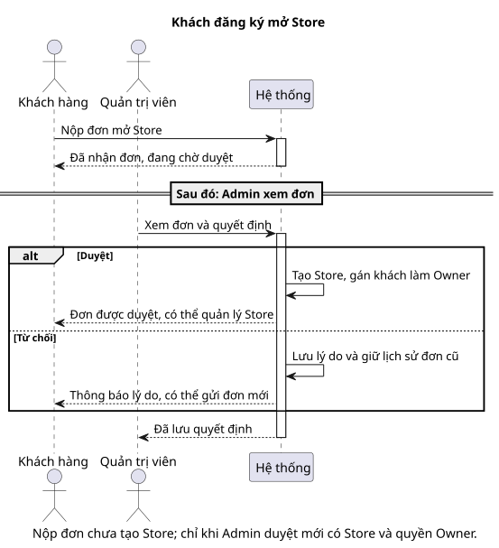

# Sequence 06 — Customer đăng ký Store, Admin duyệt

[Sơ đồ dễ đọc](06-store-application.puml) · [Bản kỹ thuật](../technical/sequence/06-store-application.puml) · [Mục lục sequence](README.md) · [ERD Store](../erd/02-store-membership.md)

## Hiểu nhanh

Customer gửi đơn xin mở Store, nhưng **chưa có Store ngay**. Admin xem đơn rồi chọn duyệt hoặc từ chối. Nếu duyệt, Store được tạo và Customer trở thành Owner. Nếu từ chối, Customer thấy lý do; đơn cũ vẫn được giữ để tra cứu và họ có thể gửi một đơn mới.

Trong hình, đoạn đầu là Customer nộp đơn; khung `alt` là hai quyết định của Admin. Không có nhánh nào cho phép Customer tự tạo Store hoặc tự cấp quyền Owner trước khi Admin duyệt.

## Đối chiếu khi triển khai

Transaction, membership và audit nằm ở [bản kỹ thuật](../technical/sequence/06-store-application.puml). Phần dưới đối chiếu với bản đó.

**Mục đích:** giải thích khi nào `StoreApplication` trở thành `Store`, ai được làm Owner và vì sao đơn bị từ chối vẫn phải giữ lịch sử.

| Bên tham gia | Vai trò |
| --- | --- |
| Customer | Nộp hồ sơ mở Store và theo dõi trạng thái. |
| M3 Identity & Store | Kiểm tra điều kiện, lưu đơn, quyết định và audit. |
| Administrator | Duyệt hoặc từ chối; từ chối phải có lý do. |

**Luồng chính:** M3 kiểm tra Customer chưa có StoreMembership active và không có đơn PENDING trùng. Sau khi nộp, `StoreApplication` ở PENDING. Admin xem hồ sơ và quyết định. **Duyệt:** M3 tạo `Store`, `StoreMembership` Owner và cập nhật đơn trong **cùng transaction**; ghi M3Audit. **Từ chối:** M3 giữ đơn REJECTED, lý do và audit; Customer có thể gửi **đơn mới** sau đó.

Không tạo Store hoặc Owner ngay lúc Customer nộp đơn; cũng không sửa đơn bị từ chối thành đơn mới. Ràng buộc mỗi User tối đa một membership active và mỗi Store một Owner active cần được kiểm tra ngay tại bước duyệt, không chỉ ở giao diện. Xem [BR-03/33/35](../../business-rules.md), [RBAC](../../rbac.md) và [TC-ACC-01/02](../../test-plan.md).
