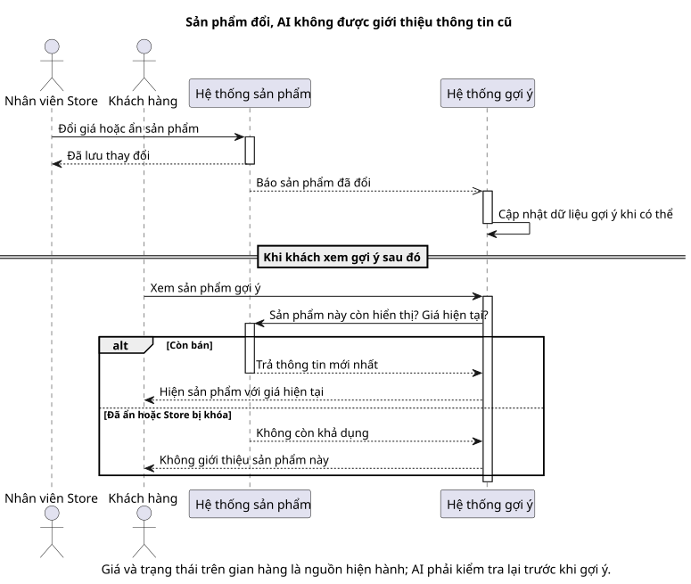

# Sequence 07 — Product thay đổi và AI index cập nhật

[Sơ đồ dễ đọc](07-product-ai-index.puml) · [Bản kỹ thuật](../technical/sequence/07-product-ai-index.puml) · [Mục lục sequence](README.md) · [Thiết kế AI](../../ai-design.md)

## Hiểu nhanh

Seller sửa giá hoặc ẩn một Product. Thông tin trên gian hàng đổi ngay, còn phần AI có thể cập nhật chậm hơn. Khi chatbot hoặc gợi ý chuẩn bị giới thiệu Product đó, hệ thống **kiểm tra lại giá và trạng thái mới nhất**. Vì vậy Product đã ẩn không bị giới thiệu, và giá cũ từ dữ liệu AI không được hiển thị cho khách.

Trên hình, “Hệ thống sản phẩm” là nơi Seller sửa Product; “Hệ thống gợi ý” cập nhật dữ liệu của mình sau đó. Mũi tên hệ thống gợi ý hỏi lại hệ thống sản phẩm gần cuối hình là điểm quan trọng nhất: **không tin dữ liệu gợi ý cũ khi trả kết quả cho người dùng**.

## Đối chiếu khi triển khai

Outbox, sự kiện ProductChanged và source version nằm ở [bản kỹ thuật](../technical/sequence/07-product-ai-index.puml). Phần dưới đối chiếu với bản đó.

**Mục đích:** phân biệt **dữ liệu Product hiện hành** ở M1 với **embedding có thể cập nhật trễ** ở M4. Đây là lý do chatbot/recommendation không được trả giá cũ hoặc Product vừa bị ẩn.

| Bên tham gia | Vai trò |
| --- | --- |
| Seller | Sửa Product/Variant với `expected_version` trong đúng Store. |
| M1 Catalog | Kiểm tra quyền, thuộc tính, SKU; lưu Product mới và outbox trong transaction. |
| M4 AI worker | Nhận ProductChanged, dedup và xây/cập nhật embedding theo version. |

**Đọc từ trên xuống:** Seller gửi thay đổi. M1 kiểm tra dữ liệu và lưu, tăng version rồi trả Product mới. Sự kiện `ProductChanged(event_id, product_id, version)` được chuyển bất đồng bộ sang M4; M4 chỉ upsert embedding khi version phù hợp, tránh sự kiện cũ ghi đè mới. Nhưng ngay cả khi index đã cập nhật, lúc trả Product card M4 vẫn hỏi M1 về trạng thái hiển thị và giá hiện hành.

**Khi index trễ hoặc Product bị ẩn/Store bị khóa:** M4 loại Product khỏi kết quả thay vì dùng giá/trạng thái trong embedding. M4 lỗi không chặn Seller sửa Product hoặc Customer mua hàng; đồng bộ AI phục hồi sau. Xem [TC-AI-01](../../test-plan.md), [BR-13/38](../../business-rules.md) và [integration contract](../../integration-contract.md).
