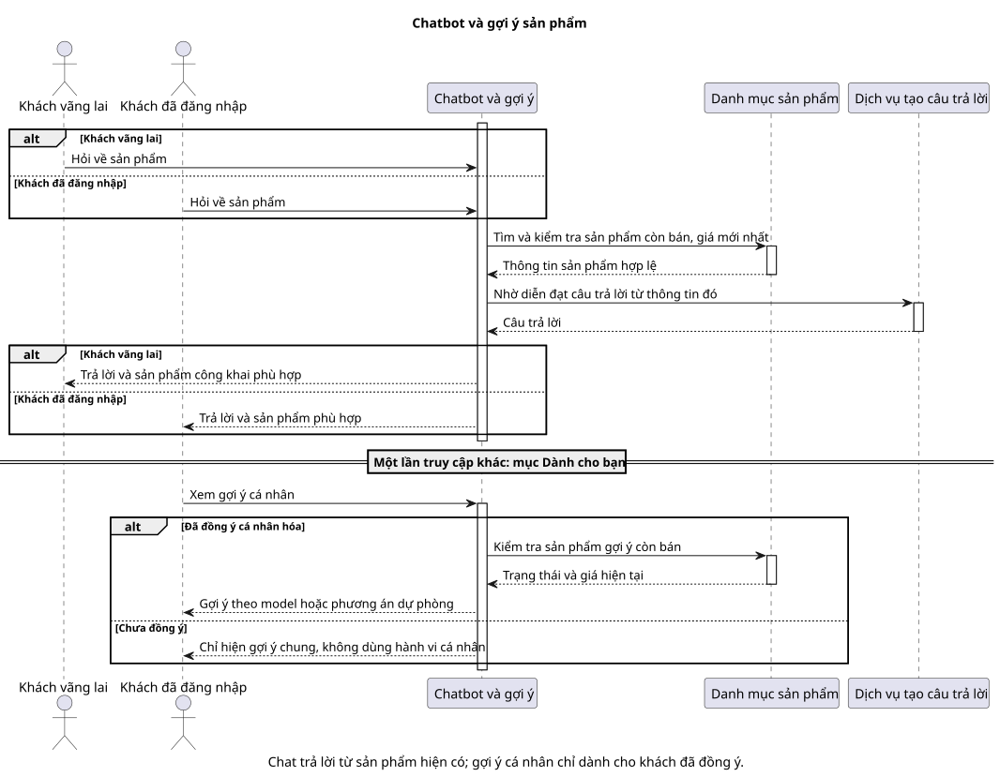

# Sequence 08 — Chatbot RAG và recommendation offline

[Sơ đồ dễ đọc](08-rag-and-recommendation.puml) · [Bản kỹ thuật](../technical/sequence/08-rag-and-recommendation.puml) · [Mục lục sequence](README.md) · [ERD AI](../erd/08-ai.md)

## Hiểu nhanh

Guest và Customer đều có thể hỏi chatbot về sản phẩm. Hệ thống tìm thông tin phù hợp, kiểm tra sản phẩm còn bán và giá hiện tại, rồi mới tạo câu trả lời; nếu thiếu thông tin, chatbot phải nói rõ thay vì đoán. Guest chỉ dùng chat cơ bản. Customer đã đăng nhập có thể nhận phần **“Dành cho bạn”** khi việc cá nhân hóa được cho phép.

Hình có hai câu chuyện ở **hai lần truy cập khác nhau**: phần trên là trả lời chat, phần dưới là mở mục “Dành cho bạn”. Đừng hiểu là hệ thống huấn luyện model mỗi khi khách gửi câu hỏi; bản kỹ thuật cho thấy việc huấn luyện diễn ra riêng.

## Đối chiếu khi triển khai

Embedding, consent, training run và metric nằm ở [bản kỹ thuật](../technical/sequence/08-rag-and-recommendation.puml). Phần dưới đối chiếu với bản đó.

**Mục đích:** mô tả hai khả năng M4 cung cấp: trả lời hội thoại dựa trên dữ liệu Product (RAG) và gợi ý cá nhân hóa dựa trên model huấn luyện offline. Chúng dùng chung Product context nhưng **không phải một lần gọi model duy nhất**.

| Bên tham gia | Vai trò |
| --- | --- |
| Guest/Customer | Guest chat cơ bản qua `anonymous_key`; Customer đăng nhập có `user_id`, consent và có thể nhận gợi ý cá nhân. |
| M4 AI | Tìm context, kiểm tra consent, lọc PII, tạo card/gợi ý và fallback. |
| M1 Catalog | Trả trạng thái hiển thị và giá Product hiện hành. |
| LLM API | Sinh câu trả lời trên context được M4 cung cấp. |
| Training worker | Dùng sự kiện hợp lệ đã dedup để train offline, so baseline và ghi metric. |

**Nhánh chat:** M4 lưu `ChatSession` theo Guest hoặc Customer, truy xuất Top-K context bằng embedding, rồi hỏi lại M1 để loại Product không bán/ẩn/Store bị khóa và lấy giá mới. M4 chỉ gửi context đã lọc PII cho LLM và trả câu trả lời có căn cứ cùng card còn hợp lệ. Guest không có gợi ý cá nhân theo User.

**Nhánh recommendation:** với Customer có consent phù hợp, M4 thu tín hiệu view/search/cart/purchase đã dedup. Worker chia train/test theo thời gian, huấn luyện CF/MF và so với baseline bằng Precision@K, Recall@K, NDCG@K. Khi phục vụ, dùng model đã đánh giá hoặc fallback; Product vẫn phải qua kiểm tra M1. Sơ đồ gộp thời gian dài vào một hình: train **không chạy đồng bộ mỗi lần chat**.

Nếu thiếu context hoặc LLM lỗi, trả lời phải nêu giới hạn thay vì bịa Product. Nếu chưa consent, model chưa sẵn sàng hoặc User cold-start, dùng fallback phù hợp. Xem [thiết kế/đánh giá AI](../../ai-design.md), [TC-AI-01/03](../../test-plan.md) và [BR-12/13/14/20](../../business-rules.md).
