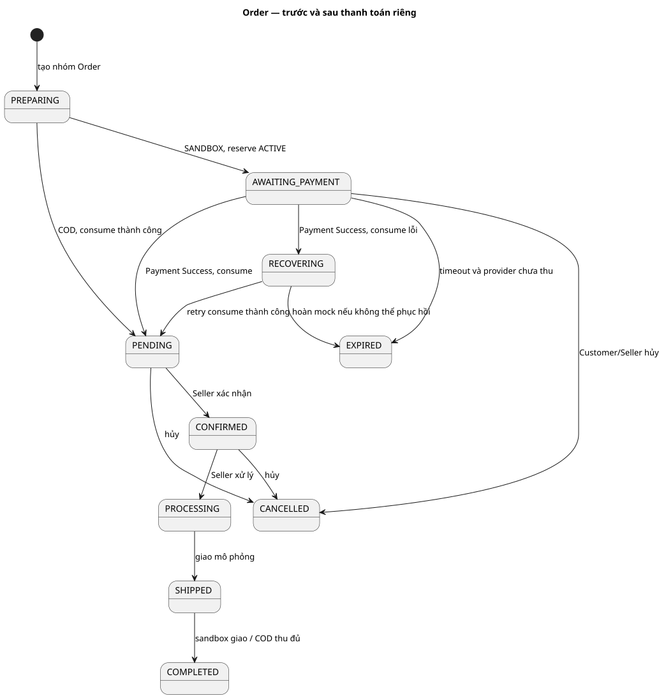
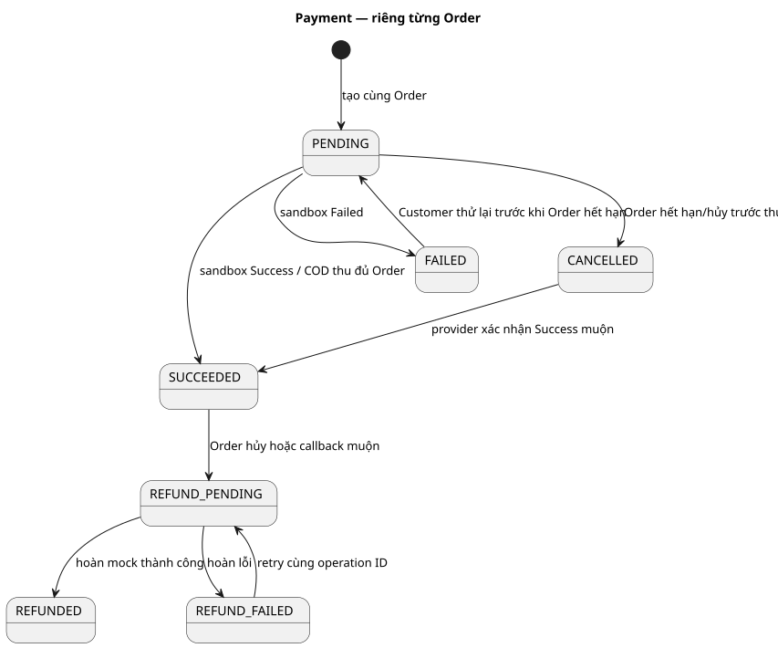
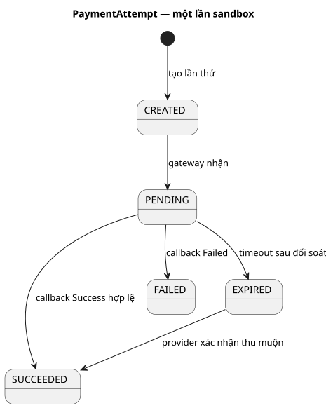
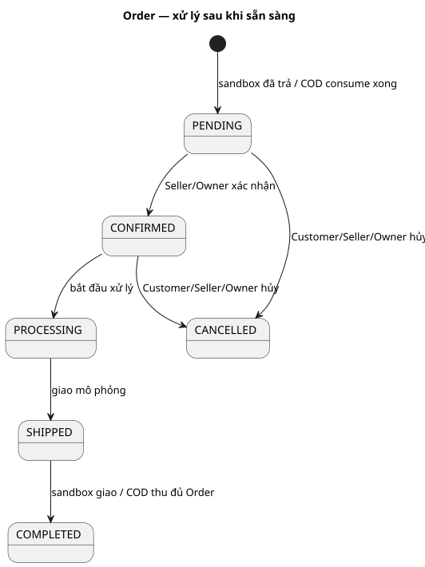
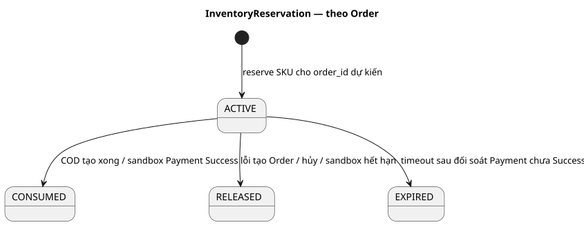
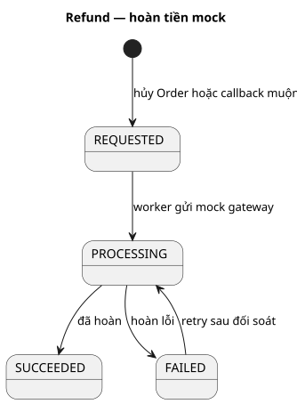

# Vòng đời Order, Payment và tồn kho

Đọc trạng thái từ [Business Rules](../../business-rules.md) và [bảng chuyển trạng thái](../../state-transitions.md) trước khi dùng các hình này. Mũi tên trên sơ đồ chỉ **chuyển trạng thái hợp lệ**, không biểu diễn thời gian thực tế. Một Order, Payment, PaymentAttempt, Reservation và Refund có vòng đời riêng; hủy Order không có nghĩa Refund đã thành công.

| Sơ đồ | Câu hỏi chính |
| --- | --- |
| [01 — Quan hệ Order/Payment](01-order-payment.puml) | Khi trả sandbox/COD, hai trạng thái liên quan thế nào? |
| [02 — Payment](02-payment.puml) | Khi nào tiền đã thu, bị hủy hoặc đang hoàn? |
| [03 — PaymentAttempt](03-payment-attempt.puml) | Một lần thử thanh toán có thể thất bại/đến muộn ra sao? |
| [04 — Order](04-order.puml) | Đơn chuyển từ chờ trả/xử lý đến hoàn tất, hủy hoặc hết hạn thế nào? |
| [05 — InventoryReservation](05-inventory-reservation.puml) | Hàng đang giữ được consume hoặc release khi nào? |
| [06 — Refund](06-refund.puml) | Hoàn tiền mock được yêu cầu, xử lý và báo kết quả thế nào? |

## Hình để đọc nhanh

