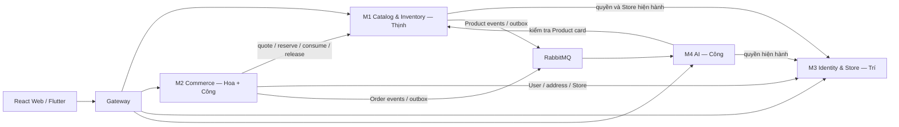

# Phân công và quyền sở hữu 4 service

Gateway không tính là service nghiệp vụ. Một repo, bốn process triển khai, bốn database; Web Customer/Seller/Admin dùng chung một React app, Android là Flutter app.

| Service | Module và dữ liệu | Người phụ trách |
| --- | --- | --- |
| M1 Catalog & Inventory | Taxonomy, Product/Variant/Image, Inventory/Reservation/StockMovement, Review, moderation/audit | Thịnh |
| M2 Commerce | Cart, quote/checkout, Order/OrderItem, voucher/redemption, báo cáo đơn | Hoa |
| M2 Commerce | Payment/Attempt/Event, SePay Test Mode, COD recording, Refund, reconciliation | Công; Hoa phối hợp Order |
| M3 Identity & Store | Auth/session, User/Profile/Address, StoreApplication/Store, staff/invitation/membership, RBAC, quản trị User/Store | Trí |
| M4 AI | Chat RAG, recommendation ALS/fallback, embeddings/index, tracking/consent, evaluation | Công |

| Thành viên | Frontend / hạ tầng | Mức trách nhiệm |
| --- | --- | --- |
| Công | Gateway, CI, môi trường, shared BE, client API mẫu; review tích hợp | Phần giao dịch nặng, AI và điều phối kiến trúc |
| Hoa | Customer Android | M2 trừ Payment/Refund; test checkout, report và Mobile |
| Trí | Admin Web | Toàn M3; tích hợp moderation M1, báo cáo/voucher M2, metric M4 |
| Thịnh | Seller Web | Toàn M1; tích hợp Order/Voucher M2 và Store/staff M3 trên Seller UI |
| Hatsaphone | Customer Web | Trang và API theo mẫu; loading/empty/error, phân trang, không sở hữu BE/AI |

Trí có cả Identity, Store, staff và RBAC; Admin Web gọi API đúng service sở hữu dữ liệu. Hoa có Cart, Order, Voucher, report và Mobile. Hatsaphone nhận việc theo từng màn với contract/component có sẵn.

Mũi tên nghiệp vụ thể hiện hợp đồng đích. Khung mới có HTTP kiểm quyền/Store/catalog và event `bootstrap.example.v1` mẫu; chưa có reserve/order/AI consumer thật.

M2 có transaction cục bộ chung giữa Cart/Order/Payment. M1/M3/M4 không tham gia transaction đó. Quy trình nhiều service dùng operation ID, outbox/inbox và bù trừ/phục hồi theo thiết kế; không join/FK/ghi database service khác. Shared code chỉ chứa cơ chế chung; repository nghiệp vụ không dùng entity/DB service khác.

Owner sửa migration, contract, code và test của module. Khi cần API service khác, thống nhất contract với owner đó; Công review tác động tích hợp. Chi tiết việc và tiêu chí bàn giao nằm trong [backlog](member-backlog.md).
