# Đặc tả Use Case 2.1 Draft

Có **một sơ đồ tổng quan** và **12 sơ đồ chi tiết** trong [diagrams/use-case](diagrams/use-case/). Bản chuyển đổi [Use Case 1.0](legacy/use-cases.md) chỉ để truy vết. Actor là vai trò nghiệp vụ; M1–M4, database và worker không là actor của ranh giới marketplace.

## Actor và quan hệ UML

| Actor | Phạm vi |
| --- | --- |
| Guest | Người chưa đăng nhập; đăng ký, đăng nhập và yêu cầu đặt lại mật khẩu. |
| Authenticated (trừu tượng) | Người dùng đã đăng nhập; đăng xuất, đổi mật khẩu và hồ sơ. Customer, Seller, Administrator kế thừa hành vi này. |
| Visitor (trừu tượng) | Người truy cập catalog công khai; Guest và Customer kế thừa hành vi này. Seller/Admin vẫn truy cập public API như mọi User. |
| Customer | Mua hàng, theo dõi đơn, đánh giá và đăng ký Store. Một User có thể dùng đồng thời vai trò này với Seller/Owner. |
| Seller | Nhân viên Store, quyền hiệu lực có thể bị Owner thu hồi theo [RBAC](rbac.md). |
| Owner | Kế thừa Seller, thêm quản lý Store, nhân viên, voucher và báo cáo. |
| Administrator | Quản trị toàn sàn; không mặc nhiên là Seller của Store. |
| Gateway sandbox / LLM | Actor hỗ trợ ngoài hệ thống ở thanh toán sandbox / chat RAG. |

Guest mô tả trạng thái **trước đăng nhập**, nên Seller/Owner/Admin cũng bắt đầu đăng nhập ở vai Guest. Generalization trên hình biểu diễn hành vi dùng chung, không gán vai trò vĩnh viễn cho User. Actor Customer và Seller/Owner có thể là cùng một User ở các request khác nhau.

| Nguồn | Đích | Quan hệ | Điều kiện/lý do |
| --- | --- | --- | --- |
| Owner | Seller | Generalization actor | Owner có quyền nghiệp vụ Seller, vẫn chịu scope và permission hiệu lực. |
| Customer / Seller / Admin | Authenticated | Generalization actor | Dùng đăng xuất, đổi mật khẩu và hồ sơ chung. |
| Guest / Customer | Visitor | Generalization actor | Dùng chức năng catalog công khai; không kế thừa đăng ký/đăng nhập. |
| Customer | UC-CHECKOUT-CONFIRM | Association | Customer khởi tạo checkout. |
| Gateway sandbox | UC-PAY-SANDBOX | Association | Gateway chỉ tham gia nhánh sandbox. |
| LLM | UC-CHAT-TALK | Association | Dịch vụ ngoài trả nội dung RAG. |
| UC-SEARCH-FILTER | UC-SEARCH-QUERY | Extend | Sau truy vấn, người dùng tùy chọn lọc/sắp xếp. |
| UC-VCH-APPLY | UC-CHECKOUT-QUOTE | Extend khái niệm | Voucher là lựa chọn khi xem giá; quan hệ xuyên nhóm ghi tại đây, không khai báo trùng UC trên hai hình. |
| UC-PAY-SANDBOX / UC-PAY-COD | UC-CHECKOUT-CONFIRM | Nhánh theo từng Order | Sau tạo Order, mỗi Order có phương thức riêng; không dùng include/extend cho luồng thanh toán kỹ thuật. |
| UC-SORDER-COD | UC-SORDER-STATUS | Nhánh có điều kiện | Chỉ ở bước SHIPPED → COMPLETED của COD, thu đủ là bắt buộc; sandbox hoàn tất qua STATUS. |

**Không dùng include cho bước dữ liệu/kỹ thuật:** chọn địa chỉ, xác thực quyền, reserve tồn, ghi StockMovement, xác minh review và gọi callback nằm trong luồng hoặc sequence. Mỗi Order có đúng một phương thức SANDBOX hoặc COD; các Order cùng nhóm có thể chọn khác nhau và thanh toán riêng. Sơ đồ chi tiết chỉ khai báo mỗi UC đúng một lần. Luồng UI từ Product detail sang review/gợi ý, từ chat card sang Product detail là điều hướng, không phải include.

## Danh mục và phân rã

| Nhóm | Mã Use Case | Mục tiêu | Actor | Service | FR chính |
| --- | --- | --- | --- | --- | --- |
| [01-auth-profile](diagrams/use-case/01-auth-profile.puml) | [UC-AUTH-REGISTER](#uc-auth-register) | Đăng ký Customer | Guest | M3 | FR-AUTH-01 |
| [01-auth-profile](diagrams/use-case/01-auth-profile.puml) | [UC-AUTH-LOGIN](#uc-auth-login) | Đăng nhập | Guest | M3 | FR-AUTH-02 |
| [01-auth-profile](diagrams/use-case/01-auth-profile.puml) | [UC-AUTH-LOGOUT](#uc-auth-logout) | Đăng xuất | Customer/Seller/Owner/Admin | M3 | FR-AUTH-02 |
| [01-auth-profile](diagrams/use-case/01-auth-profile.puml) | [UC-AUTH-RESET](#uc-auth-reset) | Đặt lại mật khẩu đã quên | Guest | M3 | FR-AUTH-03 |
| [01-auth-profile](diagrams/use-case/01-auth-profile.puml) | [UC-AUTH-CHANGE](#uc-auth-change) | Đổi mật khẩu khi đã đăng nhập | Authenticated | M3 | FR-AUTH-03 |
| [01-auth-profile](diagrams/use-case/01-auth-profile.puml) | [UC-PROFILE-EDIT](#uc-profile-edit) | Xem và sửa hồ sơ cá nhân | Authenticated | M3 | FR-PROFILE-01 |
| [01-auth-profile](diagrams/use-case/01-auth-profile.puml) | [UC-ADDR-MANAGE](#uc-addr-manage) | Thêm, sửa, xóa và chọn địa chỉ | Customer | M3 | FR-ADDR-01 |
| [02-discovery](diagrams/use-case/02-discovery.puml) | [UC-CAT-BROWSE](#uc-cat-browse) | Duyệt danh mục | Guest/Customer | M1 | FR-CAT-01,FR-CAT-02 |
| [02-discovery](diagrams/use-case/02-discovery.puml) | [UC-SEARCH-QUERY](#uc-search-query) | Tìm sản phẩm theo từ khóa | Guest/Customer | M1 | FR-SEARCH-01,FR-SEARCH-04 |
| [02-discovery](diagrams/use-case/02-discovery.puml) | [UC-SEARCH-FILTER](#uc-search-filter) | Lọc và sắp xếp theo thuộc tính động | Guest/Customer | M1 | FR-SEARCH-02,FR-SEARCH-03 |
| [02-discovery](diagrams/use-case/02-discovery.puml) | [UC-PROD-DETAIL](#uc-prod-detail) | Xem chi tiết sản phẩm | Guest/Customer | M1 | FR-PROD-01 |
| [02-discovery](diagrams/use-case/02-discovery.puml) | [UC-STORE-BROWSE](#uc-store-browse) | Xem gian hàng công khai | Guest/Customer | M1 | FR-STOREVIEW-01 |
| [03-cart-checkout](diagrams/use-case/03-cart-checkout.puml) | [UC-CART-ADD](#uc-cart-add) | Thêm Variant vào giỏ | Customer | M2 | FR-CART-01 |
| [03-cart-checkout](diagrams/use-case/03-cart-checkout.puml) | [UC-CART-EDIT](#uc-cart-edit) | Đổi số lượng hoặc xóa item | Customer | M2 | FR-CART-02 |
| [03-cart-checkout](diagrams/use-case/03-cart-checkout.puml) | [UC-CART-SELECT](#uc-cart-select) | Chọn item của nhiều Store | Customer | M2 | FR-CART-03 |
| [03-cart-checkout](diagrams/use-case/03-cart-checkout.puml) | [UC-CHECKOUT-QUOTE](#uc-checkout-quote) | Xem giá, voucher và phí theo Store | Customer | M2 | FR-CHECKOUT-02,FR-CHECKOUT-03,FR-CHECKOUT-06,FR-VCH-04 |
| [03-cart-checkout](diagrams/use-case/03-cart-checkout.puml) | [UC-CHECKOUT-CONFIRM](#uc-checkout-confirm) | Tạo Order riêng cho từng Store | Customer | M2 | FR-CHECKOUT-01,FR-CHECKOUT-04,FR-CHECKOUT-05,FR-CHECKOUT-06,FR-CHECKOUT-07,FR-ORDER-01 |
| [03-cart-checkout](diagrams/use-case/03-cart-checkout.puml) | [UC-PAY-SANDBOX](#uc-pay-sandbox) | Thanh toán sandbox cho một Order | Customer | M2 | FR-PAY-01,FR-PAY-02 |
| [03-cart-checkout](diagrams/use-case/03-cart-checkout.puml) | [UC-PAY-COD](#uc-pay-cod) | Chọn COD cho Order của Store | Customer | M2 | FR-PAY-03 |
| [04-payment-customer-order](diagrams/use-case/04-payment-customer-order.puml) | [UC-ORDER-LIST](#uc-order-list) | Xem danh sách, chi tiết và tracking đơn của mình | Customer | M2 | FR-ORDER-02,FR-ORDER-03 |
| [04-payment-customer-order](diagrams/use-case/04-payment-customer-order.puml) | [UC-ORDER-CANCEL](#uc-order-cancel) | Hủy một Order còn cho phép | Customer | M2 | FR-ORDER-04,FR-ORDER-05,FR-PAY-05 |
| [04-payment-customer-order](diagrams/use-case/04-payment-customer-order.puml) | [UC-REFUND-TRACK](#uc-refund-track) | Xem trạng thái hoàn tiền mock | Customer | M2 | FR-PAY-05 |
| [05-voucher](diagrams/use-case/05-voucher.puml) | [UC-VCH-STORE](#uc-vch-store) | Quản lý voucher Store | Owner | M2 | FR-VCH-01 |
| [05-voucher](diagrams/use-case/05-voucher.puml) | [UC-VCH-PLATFORM](#uc-vch-platform) | Quản lý voucher toàn sàn | Admin | M2 | FR-VCH-01 |
| [05-voucher](diagrams/use-case/05-voucher.puml) | [UC-VCH-APPLY](#uc-vch-apply) | Áp voucher Store và toàn sàn | Customer | M2 | FR-VCH-02,FR-VCH-03,FR-VCH-04 |
| [05-voucher](diagrams/use-case/05-voucher.puml) | [UC-VCH-USAGE](#uc-vch-usage) | Xem lượt sử dụng voucher | Owner/Admin | M2 | FR-VCH-03 |
| [06-review](diagrams/use-case/06-review.puml) | [UC-REV-BROWSE](#uc-rev-browse) | Xem review và điểm tổng hợp | Guest/Customer | M1 | FR-REV-02 |
| [06-review](diagrams/use-case/06-review.puml) | [UC-REV-CREATE](#uc-rev-create) | Đánh giá OrderItem đã hoàn tất | Customer | M1 | FR-REV-01 |
| [06-review](diagrams/use-case/06-review.puml) | [UC-REV-EDIT](#uc-rev-edit) | Sửa đánh giá của mình | Customer | M1 | FR-REV-01 |
| [06-review](diagrams/use-case/06-review.puml) | [UC-REV-MODERATE](#uc-rev-moderate) | Ẩn hoặc hiện lại đánh giá | Admin | M1 | FR-REV-03 |
| [07-store-staff](diagrams/use-case/07-store-staff.puml) | [UC-STORE-APPLY](#uc-store-apply) | Đăng ký mở Store | Customer | M3 | FR-STORE-05 |
| [07-store-staff](diagrams/use-case/07-store-staff.puml) | [UC-STORE-REVIEW](#uc-store-review) | Duyệt hoặc từ chối Store | Admin | M3 | FR-STORE-06 |
| [07-store-staff](diagrams/use-case/07-store-staff.puml) | [UC-STORE-EDIT](#uc-store-edit) | Cập nhật thông tin Store | Owner | M3 | FR-STORE-01 |
| [07-store-staff](diagrams/use-case/07-store-staff.puml) | [UC-STAFF-INVITE](#uc-staff-invite) | Mời Seller và cấp quyền | Owner | M3 | FR-STORE-02,FR-STORE-07 |
| [07-store-staff](diagrams/use-case/07-store-staff.puml) | [UC-STAFF-ACCEPT](#uc-staff-accept) | Chấp nhận lời mời Seller | Customer | M3 | FR-STORE-07 |
| [07-store-staff](diagrams/use-case/07-store-staff.puml) | [UC-STAFF-INBOX](#uc-staff-inbox) | Xem lời mời tham gia Store của tôi | Customer | M3 | FR-STORE-07 |
| [07-store-staff](diagrams/use-case/07-store-staff.puml) | [UC-STAFF-LIST](#uc-staff-list) | Xem danh sách Seller và lời mời của Store | Owner | M3 | FR-STORE-02 |
| [07-store-staff](diagrams/use-case/07-store-staff.puml) | [UC-STAFF-PERMISSIONS](#uc-staff-permissions) | Cập nhật quyền Seller | Owner | M3 | FR-STORE-02 |
| [07-store-staff](diagrams/use-case/07-store-staff.puml) | [UC-STAFF-LOCK](#uc-staff-lock) | Khóa hoặc mở quyền nhân viên | Owner | M3 | FR-STORE-02 |
| [08-product-management](diagrams/use-case/08-product-management.puml) | [UC-SPROD-LIST](#uc-sprod-list) | Xem, tìm và lọc Product của Store | Seller/Owner | M1 | FR-MPROD-01 |
| [08-product-management](diagrams/use-case/08-product-management.puml) | [UC-SPROD-CREATE](#uc-sprod-create) | Tạo Product theo ProductType | Seller/Owner | M1 | FR-MPROD-02,FR-MPROD-03,FR-MPROD-04,FR-MPROD-08,FR-MPROD-09 |
| [08-product-management](diagrams/use-case/08-product-management.puml) | [UC-SPROD-EDIT](#uc-sprod-edit) | Sửa và đăng bán lại Product | Seller/Owner | M1 | FR-MPROD-05,FR-MPROD-09 |
| [08-product-management](diagrams/use-case/08-product-management.puml) | [UC-SPROD-VARIANT](#uc-sprod-variant) | Tạo Variant/SKU mặc định hoặc có lựa chọn | Seller/Owner | M1 | FR-MPROD-07,FR-MPROD-10 |
| [08-product-management](diagrams/use-case/08-product-management.puml) | [UC-SPROD-IMAGE](#uc-sprod-image) | Quản lý ảnh Product và Variant | Seller/Owner | M1 | FR-MPROD-06 |
| [08-product-management](diagrams/use-case/08-product-management.puml) | [UC-SPROD-HIDE](#uc-sprod-hide) | Ngừng bán Product | Seller/Owner | M1 | FR-MPROD-05 |
| [09-inventory](diagrams/use-case/09-inventory.puml) | [UC-INV-VIEW](#uc-inv-view) | Xem tồn khả dụng và đang giữ | Seller/Owner | M1 | FR-INV-01 |
| [09-inventory](diagrams/use-case/09-inventory.puml) | [UC-INV-ADJUST](#uc-inv-adjust) | Nhập, xuất hoặc điều chỉnh tồn có lý do | Seller/Owner | M1 | FR-INV-02 |
| [09-inventory](diagrams/use-case/09-inventory.puml) | [UC-INV-HISTORY](#uc-inv-history) | Xem lịch sử biến động kho | Seller/Owner | M1 | FR-INV-03 |
| [10-store-orders-report](diagrams/use-case/10-store-orders-report.puml) | [UC-SORDER-LIST](#uc-sorder-list) | Xem danh sách và chi tiết đơn của Store | Seller/Owner | M2 | FR-SORDER-01 |
| [10-store-orders-report](diagrams/use-case/10-store-orders-report.puml) | [UC-SORDER-STATUS](#uc-sorder-status) | Chuyển trạng thái và xác nhận giao đơn | Seller/Owner | M2 | FR-SORDER-02,FR-SORDER-03 |
| [10-store-orders-report](diagrams/use-case/10-store-orders-report.puml) | [UC-SORDER-CANCEL](#uc-sorder-cancel) | Hủy đơn chưa xử lý có lý do | Seller/Owner | M2 | FR-SORDER-02,FR-ORDER-05 |
| [10-store-orders-report](diagrams/use-case/10-store-orders-report.puml) | [UC-SORDER-COD](#uc-sorder-cod) | Ghi nhận thu đủ COD theo Order | Seller/Owner | M2 | FR-PAY-04 |
| [10-store-orders-report](diagrams/use-case/10-store-orders-report.puml) | [UC-REP-STORE](#uc-rep-store) | Xem báo cáo Store | Owner | M2 | FR-REP-01,FR-REP-02,FR-REP-03 |
| [11-platform-admin](diagrams/use-case/11-platform-admin.puml) | [UC-ADMIN-ACCOUNT](#uc-admin-account) | Khóa hoặc mở tài khoản | Admin | M3 | FR-ADMIN-02 |
| [11-platform-admin](diagrams/use-case/11-platform-admin.puml) | [UC-ADMIN-STORE](#uc-admin-store) | Khóa hoặc mở Store | Admin | M3 | FR-STORE-04,FR-STORE-08 |
| [11-platform-admin](diagrams/use-case/11-platform-admin.puml) | [UC-ADMIN-TAX](#uc-admin-tax) | Quản lý Category, ProductType, AttributeKey | Admin | M1 | FR-PTYPE-01,FR-CATEGORY-ADMIN-01 |
| [11-platform-admin](diagrams/use-case/11-platform-admin.puml) | [UC-ADMIN-RBAC](#uc-admin-rbac) | Quản lý Role và Permission | Admin | M3 | FR-ADMIN-03 |
| [11-platform-admin](diagrams/use-case/11-platform-admin.puml) | [UC-ADMIN-PRODUCT](#uc-admin-product) | Ẩn hoặc bỏ ẩn Product | Admin | M1 | FR-ADMIN-04 |
| [11-platform-admin](diagrams/use-case/11-platform-admin.puml) | [UC-ADMIN-MONITOR](#uc-admin-monitor) | Giám sát đơn và nền tảng | Admin | M2 | FR-ADMIN-01,FR-ADMIN-05 |
| [12-ai](diagrams/use-case/12-ai.puml) | [UC-CHAT-TALK](#uc-chat-talk) | Hội thoại RAG và xem card sản phẩm | Guest/Customer | M4 | FR-AI-01,FR-AI-02,FR-AI-03,FR-AI-04,FR-AI-05,FR-AI-06,FR-AI-07 |
| [12-ai](diagrams/use-case/12-ai.puml) | [UC-CHAT-HISTORY](#uc-chat-history) | Xem lại phiên chat của mình | Customer | M4 | FR-AI-08 |
| [12-ai](diagrams/use-case/12-ai.puml) | [UC-REC-FOR-YOU](#uc-rec-for-you) | Xem Dành cho bạn và fallback | Customer | M4 | FR-REC-01,FR-REC-02,FR-REC-03,FR-REC-04,FR-REC-06,FR-REC-07,FR-REC-09,FR-REC-10,FR-REC-11 |
| [12-ai](diagrams/use-case/12-ai.puml) | [UC-REC-RELATED](#uc-rec-related) | Xem gợi ý liên quan | Guest/Customer | M4 | FR-REC-05 |
| [12-ai](diagrams/use-case/12-ai.puml) | [UC-AIMON-VIEW](#uc-aimon-view) | Xem metric, log, model và index AI theo phạm vi | Owner/Admin | M4 | FR-ADMIN-06,FR-ADMIN-07,FR-REC-08 |

## Ánh xạ UC cũ

| UC nguồn | UC hiện hành 2.1 |
| --- | --- |
| UC-AUTH-01 | UC-AUTH-REGISTER, UC-AUTH-LOGIN, UC-AUTH-RESET, UC-AUTH-CHANGE |
| UC-PROD-01/02 | UC-CAT-BROWSE, UC-SEARCH-QUERY/FILTER, UC-PROD-DETAIL |
| UC-CART-01 | UC-CART-ADD/EDIT/SELECT |
| UC-CHECKOUT-01 | UC-CHECKOUT-QUOTE/CONFIRM, UC-PAY-SANDBOX/COD |
| UC-PAY-01 | UC-PAY-SANDBOX/COD, UC-REFUND-TRACK |
| UC-ORDER-01 | UC-ORDER-LIST/CANCEL |
| UC-STORE-01/02 | UC-STORE-APPLY/REVIEW/EDIT, UC-STAFF-INVITE/ACCEPT/INBOX/LIST/PERMISSIONS/LOCK |
| UC-SPROD-01/02 | UC-SPROD-LIST/CREATE/EDIT/VARIANT/IMAGE/HIDE |
| UC-INV-01 | UC-INV-VIEW/ADJUST/HISTORY |
| UC-SORDER-01 | UC-SORDER-LIST/STATUS/CANCEL/COD |
| UC-REP-01 | UC-REP-STORE |
| UC-ADMIN-01/02/03 | UC-ADMIN-ACCOUNT/STORE/TAX/RBAC/PRODUCT/MONITOR |
| UC-CHAT-01, UC-REC-01, UC-AIMON-01 | UC-CHAT-TALK/HISTORY, UC-REC-FOR-YOU/RELATED, UC-AIMON-VIEW |

UC mới voucher/review được thêm, không ép ánh xạ giả sang UC 1.0.

## Ánh xạ Use Case tổng quan

Mã `OV-*` là mục tiêu gộp của hình tổng quan, không thay thế mã `UC-*` chi tiết. Một nhóm có thể xuất hiện trong nhiều mục tiêu (ví dụ Review ở khám phá và sau mua).

| Mã tổng quan | Nhóm sơ đồ chi tiết | UC chi tiết |
| --- | --- | --- |
| OV-AUTH | 01-auth-profile | UC-AUTH-REGISTER, UC-AUTH-LOGIN, UC-AUTH-LOGOUT, UC-AUTH-RESET, UC-AUTH-CHANGE, UC-PROFILE-EDIT, UC-ADDR-MANAGE |
| OV-DISCOVER | 02-discovery, 06-review, 12-ai | UC-CAT-BROWSE, UC-SEARCH-QUERY, UC-SEARCH-FILTER, UC-PROD-DETAIL, UC-STORE-BROWSE, UC-REV-BROWSE, UC-REC-RELATED |
| OV-CHECKOUT | 03-cart-checkout, 05-voucher | UC-CART-ADD, UC-CART-EDIT, UC-CART-SELECT, UC-CHECKOUT-QUOTE, UC-CHECKOUT-CONFIRM, UC-PAY-SANDBOX, UC-PAY-COD, UC-VCH-APPLY |
| OV-POST | 04-payment-customer-order, 06-review | UC-ORDER-LIST, UC-ORDER-CANCEL, UC-REFUND-TRACK, UC-REV-CREATE, UC-REV-EDIT |
| OV-APPLY | 07-store-staff | UC-STORE-APPLY, UC-STAFF-ACCEPT, UC-STAFF-INBOX |
| OV-CATALOG | 08-product-management, 09-inventory | UC-SPROD-LIST, UC-SPROD-CREATE, UC-SPROD-EDIT, UC-SPROD-VARIANT, UC-SPROD-IMAGE, UC-SPROD-HIDE, UC-INV-VIEW, UC-INV-ADJUST, UC-INV-HISTORY |
| OV-FULFILL | 10-store-orders-report | UC-SORDER-LIST, UC-SORDER-STATUS, UC-SORDER-CANCEL, UC-SORDER-COD |
| OV-STORE | 05-voucher, 07-store-staff, 10-store-orders-report, 12-ai | UC-STORE-EDIT, UC-STAFF-INVITE, UC-STAFF-LIST, UC-STAFF-PERMISSIONS, UC-STAFF-LOCK, UC-VCH-STORE, UC-VCH-USAGE, UC-REP-STORE, UC-AIMON-VIEW |
| OV-ADMIN | 05-voucher, 06-review, 07-store-staff, 11-platform-admin, 12-ai | UC-VCH-PLATFORM, UC-VCH-USAGE, UC-REV-MODERATE, UC-STORE-REVIEW, UC-ADMIN-ACCOUNT, UC-ADMIN-STORE, UC-ADMIN-TAX, UC-ADMIN-RBAC, UC-ADMIN-PRODUCT, UC-ADMIN-MONITOR, UC-AIMON-VIEW |
| OV-AI | 12-ai | UC-CHAT-TALK, UC-CHAT-HISTORY, UC-REC-FOR-YOU, UC-REC-RELATED |

## Đặc tả chi tiết

## Sơ đồ Use Case

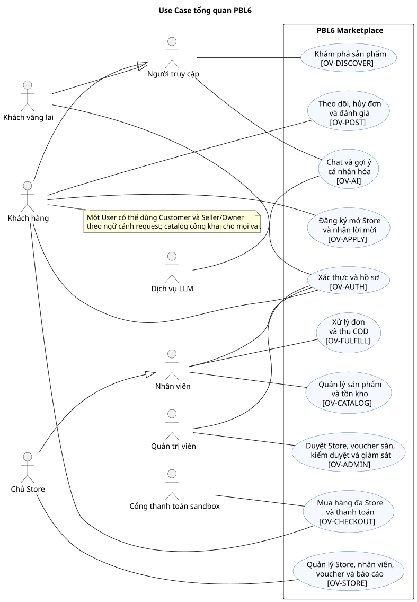

Các sơ đồ nhóm được đặt ngay trước đặc tả đầu tiên của nhóm. Mỗi hình giữ [mã nguồn PlantUML](diagrams/use-case/) để chỉnh sửa.

## Nhóm 01 — Xác thực và hồ sơ

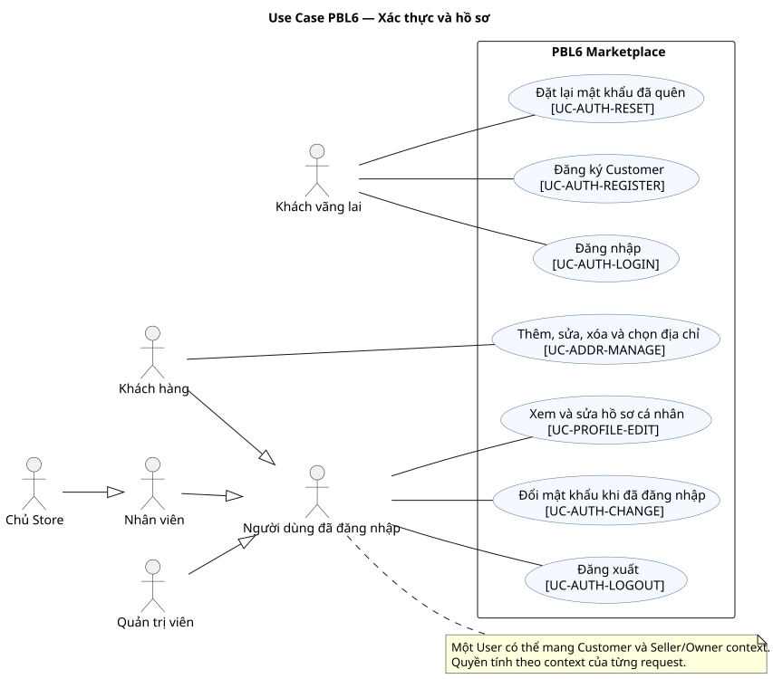

### UC-AUTH-REGISTER — Đăng ký Customer

- **Actor chính:** Guest. **Actor phụ:** không có actor ngoài hệ thống. **Phạm vi:** PBL6 Marketplace. **Nền tảng:** Web/Mobile/Portal theo tài khoản. **Service:** M3.
- **Mục tiêu:** Đăng ký Customer. **Trigger:** Guest nhập email, mật khẩu và thông tin Customer cơ bản.
- **Tiền điều kiện:** Email chưa có User; Guest chưa đăng nhập. **Quyền:** không cần đăng nhập.
- **Hậu điều kiện thành công:** User và CustomerProfile được tạo; email chỉ xác minh sau khi dùng link hợp lệ. **Bảo đảm khi thất bại:** Không ghi thay đổi nghiệp vụ của UC này; trả lỗi có mã và giữ dữ liệu đã chốt trước đó.
- **Dữ liệu vào/ra:** email, mật khẩu, tên → user_id, trạng thái xác minh. **Yêu cầu:** FR-AUTH-01. **Story:** US-AUTH-01. **Quy tắc:** BR-04/05/34. **OpenAPI operationId:** register,verifyEmail. **Dữ liệu:** User. **AC:** tiêu chí Given–When–Then ở [User Stories](user-stories.md) và các test nhóm AUTH trong [Test Plan](test-plan.md).

Luồng chính:

1. Guest nhập email, mật khẩu và thông tin Customer cơ bản.
2. M3 kiểm tra định dạng, email chưa dùng và chính sách mật khẩu.
3. M3 tạo User/CustomerProfile, chỉ lưu password hash và gửi link xác minh một lần vào mock mailbox demo.
4. Người dùng mở link để M3 đặt email_verified_at; link sai/hết hạn không xác minh.
5. Tài khoản mới chưa có quyền Store; chỉ email đã xác minh mới thấy/nhận lời mời.

Luồng thay thế/ngoại lệ:

- Tại bước 2, dữ liệu đăng ký/xác thực không hợp lệ hoặc bị giới hạn tần suất: trả lỗi có mã; không cấp phiên hoặc tiết lộ tài khoản.
- Tại bước 2, email đã tồn tại: không tạo User thứ hai; phản hồi không làm lộ trạng thái tài khoản.
- Tại bước 4, link sai/hết hạn/đã dùng: không xác minh; người dùng có thể xin link mới trong giới hạn tần suất.

### UC-AUTH-LOGIN — Đăng nhập

- **Actor chính:** Guest. **Actor phụ:** không có actor ngoài hệ thống. **Phạm vi:** PBL6 Marketplace. **Nền tảng:** Web/Mobile/Portal theo tài khoản. **Service:** M3.
- **Mục tiêu:** Đăng nhập. **Trigger:** Guest nhập credential trên Client hoặc Portal.
- **Tiền điều kiện:** User tồn tại, chưa bị khóa. **Quyền:** không cần đăng nhập.
- **Hậu điều kiện thành công:** Phiên và cặp token hợp lệ được cấp theo User, không gắn một role cố định. **Bảo đảm khi thất bại:** Không ghi thay đổi nghiệp vụ của UC này; trả lỗi có mã và giữ dữ liệu đã chốt trước đó.
- **Dữ liệu vào/ra:** email, mật khẩu → access/refresh token, hồ sơ ngữ cảnh. **Yêu cầu:** FR-AUTH-02. **Story:** US-AUTH-02, US-AUTH-03. **Quy tắc:** BR-04/05/34. **OpenAPI operationId:** login. **Dữ liệu:** Session. **AC:** tiêu chí Given–When–Then ở [User Stories](user-stories.md) và các test nhóm AUTH trong [Test Plan](test-plan.md).

Luồng chính:

1. Guest nhập credential trên Client hoặc Portal.
2. M3 xác minh tài khoản hiệu lực, password hash và rate limit.
3. M3 tạo access/refresh session cho User, không đóng cứng một role trong JWT.
4. Client gọi /me/context để lấy Customer, Store membership và permission hiện hành.
5. Seller/Owner/Admin dùng cùng login; quyền cụ thể được kiểm tra lại ở request nghiệp vụ.

Luồng thay thế/ngoại lệ:

- Tại bước 2, dữ liệu đăng ký/xác thực không hợp lệ hoặc bị giới hạn tần suất: trả lỗi có mã; không cấp phiên hoặc tiết lộ tài khoản.
- Tại bước 2, sai thông tin hoặc User bị khóa: từ chối và áp dụng rate limit; không tiết lộ email có tồn tại.

### UC-AUTH-LOGOUT — Đăng xuất

- **Actor chính:** Customer/Seller/Owner/Admin. **Actor phụ:** không có actor ngoài hệ thống. **Phạm vi:** PBL6 Marketplace. **Nền tảng:** Web/Mobile/Portal theo tài khoản. **Service:** M3.
- **Mục tiêu:** Đăng xuất. **Trigger:** User chọn đăng xuất ở phiên hiện tại.
- **Tiền điều kiện:** User có phiên còn hiệu lực. **Quyền:** kiểm tra User và quyền hiệu lực trong phạm vi thao tác.
- **Hậu điều kiện thành công:** Refresh token/phiên tương ứng bị thu hồi; request mới dùng token đó bị từ chối. **Bảo đảm khi thất bại:** Không ghi thay đổi nghiệp vụ của UC này; trả lỗi có mã và giữ dữ liệu đã chốt trước đó.
- **Dữ liệu vào/ra:** refresh token hoặc session_id → xác nhận đăng xuất. **Yêu cầu:** FR-AUTH-02. **Story:** US-AUTH-02, US-AUTH-03. **Quy tắc:** BR-04/05/34. **OpenAPI operationId:** logout. **Dữ liệu:** Session. **AC:** tiêu chí Given–When–Then ở [User Stories](user-stories.md) và các test nhóm AUTH trong [Test Plan](test-plan.md).

Luồng chính:

1. User chọn đăng xuất ở phiên hiện tại.
2. Hệ thống xác định phiên/refresh token tương ứng.
3. Hệ thống thu hồi phiên và refresh token.
4. Giao diện xóa token cục bộ, chuyển về trạng thái chưa đăng nhập.

Luồng thay thế/ngoại lệ:

- Tại bước 2, phiên không còn hiệu lực: vẫn xóa token cục bộ; không phục hồi hoặc cấp lại phiên.
- Tại bước 2, phiên đã thu hồi: trả kết quả an toàn, không khôi phục quyền.

### UC-AUTH-RESET — Đặt lại mật khẩu đã quên

- **Actor chính:** Guest. **Actor phụ:** không có actor ngoài hệ thống. **Phạm vi:** PBL6 Marketplace. **Nền tảng:** Web/Mobile/Portal theo tài khoản. **Service:** M3.
- **Mục tiêu:** Đặt lại mật khẩu đã quên. **Trigger:** Người chưa đăng nhập chọn quên mật khẩu và nhập email tài khoản.
- **Tiền điều kiện:** Có yêu cầu đặt lại theo email, chưa cần đăng nhập. **Quyền:** không cần đăng nhập.
- **Hậu điều kiện thành công:** Token một lần được gửi qua mock mailbox; mật khẩu mới chỉ được lưu khi token hợp lệ. **Bảo đảm khi thất bại:** Không ghi thay đổi nghiệp vụ của UC này; trả lỗi có mã và giữ dữ liệu đã chốt trước đó.
- **Dữ liệu vào/ra:** email, token, mật khẩu mới → trạng thái yêu cầu/xác nhận. **Yêu cầu:** FR-AUTH-03. **Story:** US-AUTH-04, US-AUTH-05. **Quy tắc:** BR-04/05/34. **OpenAPI operationId:** resetPassword,confirmResetPassword. **Dữ liệu:** Credential. **AC:** tiêu chí Given–When–Then ở [User Stories](user-stories.md) và các test nhóm AUTH trong [Test Plan](test-plan.md).

Luồng chính:

1. Người chưa đăng nhập chọn quên mật khẩu và nhập email tài khoản.
2. M3 phát mã/link một lần có hạn vào mock mailbox của môi trường demo; phản hồi giống nhau dù email không tồn tại.
3. Người dùng mở mock mailbox theo email của mình và nhập mã cùng mật khẩu mới.
4. M3 đổi hash, vô hiệu hóa mã và các refresh session cũ.
5. Người dùng đăng nhập lại; mã hết hạn/đã dùng bị từ chối.

Luồng thay thế/ngoại lệ:

- Tại bước 2, email không tồn tại: trả cùng thông điệp tiếp nhận như email hợp lệ, không phát token.
- Tại bước 2, vượt giới hạn yêu cầu: trả 429; không phát thêm link.
- Tại bước 4, token sai/hết hạn/đã dùng hoặc mật khẩu mới không đạt chính sách: không đổi hash và không thu hồi phiên cũ.

### UC-AUTH-CHANGE — Đổi mật khẩu khi đã đăng nhập

- **Actor chính:** Authenticated. **Actor phụ:** không có actor ngoài hệ thống. **Phạm vi:** PBL6 Marketplace. **Nền tảng:** Web/Mobile/Portal theo tài khoản. **Service:** M3.
- **Mục tiêu:** Đổi mật khẩu khi đã đăng nhập. **Trigger:** Người dùng đã đăng nhập mở đổi mật khẩu và nhập mật khẩu cũ/mới.
- **Tiền điều kiện:** User đăng nhập, mật khẩu cũ hợp lệ. **Quyền:** kiểm tra User và quyền hiệu lực trong phạm vi thao tác.
- **Hậu điều kiện thành công:** Mật khẩu hash mới được lưu và các phiên cần thu hồi bị vô hiệu. **Bảo đảm khi thất bại:** Không ghi thay đổi nghiệp vụ của UC này; trả lỗi có mã và giữ dữ liệu đã chốt trước đó.
- **Dữ liệu vào/ra:** mật khẩu cũ, mật khẩu mới → xác nhận đổi. **Yêu cầu:** FR-AUTH-03. **Story:** US-AUTH-04, US-AUTH-05. **Quy tắc:** BR-04/05. **OpenAPI operationId:** changePassword. **Dữ liệu:** Credential. **AC:** tiêu chí Given–When–Then ở [User Stories](user-stories.md) và các test nhóm AUTH trong [Test Plan](test-plan.md).

Luồng chính:

1. Người dùng đã đăng nhập mở đổi mật khẩu và nhập mật khẩu cũ/mới.
2. M3 xác minh phiên hiệu lực, mật khẩu cũ và chính sách mật khẩu mới.
3. M3 cập nhật hash và thu hồi các phiên refresh khác.
4. Hệ thống xác nhận thay đổi, yêu cầu đăng nhập lại ở phiên bị thu hồi.
5. Sai mật khẩu cũ hoặc tài khoản bị khóa không làm đổi dữ liệu.

Luồng thay thế/ngoại lệ:

- Tại bước 2, User bị khóa hoặc phiên hết hiệu lực: từ chối đổi mật khẩu, không ghi hash mới.
- Tại bước 2, mật khẩu cũ sai hoặc mật khẩu mới không đạt chính sách: giữ hash và các phiên hiện tại.

### UC-PROFILE-EDIT — Xem và sửa hồ sơ cá nhân

- **Actor chính:** Authenticated. **Actor phụ:** không có actor ngoài hệ thống. **Phạm vi:** PBL6 Marketplace. **Nền tảng:** Web/Mobile/Portal theo tài khoản. **Service:** M3.
- **Mục tiêu:** Xem và sửa hồ sơ cá nhân. **Trigger:** User mở hồ sơ của mình và nhập trường muốn sửa.
- **Tiền điều kiện:** User đăng nhập và chỉ sửa hồ sơ của mình. **Quyền:** kiểm tra User và quyền hiệu lực trong phạm vi thao tác.
- **Hậu điều kiện thành công:** Hồ sơ User được cập nhật, không đổi quyền Store. **Bảo đảm khi thất bại:** Không ghi thay đổi nghiệp vụ của UC này; trả lỗi có mã và giữ dữ liệu đã chốt trước đó.
- **Dữ liệu vào/ra:** tên, điện thoại, thuộc tính hồ sơ → hồ sơ mới. **Yêu cầu:** FR-PROFILE-01. **Story:** US-PROFILE-01, US-PROFILE-02. **Quy tắc:** BR-05. **OpenAPI operationId:** getProfile,updateProfile. **Dữ liệu:** CustomerProfile. **AC:** tiêu chí Given–When–Then ở [User Stories](user-stories.md) và các test nhóm PROFILE trong [Test Plan](test-plan.md).

Luồng chính:

1. User mở hồ sơ của mình và nhập trường muốn sửa.
2. Hệ thống xác minh User còn hoạt động và kiểm tra định dạng.
3. Hồ sơ được cập nhật mà không đổi role/membership.
4. Giao diện hiển thị dữ liệu mới.

Luồng thay thế/ngoại lệ:

- Tại bước 2, User bị khóa hoặc cố sửa hồ sơ User khác: trả 403/404, không trả dữ liệu người khác.
- Tại bước 2, trường hồ sơ sai định dạng: hiển thị lỗi tại trường, giữ hồ sơ cũ.

### UC-ADDR-MANAGE — Thêm, sửa, xóa và chọn địa chỉ

- **Actor chính:** Customer. **Actor phụ:** không có actor ngoài hệ thống. **Phạm vi:** PBL6 Marketplace. **Nền tảng:** Web/Mobile/Portal theo tài khoản. **Service:** M3.
- **Mục tiêu:** Thêm, sửa, xóa và chọn địa chỉ. **Trigger:** Customer mở danh sách địa chỉ của mình.
- **Tiền điều kiện:** Customer đăng nhập và sở hữu Address. **Quyền:** kiểm tra User và quyền hiệu lực trong phạm vi thao tác.
- **Hậu điều kiện thành công:** Address được thêm/sửa/xóa hoặc chọn mặc định; snapshot trên Order cũ không đổi. **Bảo đảm khi thất bại:** Không ghi thay đổi nghiệp vụ của UC này; trả lỗi có mã và giữ dữ liệu đã chốt trước đó.
- **Dữ liệu vào/ra:** địa chỉ, address_id, thao tác → danh sách địa chỉ. **Yêu cầu:** FR-ADDR-01. **Story:** US-ADDR-01, US-ADDR-02, US-ADDR-03, US-ADDR-04. **Quy tắc:** BR-05/21. **OpenAPI operationId:** listAddresses,createAddress,updateAddress,deleteAddress. **Dữ liệu:** Address. **AC:** tiêu chí Given–When–Then ở [User Stories](user-stories.md) và các test nhóm ADDR trong [Test Plan](test-plan.md).

Luồng chính:

1. Customer mở danh sách địa chỉ của mình.
2. Customer thêm/sửa/xóa hoặc chọn địa chỉ mặc định.
3. Hệ thống kiểm tra quyền sở hữu và dữ liệu địa chỉ.
4. Danh sách địa chỉ cập nhật; Order cũ vẫn giữ địa chỉ snapshot.

Luồng thay thế/ngoại lệ:

- Tại bước 3, địa chỉ không thuộc Customer hoặc dữ liệu giao hàng thiếu: từ chối sửa/xóa; giữ danh sách cũ.
- Tại bước 4, địa chỉ đang được Order dùng: chỉ dữ liệu địa chỉ hiện hành thay đổi; snapshot Order cũ giữ nguyên.
## Nhóm 02 — Khám phá sản phẩm

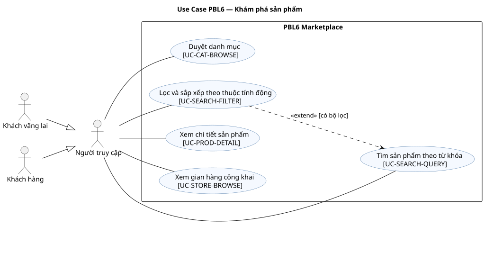

### UC-CAT-BROWSE — Duyệt danh mục

- **Actor chính:** Guest/Customer. **Actor phụ:** không có actor ngoài hệ thống. **Phạm vi:** PBL6 Marketplace. **Nền tảng:** Web/Mobile. **Service:** M1.
- **Mục tiêu:** Duyệt danh mục. **Trigger:** Guest/Customer chọn Category hoặc ProductType.
- **Tiền điều kiện:** Category công khai và Store/Product đang được phép hiển thị. **Quyền:** không cần đăng nhập.
- **Hậu điều kiện thành công:** Danh sách Category/Product công khai theo bộ lọc được trả. **Bảo đảm khi thất bại:** Không ghi thay đổi nghiệp vụ của UC này; trả lỗi có mã và giữ dữ liệu đã chốt trước đó.
- **Dữ liệu vào/ra:** category_id, trang → danh mục và Product. **Yêu cầu:** FR-CAT-01,FR-CAT-02. **Story:** US-CAT-01, US-CAT-02. **Quy tắc:** BR-38. **OpenAPI operationId:** listCategories,listProducts. **Dữ liệu:** Category. **AC:** tiêu chí Given–When–Then ở [User Stories](user-stories.md) và các test nhóm CAT trong [Test Plan](test-plan.md).

Luồng chính:

1. Guest/Customer chọn Category hoặc ProductType.
2. Hệ thống lấy cây danh mục và Product công khai phù hợp.
3. Hệ thống phân trang, chỉ giữ Product/Store còn hiển thị.
4. Người dùng thấy danh sách và có thể mở Product.

Luồng thay thế/ngoại lệ:

- Tại bước 2, Category/ProductType không tồn tại: trả 404; danh mục hợp lệ nhưng chưa có Product trả trang rỗng.
- Tại bước 3, Product bị ẩn hoặc Store bị khóa: loại khỏi danh sách, không hiển thị giá cũ từ cache.

### UC-SEARCH-QUERY — Tìm sản phẩm theo từ khóa

- **Actor chính:** Guest/Customer. **Actor phụ:** không có actor ngoài hệ thống. **Phạm vi:** PBL6 Marketplace. **Nền tảng:** Web/Mobile. **Service:** M1.
- **Mục tiêu:** Tìm sản phẩm theo từ khóa. **Trigger:** Người dùng nhập từ khóa tìm sản phẩm.
- **Tiền điều kiện:** Người dùng truy cập danh mục công khai. **Quyền:** không cần đăng nhập.
- **Hậu điều kiện thành công:** Trả Product phù hợp từ khóa, có phân trang và giá hiện hành. **Bảo đảm khi thất bại:** Không ghi thay đổi nghiệp vụ của UC này; trả lỗi có mã và giữ dữ liệu đã chốt trước đó.
- **Dữ liệu vào/ra:** query, trang → Product và tổng kết quả. **Yêu cầu:** FR-SEARCH-01,FR-SEARCH-04. **Story:** US-SEARCH-01, US-SEARCH-04. **Quy tắc:** BR-38. **OpenAPI operationId:** listProducts. **Dữ liệu:** Product. **AC:** tiêu chí Given–When–Then ở [User Stories](user-stories.md) và các test nhóm SEARCH trong [Test Plan](test-plan.md).

Luồng chính:

1. Người dùng nhập từ khóa tìm sản phẩm.
2. Hệ thống chuẩn hóa từ khóa và tìm Product công khai.
3. Kết quả được sắp xếp và phân trang cùng giá hiện hành.
4. Người dùng mở Product từ kết quả.

Luồng thay thế/ngoại lệ:

- Tại bước 2, từ khóa rỗng/quá dài: báo điều kiện nhập, không chạy truy vấn tốn tài nguyên.
- Tại bước 2, dịch vụ tìm kiếm lỗi: báo lỗi có thể thử lại, không trả kết quả stale như hàng đang bán.

### UC-SEARCH-FILTER — Lọc và sắp xếp theo thuộc tính động

- **Actor chính:** Guest/Customer. **Actor phụ:** không có actor ngoài hệ thống. **Phạm vi:** PBL6 Marketplace. **Nền tảng:** Web/Mobile. **Service:** M1.
- **Mục tiêu:** Lọc và sắp xếp theo thuộc tính động. **Trigger:** Người dùng chọn bộ lọc và cách sắp xếp.
- **Tiền điều kiện:** Có danh sách tìm kiếm/danh mục và định nghĩa thuộc tính hiện hành. **Quyền:** không cần đăng nhập.
- **Hậu điều kiện thành công:** Trả danh sách sau lọc/sắp xếp, chỉ Product còn hiển thị. **Bảo đảm khi thất bại:** Không ghi thay đổi nghiệp vụ của UC này; trả lỗi có mã và giữ dữ liệu đã chốt trước đó.
- **Dữ liệu vào/ra:** filter theo ProductType, sort, trang → Product. **Yêu cầu:** FR-SEARCH-02,FR-SEARCH-03. **Story:** US-SEARCH-02, US-SEARCH-03. **Quy tắc:** BR-38. **OpenAPI operationId:** listProducts. **Dữ liệu:** Product. **AC:** tiêu chí Given–When–Then ở [User Stories](user-stories.md) và các test nhóm SEARCH trong [Test Plan](test-plan.md).

Luồng chính:

1. Người dùng chọn bộ lọc và cách sắp xếp.
2. Hệ thống lấy định nghĩa thuộc tính của ProductType liên quan.
3. Hệ thống áp điều kiện lên Product công khai, phân trang kết quả.
4. Giao diện giữ bộ lọc và hiển thị danh sách mới.

Luồng thay thế/ngoại lệ:

- Tại bước 2, thuộc tính lọc không thuộc ProductType hoặc giá trị ngoài tập cho phép: báo lỗi, không âm thầm bỏ điều kiện.
- Tại bước 3, không có Product phù hợp: trả trang rỗng và giữ bộ lọc để người dùng đổi điều kiện.

### UC-PROD-DETAIL — Xem chi tiết sản phẩm

- **Actor chính:** Guest/Customer. **Actor phụ:** không có actor ngoài hệ thống. **Phạm vi:** PBL6 Marketplace. **Nền tảng:** Web/Mobile. **Service:** M1.
- **Mục tiêu:** Xem chi tiết sản phẩm. **Trigger:** Người dùng mở một Product từ danh mục, tìm kiếm hoặc gợi ý.
- **Tiền điều kiện:** Product thuộc Store hoạt động và được công khai. **Quyền:** không cần đăng nhập.
- **Hậu điều kiện thành công:** Hiển thị mô tả, Variant, giá, tồn khả dụng, review và gợi ý hợp lệ. **Bảo đảm khi thất bại:** Không ghi thay đổi nghiệp vụ của UC này; trả lỗi có mã và giữ dữ liệu đã chốt trước đó.
- **Dữ liệu vào/ra:** product_id → thông tin Product/Variant/review. **Yêu cầu:** FR-PROD-01. **Story:** US-PROD-01. **Quy tắc:** BR-09/38. **OpenAPI operationId:** getProduct. **Dữ liệu:** Product. **AC:** tiêu chí Given–When–Then ở [User Stories](user-stories.md) và các test nhóm PROD trong [Test Plan](test-plan.md).

Luồng chính:

1. Người dùng mở một Product từ danh mục, tìm kiếm hoặc gợi ý.
2. Hệ thống kiểm tra Store/Product còn công khai.
3. Hệ thống lấy Variant, giá/tồn, ảnh và Review VISIBLE.
4. Trang chi tiết hiển thị lựa chọn mua và gợi ý liên quan hợp lệ.

Luồng thay thế/ngoại lệ:

- Tại bước 2, Product bị ẩn, ngừng bán hoặc Store khóa: trả 404 ở public API; không hiển thị nút mua.
- Tại bước 3, Variant hết tồn: vẫn cho xem Product nhưng đánh dấu Variant không thể thêm vào giỏ.

### UC-STORE-BROWSE — Xem gian hàng công khai

- **Actor chính:** Guest/Customer. **Actor phụ:** không có actor ngoài hệ thống. **Phạm vi:** PBL6 Marketplace. **Nền tảng:** Web/Mobile. **Service:** M1.
- **Mục tiêu:** Xem gian hàng công khai. **Trigger:** Người dùng mở gian hàng công khai.
- **Tiền điều kiện:** Store còn công khai. **Quyền:** không cần đăng nhập.
- **Hậu điều kiện thành công:** Hiển thị hồ sơ Store và Product đang bán của Store đó. **Bảo đảm khi thất bại:** Không ghi thay đổi nghiệp vụ của UC này; trả lỗi có mã và giữ dữ liệu đã chốt trước đó.
- **Dữ liệu vào/ra:** store_id, trang → Store và Product. **Yêu cầu:** FR-STOREVIEW-01. **Story:** US-STOREVIEW-01. **Quy tắc:** BR-34/38. **OpenAPI operationId:** listStoreProducts. **Dữ liệu:** Store. **AC:** tiêu chí Given–When–Then ở [User Stories](user-stories.md) và các test nhóm STOREVIEW trong [Test Plan](test-plan.md).

Luồng chính:

1. Người dùng mở gian hàng công khai.
2. Hệ thống kiểm tra Store ACTIVE.
3. Hệ thống lấy hồ sơ Store và Product ACTIVE/VISIBLE của Store.
4. Giao diện phân trang danh sách sản phẩm.

Luồng thay thế/ngoại lệ:

- Tại bước 2, Store khóa hoặc không tồn tại: trả 404; không hiển thị Product thuộc Store đó.
- Tại bước 3, Store còn hoạt động nhưng chưa có Product công khai: hiển thị trang Store và danh sách rỗng.
## Nhóm 03 — Giỏ và xác nhận đơn

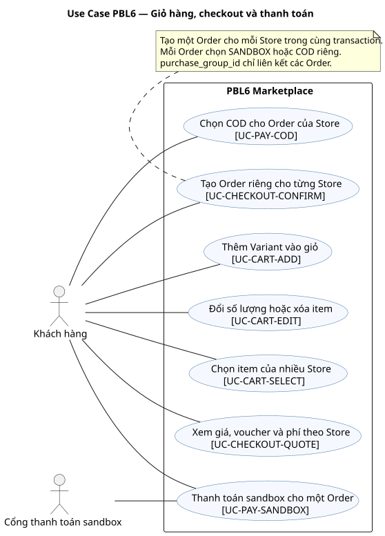

### UC-CART-ADD — Thêm Variant vào giỏ

- **Actor chính:** Customer. **Actor phụ:** không có actor ngoài hệ thống. **Phạm vi:** PBL6 Marketplace. **Nền tảng:** Web/Mobile. **Service:** M2.
- **Mục tiêu:** Thêm Variant vào giỏ. **Trigger:** Customer chọn Variant và số lượng ở trang Product.
- **Tiền điều kiện:** Customer đăng nhập; Variant còn bán. **Quyền:** kiểm tra User và quyền hiệu lực trong phạm vi thao tác.
- **Hậu điều kiện thành công:** CartItem của Customer được tạo hoặc tăng số lượng yêu cầu. **Bảo đảm khi thất bại:** Không ghi thay đổi nghiệp vụ của UC này; trả lỗi có mã và giữ dữ liệu đã chốt trước đó.
- **Dữ liệu vào/ra:** variant_id, quantity → CartItem/tổng giỏ tham khảo. **Yêu cầu:** FR-CART-01. **Story:** US-CART-01. **Quy tắc:** BR-01/36. **OpenAPI operationId:** addCartItem. **Dữ liệu:** CartItem. **AC:** tiêu chí Given–When–Then ở [User Stories](user-stories.md) và các test nhóm CART trong [Test Plan](test-plan.md).

Luồng chính:

1. Customer chọn Variant và số lượng ở trang Product.
2. Hệ thống kiểm tra Variant/Store còn bán và số lượng hợp lệ.
3. CartItem của Customer được tạo hoặc cộng số lượng.
4. Giao diện hiển thị giỏ mới; giá sẽ được tính lại khi xác nhận.

Luồng thay thế/ngoại lệ:

- Tại bước 2, user bị khóa hoặc tài nguyên không thuộc Customer hiện hành: trả 403/404, không lộ dữ liệu người khác.
- Tại bước 2, variant hết bán hoặc số lượng sai: không thêm; giá giỏ không được coi là giá chốt.

### UC-CART-EDIT — Đổi số lượng hoặc xóa item

- **Actor chính:** Customer. **Actor phụ:** không có actor ngoài hệ thống. **Phạm vi:** PBL6 Marketplace. **Nền tảng:** Web/Mobile. **Service:** M2.
- **Mục tiêu:** Đổi số lượng hoặc xóa item. **Trigger:** Customer mở giỏ và chọn CartItem của mình.
- **Tiền điều kiện:** Customer sở hữu CartItem. **Quyền:** kiểm tra User và quyền hiệu lực trong phạm vi thao tác.
- **Hậu điều kiện thành công:** Số lượng đổi hoặc CartItem bị xóa trong giỏ của Customer. **Bảo đảm khi thất bại:** Không ghi thay đổi nghiệp vụ của UC này; trả lỗi có mã và giữ dữ liệu đã chốt trước đó.
- **Dữ liệu vào/ra:** cart_item_id, quantity/thao tác → giỏ mới. **Yêu cầu:** FR-CART-02. **Story:** US-CART-02, US-CART-03. **Quy tắc:** BR-01/36. **OpenAPI operationId:** updateCartItem,removeCartItem. **Dữ liệu:** CartItem. **AC:** tiêu chí Given–When–Then ở [User Stories](user-stories.md) và các test nhóm CART trong [Test Plan](test-plan.md).

Luồng chính:

1. Customer mở giỏ và chọn CartItem của mình.
2. Customer đổi số lượng hoặc xóa item.
3. Hệ thống kiểm tra quyền sở hữu và lưu thay đổi giỏ.
4. Giao diện hiển thị giỏ mới theo Store.

Luồng thay thế/ngoại lệ:

- Tại bước 2, user bị khóa hoặc tài nguyên không thuộc Customer hiện hành: trả 403/404, không lộ dữ liệu người khác.
- Tại bước 2, item không thuộc Customer hoặc số lượng sai: không thay đổi giỏ.

### UC-CART-SELECT — Chọn item của nhiều Store

- **Actor chính:** Customer. **Actor phụ:** không có actor ngoài hệ thống. **Phạm vi:** PBL6 Marketplace. **Nền tảng:** Web/Mobile. **Service:** M2.
- **Mục tiêu:** Chọn item của nhiều Store. **Trigger:** Customer đánh dấu CartItem muốn mua ở một hoặc nhiều Store.
- **Tiền điều kiện:** Giỏ của Customer có ít nhất một item. **Quyền:** kiểm tra User và quyền hiệu lực trong phạm vi thao tác.
- **Hậu điều kiện thành công:** Các item được chọn và nhóm theo Store cho bước xem giá. **Bảo đảm khi thất bại:** Không ghi thay đổi nghiệp vụ của UC này; trả lỗi có mã và giữ dữ liệu đã chốt trước đó.
- **Dữ liệu vào/ra:** cart_item_ids → nhóm Store/item đã chọn. **Yêu cầu:** FR-CART-03. **Story:** US-CART-04. **Quy tắc:** BR-01/36. **OpenAPI operationId:** listCartItems. **Dữ liệu:** CartItem. **AC:** tiêu chí Given–When–Then ở [User Stories](user-stories.md) và các test nhóm CART trong [Test Plan](test-plan.md).

Luồng chính:

1. Customer đánh dấu CartItem muốn mua ở một hoặc nhiều Store.
2. Hệ thống kiểm tra các item thuộc giỏ của Customer.
3. Hệ thống nhóm item theo Store, giữ số lượng đã chọn.
4. Customer tiếp tục sang bước xem giá.

Luồng thay thế/ngoại lệ:

- Tại bước 2, user bị khóa hoặc tài nguyên không thuộc Customer hiện hành: trả 403/404, không lộ dữ liệu người khác.
- Tại bước 2, danh sách rỗng hoặc có item của Customer khác: từ chối xác nhận.

### UC-CHECKOUT-QUOTE — Xem giá, voucher và phí theo Store

- **Actor chính:** Customer. **Actor phụ:** không có actor ngoài hệ thống. **Phạm vi:** PBL6 Marketplace. **Nền tảng:** Web/Mobile. **Service:** M2.
- **Mục tiêu:** Xem giá, voucher và phí theo Store. **Trigger:** Customer chọn item, một địa chỉ và phương thức cho từng Store.
- **Tiền điều kiện:** Customer có item đã chọn, Address của mình và phương thức từng Store. **Quyền:** kiểm tra User và quyền hiệu lực trong phạm vi thao tác.
- **Hậu điều kiện thành công:** Trả giá/phí/voucher từng Store và tổng tham khảo có hạn; chưa tạo Order. **Bảo đảm khi thất bại:** Không ghi thay đổi nghiệp vụ của UC này; trả lỗi có mã và giữ dữ liệu đã chốt trước đó.
- **Dữ liệu vào/ra:** cart_item_ids, address_id, payment_methods, voucher → quote_id, StoreQuote. **Yêu cầu:** FR-CHECKOUT-02,FR-CHECKOUT-03,FR-CHECKOUT-06,FR-VCH-04. **Story:** US-CHECKOUT-01, US-CHECKOUT-02, US-CHECKOUT-03, US-VCH-03. **Quy tắc:** BR-18/27/28/29/31. **OpenAPI operationId:** quoteCheckout. **Dữ liệu:** Quote. **AC:** tiêu chí Given–When–Then ở [User Stories](user-stories.md) và các test nhóm CHECKOUT trong [Test Plan](test-plan.md).

Luồng chính:

1. Customer chọn item, một địa chỉ và phương thức cho từng Store.
2. Hệ thống kiểm tra giá Variant, tồn, Store, voucher và phí mới nhất.
3. Hệ thống tính giảm Store rồi sàn, phân bổ sàn xuống Store.
4. Customer thấy StoreQuote, tổng tham khảo và hạn quote trước khi xác nhận.

Luồng thay thế/ngoại lệ:

- Tại bước 2, user bị khóa hoặc tài nguyên không thuộc Customer hiện hành: trả 403/404, không lộ dữ liệu người khác.
- Tại bước 2, giá/tồn/Store/voucher đổi: trả quote mới hoặc lỗi có mã, chưa giữ lịch sử mua.

### UC-CHECKOUT-CONFIRM — Tạo Order riêng cho từng Store

- **Actor chính:** Customer. **Actor phụ:** không có actor ngoài hệ thống. **Phạm vi:** PBL6 Marketplace. **Nền tảng:** Web/Mobile. **Service:** M2.
- **Mục tiêu:** Tạo Order riêng cho từng Store. **Trigger:** Customer chọn item nhiều Store, một địa chỉ và phương thức theo từng Store.
- **Tiền điều kiện:** Customer xác nhận quote còn hạn với Idempotency-Key hợp lệ. **Quyền:** kiểm tra User và quyền hiệu lực trong phạm vi thao tác.
- **Hậu điều kiện thành công:** Tạo nguyên tập Order/Payment riêng Store, snapshot và purchase_group_id; không tạo một phần. **Bảo đảm khi thất bại:** Giữ trạng thái/operation ID để retry hoặc đối soát đúng Order; không tạo đơn, thu tiền hay hoàn tiền lặp.
- **Dữ liệu vào/ra:** quote_id, cart_item_ids, address_id, payment_methods, voucher, key → OrderBatch. **Yêu cầu:** FR-CHECKOUT-01,FR-CHECKOUT-04,FR-CHECKOUT-05,FR-CHECKOUT-06,FR-CHECKOUT-07,FR-ORDER-01. **Story:** US-CHECKOUT-01, US-ORDER-01. **Quy tắc:** BR-01/02/16/18/19/21/22/23/41. **OpenAPI operationId:** confirmCheckout,getPurchaseGroupOrders. **Dữ liệu:** CartItem, Order, OrderItem, Payment, IdempotencyRecord. **AC:** [Story](user-stories.md), [Test Plan](test-plan.md).

Luồng chính:

1. Customer chọn item nhiều Store, một địa chỉ và phương thức theo từng Store.
2. M2 tính lại giá/voucher/tồn và yêu cầu xác nhận lại nếu quote đổi.
3. M2 tạo purchase_group_id và ID dự kiến cho từng Order; M1 reserve đủ mọi SKU, M2 giữ lượt voucher.
4. M2 tạo nguyên tập Order, OrderItem snapshot và Payment riêng mỗi Order trong một transaction; không tạo một phần.
5. COD consume tồn rồi chuyển PENDING; sandbox AWAITING_PAYMENT, giữ tồn tới khi trả hoặc hết hạn; trả danh sách Order.

Luồng thay thế/ngoại lệ:

- Tại bước 2, user bị khóa hoặc tài nguyên không thuộc Customer hiện hành: trả 403/404, không lộ dữ liệu người khác.
- Tại bước 3, một SKU/giá/Store không hợp lệ: không tạo Order; retry cùng key trả nhóm cũ, khác payload trả 409.

### UC-PAY-SANDBOX — Thanh toán sandbox cho một Order

- **Actor chính:** Customer. **Actor phụ:** Cổng thanh toán sandbox. **Phạm vi:** PBL6 Marketplace. **Nền tảng:** Web/Mobile. **Service:** M2.
- **Mục tiêu:** Thanh toán sandbox cho một Order. **Trigger:** Customer mở Order AWAITING_PAYMENT của mình còn hạn.
- **Tiền điều kiện:** Order SANDBOX của Customer còn AWAITING_PAYMENT và trong hạn. **Quyền:** kiểm tra User và quyền hiệu lực trong phạm vi thao tác.
- **Hậu điều kiện thành công:** Payment của Order thành công; Order PENDING sau consume hoặc RECOVERING khi cần phục hồi. **Bảo đảm khi thất bại:** Giữ trạng thái/operation ID để retry hoặc đối soát đúng Order; không tạo đơn, thu tiền hay hoàn tiền lặp.
- **Dữ liệu vào/ra:** order_id → PaymentAttempt, Payment và trạng thái Order. **Yêu cầu:** FR-PAY-01,FR-PAY-02. **Story:** US-PAY-01, US-PAY-02. **Quy tắc:** BR-17/22/23/40. **OpenAPI operationId:** createPaymentAttempt,getPayment. **Dữ liệu:** Order, Payment, PaymentAttempt, PaymentEvent, Refund. **AC:** [Story](user-stories.md), [Test Plan](test-plan.md).

Luồng chính:

1. Customer mở Order AWAITING_PAYMENT của mình còn hạn.
2. M2 tạo PaymentAttempt đúng Payment của Order và gửi gateway sandbox.
3. Callback xác thực và chống lặp cập nhật Payment của riêng Order.
4. Success: M1 consume reservation và Order chuyển PENDING; lỗi consume vào RECOVERING để worker retry, không thu lại.
5. Nếu callback Success đến sau Order EXPIRED và reservation đã release, hoàn mock Payment của Order đó; Order khác không đổi.

Luồng thay thế/ngoại lệ:

- Tại bước 2, user bị khóa hoặc tài nguyên không thuộc Customer hiện hành: trả 403/404, không lộ dữ liệu người khác.
- Tại bước 3, callback trùng không thu lặp; Success muộn sau EXPIRED/release tạo Refund, không mở Order.

### UC-PAY-COD — Chọn COD cho Order của Store

- **Actor chính:** Customer. **Actor phụ:** không có actor ngoài hệ thống. **Phạm vi:** PBL6 Marketplace. **Nền tảng:** Web/Mobile. **Service:** M2.
- **Mục tiêu:** Chọn COD cho Order của Store. **Trigger:** Customer chọn COD cho Store tương ứng trước khi tạo Order.
- **Tiền điều kiện:** Customer chọn COD cho Store trước khi xác nhận giỏ. **Quyền:** kiểm tra User và quyền hiệu lực trong phạm vi thao tác.
- **Hậu điều kiện thành công:** Order Store đó có Payment COD và số tiền cần thu riêng; PENDING sau consume. **Bảo đảm khi thất bại:** Giữ trạng thái/operation ID để retry hoặc đối soát đúng Order; không tạo đơn, thu tiền hay hoàn tiền lặp.
- **Dữ liệu vào/ra:** payment_methods[store_id]=COD → Order/Payment COD. **Yêu cầu:** FR-PAY-03. **Story:** US-COD-01, US-PAY-01. **Quy tắc:** BR-17/21/41. **OpenAPI operationId:** confirmCheckout. **Dữ liệu:** Order, Payment, CODCollection. **AC:** [Story](user-stories.md), [Test Plan](test-plan.md).

Luồng chính:

1. Customer chọn COD cho Store tương ứng trước khi tạo Order.
2. M2 kiểm tra quote/địa chỉ/voucher của Order dự kiến.
3. M2 tạo Order và Payment COD riêng cùng các Order khác trong một transaction.
4. M1 consume tồn Order COD; nếu command lỗi Order ở PREPARING để retry, chưa báo sẵn sàng xử lý.
5. M2 trả Order COD ở PENDING khi sẵn sàng; việc thu tiền khi giao thuộc UC-SORDER-COD.

Luồng thay thế/ngoại lệ:

- Tại bước 2, user bị khóa hoặc tài nguyên không thuộc Customer hiện hành: trả 403/404, không lộ dữ liệu người khác.
- Tại bước 4, consume lỗi sau tạo: Order PREPARING, Seller chưa xử lý và worker retry.
## Nhóm 04 — Thanh toán và đơn Customer

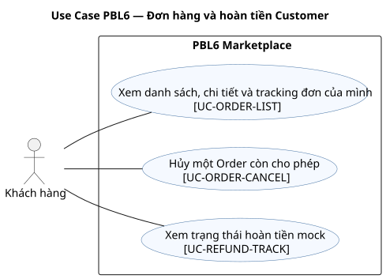

### UC-ORDER-LIST — Xem danh sách, chi tiết và tracking đơn của mình

- **Actor chính:** Customer. **Actor phụ:** không có actor ngoài hệ thống. **Phạm vi:** PBL6 Marketplace. **Nền tảng:** Web/Mobile. **Service:** M2.
- **Mục tiêu:** Xem danh sách, chi tiết và tracking đơn của mình. **Trigger:** Customer mở danh sách đơn của mình.
- **Tiền điều kiện:** Customer đăng nhập. **Quyền:** kiểm tra User và quyền hiệu lực trong phạm vi thao tác.
- **Hậu điều kiện thành công:** Chỉ Order của Customer, trạng thái Order/Payment/Refund và tracking được hiển thị. **Bảo đảm khi thất bại:** Không ghi thay đổi nghiệp vụ của UC này; trả lỗi có mã và giữ dữ liệu đã chốt trước đó.
- **Dữ liệu vào/ra:** filter, trang, order_id → danh sách/chi tiết Order. **Yêu cầu:** FR-ORDER-02,FR-ORDER-03. **Story:** US-ORDER-02, US-ORDER-03, US-ORDER-04. **Quy tắc:** BR-24/25/26/39. **OpenAPI operationId:** listOwnOrders,getOwnOrder. **Dữ liệu:** Order. **AC:** tiêu chí Given–When–Then ở [User Stories](user-stories.md) và các test nhóm ORDER trong [Test Plan](test-plan.md).

Luồng chính:

1. Customer mở danh sách đơn của mình.
2. Hệ thống lọc Order theo customer_user_id, trạng thái và trang.
3. Customer chọn Order để xem item snapshot, Payment, Refund và tracking.
4. Giao diện có thể nhóm các Order bằng purchase_group_id nhưng không gộp trạng thái.

Luồng thay thế/ngoại lệ:

- Tại bước 2, user bị khóa hoặc tài nguyên không thuộc Customer hiện hành: trả 403/404, không lộ dữ liệu người khác.
- Tại bước 2, order thuộc Customer khác: 404; không suy ra Order khác từ purchase_group_id.

### UC-ORDER-CANCEL — Hủy một Order còn cho phép

- **Actor chính:** Customer. **Actor phụ:** không có actor ngoài hệ thống. **Phạm vi:** PBL6 Marketplace. **Nền tảng:** Web/Mobile. **Service:** M2.
- **Mục tiêu:** Hủy một Order còn cho phép. **Trigger:** Customer mở Order của mình ở AWAITING_PAYMENT/Pending/Confirmed.
- **Tiền điều kiện:** Customer sở hữu Order ở AWAITING_PAYMENT/PENDING/CONFIRMED. **Quyền:** kiểm tra User và quyền hiệu lực trong phạm vi thao tác.
- **Hậu điều kiện thành công:** Chỉ Order được chọn bị CANCELLED; release/hoàn kho và Refund nếu đã trả online. **Bảo đảm khi thất bại:** Giữ trạng thái/operation ID để retry hoặc đối soát đúng Order; không tạo đơn, thu tiền hay hoàn tiền lặp.
- **Dữ liệu vào/ra:** order_id, expected_version → Order và Refund nếu có. **Yêu cầu:** FR-ORDER-04,FR-ORDER-05,FR-PAY-05. **Story:** US-ORDER-05, US-REFUND-01. **Quy tắc:** BR-24/25/26/39. **OpenAPI operationId:** cancelOwnOrder. **Dữ liệu:** Order. **AC:** tiêu chí Given–When–Then ở [User Stories](user-stories.md) và các test nhóm ORDER trong [Test Plan](test-plan.md).

Luồng chính:

1. Customer mở Order của mình ở AWAITING_PAYMENT/Pending/Confirmed.
2. M2 kiểm tra ownership, status và version.
3. M2 đổi CANCELLED; nếu chưa trả tiền release tồn, nếu đã consume thì hoàn kho chống lặp.
4. Sandbox đã trả tiền tạo Refund mock theo payable snapshot của Order; COD xóa nghĩa vụ thu.
5. Các Order khác cùng purchase_group_id giữ nguyên số tiền/trạng thái.

Luồng thay thế/ngoại lệ:

- Tại bước 2, user bị khóa hoặc tài nguyên không thuộc Customer hiện hành: trả 403/404, không lộ dữ liệu người khác.
- Tại bước 2, PROCESSING trở đi hoặc version cũ: từ chối; Order khác cùng nhóm giữ nguyên.

### UC-REFUND-TRACK — Xem trạng thái hoàn tiền mock

- **Actor chính:** Customer. **Actor phụ:** không có actor ngoài hệ thống. **Phạm vi:** PBL6 Marketplace. **Nền tảng:** Web/Mobile. **Service:** M2.
- **Mục tiêu:** Xem trạng thái hoàn tiền mock. **Trigger:** Customer mở Order đã hủy có phát sinh Refund.
- **Tiền điều kiện:** Customer sở hữu Order có Refund. **Quyền:** kiểm tra User và quyền hiệu lực trong phạm vi thao tác.
- **Hậu điều kiện thành công:** Trả trạng thái Refund riêng, không đồng nhất với trạng thái Order. **Bảo đảm khi thất bại:** Không ghi thay đổi nghiệp vụ của UC này; trả lỗi có mã và giữ dữ liệu đã chốt trước đó.
- **Dữ liệu vào/ra:** order_id/refund_id → số tiền, trạng thái Refund. **Yêu cầu:** FR-PAY-05. **Story:** US-REFUND-01. **Quy tắc:** BR-25/26. **OpenAPI operationId:** getOrderRefund. **Dữ liệu:** Refund. **AC:** tiêu chí Given–When–Then ở [User Stories](user-stories.md) và các test nhóm PAY trong [Test Plan](test-plan.md).

Luồng chính:

1. Customer mở Order đã hủy có phát sinh Refund.
2. Hệ thống kiểm tra Order thuộc Customer và tìm Refund của Order.
3. Hệ thống trả số tiền đã yêu cầu, trạng thái và thời điểm cập nhật.
4. Giao diện không ghi đã hoàn thành nếu Refund còn PROCESSING/FAILED.

Luồng thay thế/ngoại lệ:

- Tại bước 2, user bị khóa hoặc tài nguyên không thuộc Customer hiện hành: trả 403/404, không lộ dữ liệu người khác.
- Tại bước 2, refund không thuộc Customer: 404; chưa có Refund thì hiển thị chưa phát sinh.
## Nhóm 05 — Voucher

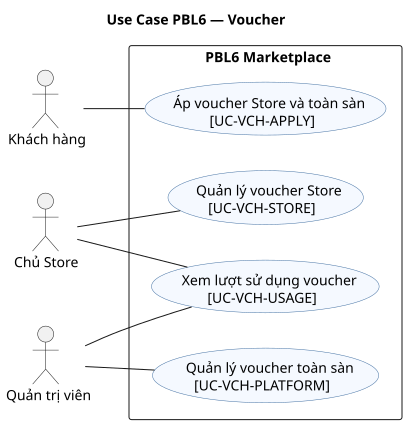

### UC-VCH-STORE — Quản lý voucher Store

- **Actor chính:** Owner. **Actor phụ:** không có actor ngoài hệ thống. **Phạm vi:** PBL6 Marketplace. **Nền tảng:** Portal. **Service:** M2.
- **Mục tiêu:** Quản lý voucher Store. **Trigger:** Owner mở voucher của Store mình và nhập mã, loại giảm, hạn dùng và giới hạn.
- **Tiền điều kiện:** Owner có membership hiệu lực của Store. **Quyền:** kiểm tra User và quyền hiệu lực trong phạm vi thao tác.
- **Hậu điều kiện thành công:** Voucher thuộc Store được tạo/sửa/ngừng hiệu lực theo version. **Bảo đảm khi thất bại:** Không ghi thay đổi nghiệp vụ của UC này; trả lỗi có mã và giữ dữ liệu đã chốt trước đó.
- **Dữ liệu vào/ra:** store_id, điều kiện voucher → voucher/trạng thái. **Yêu cầu:** FR-VCH-01. **Story:** US-VCH-01, US-VCH-02. **Quy tắc:** BR-27/28/29/30/31. **OpenAPI operationId:** createStoreVoucher,updateStoreVoucher,listStoreVouchers. **Dữ liệu:** Voucher. **AC:** tiêu chí Given–When–Then ở [User Stories](user-stories.md) và các test nhóm VCH trong [Test Plan](test-plan.md).

Luồng chính:

1. Owner mở voucher của Store mình và nhập mã, loại giảm, hạn dùng và giới hạn.
2. M2 kiểm tra Owner membership; Seller không được quản lý voucher.
3. M2 kiểm tra giá trị tối thiểu, mức trần, tổng lượt và giới hạn mỗi Customer.
4. M2 tạo/cập nhật voucher với phạm vi Store và ghi audit.
5. Voucher đã dùng được ngừng áp dụng về sau nhưng Redemption lịch sử không đổi.

Luồng thay thế/ngoại lệ:

- Tại bước 2, membership bị khóa/thu hồi hoặc tài nguyên thuộc Store khác: trả 403/404, không ghi thay đổi.
- Tại bước 2, seller hoặc Owner Store khác bị chặn; số lượt đã dùng không bị sửa ngược.

### UC-VCH-PLATFORM — Quản lý voucher toàn sàn

- **Actor chính:** Admin. **Actor phụ:** không có actor ngoài hệ thống. **Phạm vi:** PBL6 Marketplace. **Nền tảng:** Portal. **Service:** M2.
- **Mục tiêu:** Quản lý voucher toàn sàn. **Trigger:** Admin mở voucher toàn sàn và nhập mã, loại giảm, thời hạn và hạn mức.
- **Tiền điều kiện:** Administrator đang hoạt động. **Quyền:** kiểm tra User và quyền hiệu lực trong phạm vi thao tác.
- **Hậu điều kiện thành công:** Voucher toàn sàn được tạo/sửa/ngừng hiệu lực và có audit. **Bảo đảm khi thất bại:** Không ghi thay đổi nghiệp vụ của UC này; trả lỗi có mã và giữ dữ liệu đã chốt trước đó.
- **Dữ liệu vào/ra:** điều kiện voucher sàn → voucher/trạng thái. **Yêu cầu:** FR-VCH-01. **Story:** US-VCH-01, US-VCH-02. **Quy tắc:** BR-27/28/29/30/31. **OpenAPI operationId:** createPlatformVoucher,updatePlatformVoucher,listPlatformVouchers. **Dữ liệu:** Voucher. **AC:** tiêu chí Given–When–Then ở [User Stories](user-stories.md) và các test nhóm VCH trong [Test Plan](test-plan.md).

Luồng chính:

1. Admin mở voucher toàn sàn và nhập mã, loại giảm, thời hạn và hạn mức.
2. M2 kiểm tra quyền Administrator và mã không trùng trong phạm vi áp dụng.
3. M2 kiểm tra ngưỡng sau giảm Store, mức trần và giới hạn sử dụng.
4. M2 tạo/cập nhật voucher toàn sàn và ghi audit.
5. Order cũ giữ snapshot giảm giá dù voucher được đổi hoặc khóa.

Luồng thay thế/ngoại lệ:

- Tại bước 2, admin bị khóa/mất quyền hoặc đối tượng không tồn tại: trả 403/404, không ghi thay đổi.
- Tại bước 2, actor khác hoặc cấu hình giảm không hợp lệ: từ chối, giữ bản cũ.

### UC-VCH-APPLY — Áp voucher Store và toàn sàn

- **Actor chính:** Customer. **Actor phụ:** không có actor ngoài hệ thống. **Phạm vi:** PBL6 Marketplace. **Nền tảng:** Web/Mobile. **Service:** M2.
- **Mục tiêu:** Áp voucher Store và toàn sàn. **Trigger:** Customer nhập tối đa một mã Store/Store và một mã toàn sàn cho lần xác nhận giỏ.
- **Tiền điều kiện:** Customer xem quote với item và mã voucher hợp lệ. **Quyền:** kiểm tra User và quyền hiệu lực trong phạm vi thao tác.
- **Hậu điều kiện thành công:** Giảm Store rồi sàn được phân bổ xuống từng StoreQuote/Order. **Bảo đảm khi thất bại:** Không ghi thay đổi nghiệp vụ của UC này; trả lỗi có mã và giữ dữ liệu đã chốt trước đó.
- **Dữ liệu vào/ra:** mã Store/sàn, item → tiền giảm và payable theo Store. **Yêu cầu:** FR-VCH-02,FR-VCH-03,FR-VCH-04. **Story:** US-VCH-03. **Quy tắc:** BR-27/28/29/30/31. **OpenAPI operationId:** validateVouchers,quoteCheckout. **Dữ liệu:** VoucherReservation. **AC:** tiêu chí Given–When–Then ở [User Stories](user-stories.md) và các test nhóm VCH trong [Test Plan](test-plan.md).

Luồng chính:

1. Customer nhập tối đa một mã Store/Store và một mã toàn sàn cho lần xác nhận giỏ.
2. M2 kiểm tra thời gian, điều kiện min, hạn mức dùng và quyền áp dụng.
3. Tính giảm Store trước, giảm toàn sàn sau; phân bổ theo phần dư lớn nhất.
4. Hiển thị subtotal, giảm và phí từng Store để Customer xác nhận.
5. Giữ lượt trong lúc tạo Order; chốt khi nguyên tập Order được tạo, lỗi thì release; hủy Order sau đó không khôi phục lượt.

Luồng thay thế/ngoại lệ:

- Tại bước 2, user bị khóa hoặc tài nguyên không thuộc Customer hiện hành: trả 403/404, không lộ dữ liệu người khác.
- Tại bước 2, hết hạn/hết lượt/không đủ minimum: báo mã nào không hợp lệ; không dùng lượt.

### UC-VCH-USAGE — Xem lượt sử dụng voucher

- **Actor chính:** Owner/Admin. **Actor phụ:** không có actor ngoài hệ thống. **Phạm vi:** PBL6 Marketplace. **Nền tảng:** Portal. **Service:** M2.
- **Mục tiêu:** Xem lượt sử dụng voucher. **Trigger:** Owner/Admin chọn voucher trong phạm vi quyền.
- **Tiền điều kiện:** Owner xem voucher Store mình hoặc Admin xem voucher sàn. **Quyền:** kiểm tra User và quyền hiệu lực trong phạm vi thao tác.
- **Hậu điều kiện thành công:** Trả lượt giữ, đã dùng và giới hạn đúng phạm vi. **Bảo đảm khi thất bại:** Không ghi thay đổi nghiệp vụ của UC này; trả lỗi có mã và giữ dữ liệu đã chốt trước đó.
- **Dữ liệu vào/ra:** voucher_id, filter → số lượt và lịch sử sử dụng. **Yêu cầu:** FR-VCH-03. **Story:** US-VCH-03. **Quy tắc:** BR-27/28/29/30/31. **OpenAPI operationId:** getStoreVoucherUsage,getPlatformVoucherUsage. **Dữ liệu:** VoucherRedemption. **AC:** tiêu chí Given–When–Then ở [User Stories](user-stories.md) và các test nhóm VCH trong [Test Plan](test-plan.md).

Luồng chính:

1. Owner/Admin chọn voucher trong phạm vi quyền.
2. Hệ thống kiểm tra Store scope hoặc quyền toàn sàn.
3. Hệ thống tính lượt giữ, đã dùng và các lần redemption.
4. Giao diện hiển thị số lượt còn dùng, không lộ dữ liệu ngoài phạm vi.

Luồng thay thế/ngoại lệ:

- Tại bước 2, membership bị khóa/thu hồi hoặc tài nguyên thuộc Store khác: trả 403/404, không ghi thay đổi.
- Tại bước 2, không đúng phạm vi: 403/404; không lộ Customer ngoài quyền.
## Nhóm 06 — Đánh giá sản phẩm

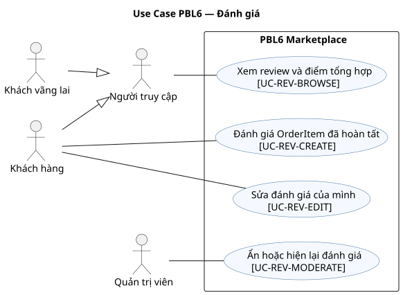

### UC-REV-BROWSE — Xem review và điểm tổng hợp

- **Actor chính:** Guest/Customer. **Actor phụ:** không có actor ngoài hệ thống. **Phạm vi:** PBL6 Marketplace. **Nền tảng:** Web/Mobile. **Service:** M1.
- **Mục tiêu:** Xem review và điểm tổng hợp. **Trigger:** Người dùng mở phần đánh giá Product.
- **Tiền điều kiện:** Product công khai. **Quyền:** không cần đăng nhập.
- **Hậu điều kiện thành công:** Hiển thị Review VISIBLE và điểm tổng hợp chỉ từ Review VISIBLE. **Bảo đảm khi thất bại:** Không ghi thay đổi nghiệp vụ của UC này; trả lỗi có mã và giữ dữ liệu đã chốt trước đó.
- **Dữ liệu vào/ra:** product_id, trang → Review/rating. **Yêu cầu:** FR-REV-02. **Story:** technical task theo FR. **Quy tắc:** BR-37/38. **OpenAPI operationId:** listProductReviews. **Dữ liệu:** Review. **AC:** tiêu chí Given–When–Then ở [User Stories](user-stories.md) và các test nhóm REV trong [Test Plan](test-plan.md).

Luồng chính:

1. Người dùng mở phần đánh giá Product.
2. Hệ thống lấy Review VISIBLE theo trang.
3. Hệ thống tính điểm trung bình/số lượng từ Review VISIBLE.
4. Giao diện hiển thị điểm và nội dung, hoặc trạng thái chưa có đánh giá.

Luồng thay thế/ngoại lệ:

- Tại bước 2, Product không công khai: không trả Review qua public API.
- Tại bước 3, không có Review VISIBLE: hiển thị chưa có đánh giá; Review bị ẩn không tính điểm.

### UC-REV-CREATE — Đánh giá OrderItem đã hoàn tất

- **Actor chính:** Customer. **Actor phụ:** không có actor ngoài hệ thống. **Phạm vi:** PBL6 Marketplace. **Nền tảng:** Web/Mobile. **Service:** M1.
- **Mục tiêu:** Đánh giá OrderItem đã hoàn tất. **Trigger:** Customer chọn OrderItem đã Completed của mình.
- **Tiền điều kiện:** Customer sở hữu OrderItem của Order COMPLETED và chưa có Review. **Quyền:** kiểm tra User và quyền hiệu lực trong phạm vi thao tác.
- **Hậu điều kiện thành công:** Tạo đúng một Review/OrderItem, điểm 1–5; cập nhật rating suy ra. **Bảo đảm khi thất bại:** Không ghi thay đổi nghiệp vụ của UC này; trả lỗi có mã và giữ dữ liệu đã chốt trước đó.
- **Dữ liệu vào/ra:** order_item_id, điểm, nội dung → Review. **Yêu cầu:** FR-REV-01. **Story:** US-REV-01, US-REV-02. **Quy tắc:** BR-37/38. **OpenAPI operationId:** createReview. **Dữ liệu:** Review. **AC:** tiêu chí Given–When–Then ở [User Stories](user-stories.md) và các test nhóm REV trong [Test Plan](test-plan.md).

Luồng chính:

1. Customer chọn OrderItem đã Completed của mình.
2. M1 xác minh điều kiện mua và chủ sở hữu qua M2.
3. M1 kiểm tra chưa có Review cho OrderItem, điểm 1–5.
4. Lưu Review và audit; làm mới cache điểm tổng hợp suy ra từ Review VISIBLE nếu có.
5. Chỉ Review hiển thị được đọc công khai.

Luồng thay thế/ngoại lệ:

- Tại bước 2, user bị khóa hoặc tài nguyên không thuộc Customer hiện hành: trả 403/404, không lộ dữ liệu người khác.
- Tại bước 2, chưa Completed/không sở hữu/đã review: từ chối, không tạo lần hai.

### UC-REV-EDIT — Sửa đánh giá của mình

- **Actor chính:** Customer. **Actor phụ:** không có actor ngoài hệ thống. **Phạm vi:** PBL6 Marketplace. **Nền tảng:** Web/Mobile. **Service:** M1.
- **Mục tiêu:** Sửa đánh giá của mình. **Trigger:** Customer mở Review của OrderItem đã đánh giá.
- **Tiền điều kiện:** Customer sở hữu Review và gửi version hiện hành. **Quyền:** kiểm tra User và quyền hiệu lực trong phạm vi thao tác.
- **Hậu điều kiện thành công:** Review được sửa, lịch sử/điểm tổng hợp cập nhật theo trạng thái hiển thị. **Bảo đảm khi thất bại:** Không ghi thay đổi nghiệp vụ của UC này; trả lỗi có mã và giữ dữ liệu đã chốt trước đó.
- **Dữ liệu vào/ra:** review_id, version, điểm/nội dung → Review mới. **Yêu cầu:** FR-REV-01. **Story:** US-REV-01, US-REV-02. **Quy tắc:** BR-37/38. **OpenAPI operationId:** updateReview. **Dữ liệu:** Review. **AC:** tiêu chí Given–When–Then ở [User Stories](user-stories.md) và các test nhóm REV trong [Test Plan](test-plan.md).

Luồng chính:

1. Customer mở Review của OrderItem đã đánh giá.
2. Customer sửa điểm/nội dung và gửi version hiện hành.
3. Hệ thống kiểm tra chủ sở hữu, version và điểm 1–5.
4. Review mới được lưu; rating suy ra cập nhật nếu Review đang VISIBLE.

Luồng thay thế/ngoại lệ:

- Tại bước 2, user bị khóa hoặc tài nguyên không thuộc Customer hiện hành: trả 403/404, không lộ dữ liệu người khác.
- Tại bước 3, version cũ hoặc Review khác chủ: từ chối; review bị ẩn không tự hiện lại.

### UC-REV-MODERATE — Ẩn hoặc hiện lại đánh giá

- **Actor chính:** Admin. **Actor phụ:** không có actor ngoài hệ thống. **Phạm vi:** PBL6 Marketplace. **Nền tảng:** Portal. **Service:** M1.
- **Mục tiêu:** Ẩn hoặc hiện lại đánh giá. **Trigger:** Admin mở Review cần kiểm duyệt hoặc khôi phục.
- **Tiền điều kiện:** Admin có quyền kiểm duyệt; Review tồn tại. **Quyền:** kiểm tra User và quyền hiệu lực trong phạm vi thao tác.
- **Hậu điều kiện thành công:** Review ẩn/hiện lại có lý do và audit; rating suy ra đổi tương ứng. **Bảo đảm khi thất bại:** Không ghi thay đổi nghiệp vụ của UC này; trả lỗi có mã và giữ dữ liệu đã chốt trước đó.
- **Dữ liệu vào/ra:** review_id, action, reason, version → trạng thái Review. **Yêu cầu:** FR-REV-03. **Story:** US-REV-03. **Quy tắc:** BR-37/38. **OpenAPI operationId:** hideReview,restoreReview. **Dữ liệu:** Review. **AC:** tiêu chí Given–When–Then ở [User Stories](user-stories.md) và các test nhóm REV trong [Test Plan](test-plan.md).

Luồng chính:

1. Admin mở Review cần kiểm duyệt hoặc khôi phục.
2. M1 kiểm tra quyền Administrator và trạng thái hiện hành.
3. Admin nhập lý do và chọn ẩn hoặc hiện lại Review.
4. M1 đổi trạng thái, ghi ReviewAudit gồm actor, hành động, lý do, thời điểm.
5. M1 tính lại điểm tổng hợp chỉ từ Review VISIBLE và cập nhật danh sách công khai.

Luồng thay thế/ngoại lệ:

- Tại bước 2, admin bị khóa/mất quyền hoặc đối tượng không tồn tại: trả 403/404, không ghi thay đổi.
- Tại bước 2, thiếu lý do/version cũ: không đổi Review hoặc rating.
## Nhóm 07 — Store và nhân viên

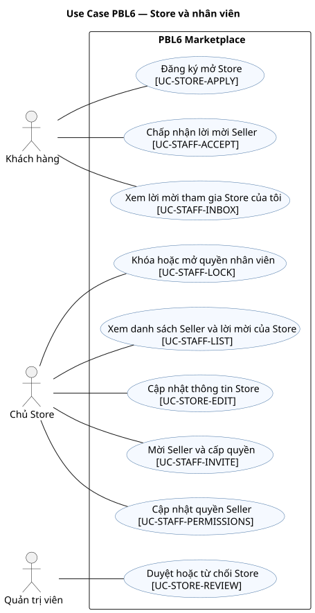

### UC-STORE-APPLY — Đăng ký mở Store

- **Actor chính:** Customer. **Actor phụ:** không có actor ngoài hệ thống. **Phạm vi:** PBL6 Marketplace. **Nền tảng:** Web/Mobile. **Service:** M3.
- **Mục tiêu:** Đăng ký mở Store. **Trigger:** Customer mở form đăng ký Store và điền thông tin.
- **Tiền điều kiện:** Customer đăng nhập và chưa có Store membership hoạt động. **Quyền:** kiểm tra User và quyền hiệu lực trong phạm vi thao tác.
- **Hậu điều kiện thành công:** StoreApplication PENDING được tạo; chưa có Store/Owner trước khi duyệt. **Bảo đảm khi thất bại:** Không ghi thay đổi nghiệp vụ của UC này; trả lỗi có mã và giữ dữ liệu đã chốt trước đó.
- **Dữ liệu vào/ra:** thông tin Store đề nghị → application_id, trạng thái. **Yêu cầu:** FR-STORE-05. **Story:** US-STORE-APPLY-01. **Quy tắc:** BR-03/33. **OpenAPI operationId:** submitStoreApplication,listOwnStoreApplications. **Dữ liệu:** StoreApplication. **AC:** tiêu chí Given–When–Then ở [User Stories](user-stories.md) và các test nhóm STORE trong [Test Plan](test-plan.md).

Luồng chính:

1. Customer mở form đăng ký Store và điền thông tin.
2. M3 kiểm tra không có membership hoạt động hoặc đơn đang chờ.
3. M3 tạo StoreApplication PENDING và trả mã theo dõi.
4. Customer có thể xem trạng thái và lý do từ chối.
5. Sau từ chối, Customer nộp đơn mới để gửi lại.

Luồng thay thế/ngoại lệ:

- Tại bước 2, user bị khóa hoặc tài nguyên không thuộc Customer hiện hành: trả 403/404, không lộ dữ liệu người khác.
- Tại bước 2, đơn thiếu dữ liệu hoặc đang có đơn PENDING: từ chối; REJECTED có thể nộp đơn mới.

### UC-STORE-REVIEW — Duyệt hoặc từ chối Store

- **Actor chính:** Admin. **Actor phụ:** không có actor ngoài hệ thống. **Phạm vi:** PBL6 Marketplace. **Nền tảng:** Portal. **Service:** M3.
- **Mục tiêu:** Duyệt hoặc từ chối Store. **Trigger:** Admin mở đơn PENDING.
- **Tiền điều kiện:** Admin có quyền; Application PENDING. **Quyền:** kiểm tra User và quyền hiệu lực trong phạm vi thao tác.
- **Hậu điều kiện thành công:** APPROVED tạo Store và Owner hoặc REJECTED lưu lý do/audit. **Bảo đảm khi thất bại:** Không ghi thay đổi nghiệp vụ của UC này; trả lỗi có mã và giữ dữ liệu đã chốt trước đó.
- **Dữ liệu vào/ra:** application_id, decision, reason, version → quyết định và Store nếu duyệt. **Yêu cầu:** FR-STORE-06. **Story:** US-STORE-APPLY-01, US-STORE-APPLY-02. **Quy tắc:** BR-03/33. **OpenAPI operationId:** listStoreApplications,reviewStoreApplication. **Dữ liệu:** StoreApplication. **AC:** tiêu chí Given–When–Then ở [User Stories](user-stories.md) và các test nhóm STORE trong [Test Plan](test-plan.md).

Luồng chính:

1. Admin mở đơn PENDING.
2. M3 kiểm tra Admin và nội dung yêu cầu.
3. Admin duyệt hoặc từ chối kèm lý do.
4. Duyệt tạo Store và Owner membership trong một transaction M3.
5. M3 ghi audit và cập nhật trạng thái cho Customer.

Luồng thay thế/ngoại lệ:

- Tại bước 2, admin bị khóa/mất quyền hoặc đối tượng không tồn tại: trả 403/404, không ghi thay đổi.
- Tại bước 2, version cũ hoặc Customer đã có Store hoạt động: không tạo Store thứ hai.

### UC-STORE-EDIT — Cập nhật thông tin Store

- **Actor chính:** Owner. **Actor phụ:** không có actor ngoài hệ thống. **Phạm vi:** PBL6 Marketplace. **Nền tảng:** Portal. **Service:** M3.
- **Mục tiêu:** Cập nhật thông tin Store. **Trigger:** Owner mở hồ sơ Store của mình.
- **Tiền điều kiện:** Owner có membership hiệu lực. **Quyền:** kiểm tra User và quyền hiệu lực trong phạm vi thao tác.
- **Hậu điều kiện thành công:** Thông tin Store của mình được sửa; Order cũ giữ snapshot. **Bảo đảm khi thất bại:** Không ghi thay đổi nghiệp vụ của UC này; trả lỗi có mã và giữ dữ liệu đã chốt trước đó.
- **Dữ liệu vào/ra:** store_id, version, tên/mô tả/phí → Store mới. **Yêu cầu:** FR-STORE-01. **Story:** US-STORE-01. **Quy tắc:** BR-03/33/34. **OpenAPI operationId:** getOwnStore,updateOwnStore. **Dữ liệu:** Store. **AC:** tiêu chí Given–When–Then ở [User Stories](user-stories.md) và các test nhóm STORE trong [Test Plan](test-plan.md).

Luồng chính:

1. Owner mở hồ sơ Store của mình.
2. Owner sửa tên, mô tả, phí hoặc thông tin được phép.
3. Hệ thống kiểm tra membership/version và lưu Store mới.
4. Giao diện hiện dữ liệu mới; Order cũ giữ snapshot.

Luồng thay thế/ngoại lệ:

- Tại bước 2, membership bị khóa/thu hồi hoặc tài nguyên thuộc Store khác: trả 403/404, không ghi thay đổi.
- Tại bước 2, khóa Store hoặc Owner khác: từ chối thay đổi bán mới; không sửa Store khác.

### UC-STAFF-INVITE — Mời Seller và cấp quyền

- **Actor chính:** Owner. **Actor phụ:** không có actor ngoài hệ thống. **Phạm vi:** PBL6 Marketplace. **Nền tảng:** Portal. **Service:** M3.
- **Mục tiêu:** Mời Seller và cấp quyền. **Trigger:** Owner chọn Store của mình, email người được mời và tập quyền Seller.
- **Tiền điều kiện:** Owner Store đang hoạt động, email mời hợp lệ. **Quyền:** kiểm tra User và quyền hiệu lực trong phạm vi thao tác.
- **Hậu điều kiện thành công:** Lời mời PENDING có hạn, chỉ chứa quyền Seller được phép. **Bảo đảm khi thất bại:** Không ghi thay đổi nghiệp vụ của UC này; trả lỗi có mã và giữ dữ liệu đã chốt trước đó.
- **Dữ liệu vào/ra:** email, quyền, hạn → invitation_id. **Yêu cầu:** FR-STORE-02,FR-STORE-07. **Story:** US-STAFF-01, US-STAFF-02, US-STORE-02, US-STORE-03, US-STORE-04, US-STORE-05, US-STORE-06. **Quy tắc:** BR-03/04/35. **OpenAPI operationId:** inviteStaff,revokeStaffInvitation. **Dữ liệu:** StaffInvitation. **AC:** tiêu chí Given–When–Then ở [User Stories](user-stories.md) và các test nhóm STORE trong [Test Plan](test-plan.md).

Luồng chính:

1. Owner chọn Store của mình, email người được mời và tập quyền Seller.
2. M3 kiểm tra membership Owner hoạt động và tập quyền không vượt Seller.
3. M3 tạo lời mời có hạn dùng, gắn email/tài khoản; mock mailbox demo nhận link.
4. Owner có thể thu hồi lời mời PENDING khi gửi nhầm; M3 ghi REVOKED và audit.
5. Lời mời REVOKED hoặc hết hạn không thể cấp membership.

Luồng thay thế/ngoại lệ:

- Tại bước 2, membership bị khóa/thu hồi hoặc tài nguyên thuộc Store khác: trả 403/404, không ghi thay đổi.
- Tại bước 2, email đã thuộc Store active/Owner cấp quyền vượt phạm vi: từ chối.

### UC-STAFF-ACCEPT — Chấp nhận lời mời Seller

- **Actor chính:** Customer. **Actor phụ:** không có actor ngoài hệ thống. **Phạm vi:** PBL6 Marketplace. **Nền tảng:** Web/Mobile. **Service:** M3.
- **Mục tiêu:** Chấp nhận lời mời Seller. **Trigger:** Customer mở lời mời còn hạn gắn đúng tài khoản/email.
- **Tiền điều kiện:** User đã xác minh email trùng lời mời còn PENDING/hạn. **Quyền:** kiểm tra User và quyền hiệu lực trong phạm vi thao tác.
- **Hậu điều kiện thành công:** StoreMembership Seller được tạo và lời mời ACCEPTED. **Bảo đảm khi thất bại:** Không ghi thay đổi nghiệp vụ của UC này; trả lỗi có mã và giữ dữ liệu đã chốt trước đó.
- **Dữ liệu vào/ra:** invitation_id → membership/quyền. **Yêu cầu:** FR-STORE-07. **Story:** US-STAFF-01, US-STAFF-02. **Quy tắc:** BR-03/35. **OpenAPI operationId:** acceptInvitation. **Dữ liệu:** StoreMembership. **AC:** tiêu chí Given–When–Then ở [User Stories](user-stories.md) và các test nhóm STORE trong [Test Plan](test-plan.md).

Luồng chính:

1. Customer mở lời mời còn hạn gắn đúng tài khoản/email.
2. M3 kiểm tra email đã xác minh, lời mời PENDING chưa hết hạn và chưa có membership Store khác đang hoạt động.
3. Customer xác nhận tham gia với quyền Seller đã được Owner cấp.
4. M3 tạo StoreMembership trong một transaction và đánh dấu lời mời đã dùng.
5. Auth context request kế tiếp nhận membership mới; token cũ không vượt quyền đã thu hồi.

Luồng thay thế/ngoại lệ:

- Tại bước 2, user bị khóa hoặc tài nguyên không thuộc Customer hiện hành: trả 403/404, không lộ dữ liệu người khác.
- Tại bước 2, lời mời hết hạn/bị thu hồi hoặc User đã có membership active: từ chối.

### UC-STAFF-INBOX — Xem lời mời tham gia Store của tôi

- **Actor chính:** Customer. **Actor phụ:** không có actor ngoài hệ thống. **Phạm vi:** PBL6 Marketplace. **Nền tảng:** Web/Mobile. **Service:** M3.
- **Mục tiêu:** Xem lời mời tham gia Store của tôi. **Trigger:** Customer đã đăng nhập mở mục lời mời tham gia Store.
- **Tiền điều kiện:** User đã đăng nhập và email xác minh. **Quyền:** kiểm tra User và quyền hiệu lực trong phạm vi thao tác.
- **Hậu điều kiện thành công:** Chỉ lời mời gửi đến email của User được hiển thị. **Bảo đảm khi thất bại:** Không ghi thay đổi nghiệp vụ của UC này; trả lỗi có mã và giữ dữ liệu đã chốt trước đó.
- **Dữ liệu vào/ra:** trang → lời mời, Store, quyền, hạn. **Yêu cầu:** FR-STORE-07. **Story:** US-STAFF-01, US-STAFF-02. **Quy tắc:** BR-03/35. **OpenAPI operationId:** listOwnInvitations. **Dữ liệu:** StaffInvitation. **AC:** tiêu chí Given–When–Then ở [User Stories](user-stories.md) và các test nhóm STORE trong [Test Plan](test-plan.md).

Luồng chính:

1. Customer đã đăng nhập mở mục lời mời tham gia Store.
2. M3 tìm StaffInvitation theo email đã xác minh của chính User.
3. M3 đánh dấu lời mời PENDING quá hạn thành EXPIRED trước khi trả danh sách.
4. M3 trả Store, quyền đề xuất, trạng thái và thời hạn; không trả token hash.
5. Customer chọn lời mời còn hạn để chấp nhận qua UC-STAFF-ACCEPT.

Luồng thay thế/ngoại lệ:

- Tại bước 2, user bị khóa hoặc tài nguyên không thuộc Customer hiện hành: trả 403/404, không lộ dữ liệu người khác.
- Tại bước 2, email chưa xác minh: không lộ lời mời; lời mời hết hạn không nhận được.

### UC-STAFF-LIST — Xem danh sách Seller và lời mời của Store

- **Actor chính:** Owner. **Actor phụ:** không có actor ngoài hệ thống. **Phạm vi:** PBL6 Marketplace. **Nền tảng:** Portal. **Service:** M3.
- **Mục tiêu:** Xem danh sách Seller và lời mời của Store. **Trigger:** Owner mở danh sách Seller và lời mời của Store hiện hành.
- **Tiền điều kiện:** Owner thuộc Store hiện hành. **Quyền:** kiểm tra User và quyền hiệu lực trong phạm vi thao tác.
- **Hậu điều kiện thành công:** Danh sách Seller và lời mời của chính Store được hiển thị. **Bảo đảm khi thất bại:** Không ghi thay đổi nghiệp vụ của UC này; trả lỗi có mã và giữ dữ liệu đã chốt trước đó.
- **Dữ liệu vào/ra:** store_id, filter, trang → membership/invitation. **Yêu cầu:** FR-STORE-02. **Story:** US-STORE-02, US-STORE-03, US-STORE-04, US-STORE-05, US-STORE-06. **Quy tắc:** BR-03/04/35. **OpenAPI operationId:** listStoreStaff,listStaffInvitations. **Dữ liệu:** StoreMembership. **AC:** tiêu chí Given–When–Then ở [User Stories](user-stories.md) và các test nhóm STORE trong [Test Plan](test-plan.md).

Luồng chính:

1. Owner mở danh sách Seller và lời mời của Store hiện hành.
2. M3 kiểm tra Owner membership còn hiệu lực và xác định Store từ auth context.
3. M3 trả Seller active/locked cùng tập quyền hiệu lực, lời mời pending/expired.
4. Owner lọc theo trạng thái để chọn nhân viên cần điều chỉnh.
5. Không trả nhân viên hoặc lời mời của Store khác.

Luồng thay thế/ngoại lệ:

- Tại bước 2, membership bị khóa/thu hồi hoặc tài nguyên thuộc Store khác: trả 403/404, không ghi thay đổi.
- Tại bước 2, owner Store khác hoặc token cũ sau thu hồi: từ chối.

### UC-STAFF-PERMISSIONS — Cập nhật quyền Seller

- **Actor chính:** Owner. **Actor phụ:** không có actor ngoài hệ thống. **Phạm vi:** PBL6 Marketplace. **Nền tảng:** Portal. **Service:** M3.
- **Mục tiêu:** Cập nhật quyền Seller. **Trigger:** Owner chọn Seller trong Store và tập quyền mới.
- **Tiền điều kiện:** Owner và Seller cùng Store; version hiện hành. **Quyền:** kiểm tra User và quyền hiệu lực trong phạm vi thao tác.
- **Hậu điều kiện thành công:** Tập quyền Seller được thay trong giới hạn Owner có thể cấp, có audit. **Bảo đảm khi thất bại:** Không ghi thay đổi nghiệp vụ của UC này; trả lỗi có mã và giữ dữ liệu đã chốt trước đó.
- **Dữ liệu vào/ra:** membership_id, permission_ids, version → quyền mới. **Yêu cầu:** FR-STORE-02. **Story:** US-STORE-02, US-STORE-03, US-STORE-04, US-STORE-05, US-STORE-06. **Quy tắc:** BR-04/06/35. **OpenAPI operationId:** updateStaff. **Dữ liệu:** MembershipPermission. **AC:** tiêu chí Given–When–Then ở [User Stories](user-stories.md) và các test nhóm STORE trong [Test Plan](test-plan.md).

Luồng chính:

1. Owner chọn Seller trong Store và tập quyền mới.
2. M3 kiểm tra quyền Owner và mọi permission đều thuộc bốn nhóm Seller cho phép.
3. M3 cập nhật MembershipPermission, version và audit trong transaction.
4. Quyền bị thu hồi có hiệu lực ở request nhạy cảm kế tiếp dù JWT cũ còn hạn.
5. Không cấp quyền voucher, báo cáo, Owner hoặc Admin.

Luồng thay thế/ngoại lệ:

- Tại bước 2, membership bị khóa/thu hồi hoặc tài nguyên thuộc Store khác: trả 403/404, không ghi thay đổi.
- Tại bước 2, cấp quyền Owner/Admin hoặc version cũ: từ chối, giữ quyền cũ.

### UC-STAFF-LOCK — Khóa hoặc mở quyền nhân viên

- **Actor chính:** Owner. **Actor phụ:** không có actor ngoài hệ thống. **Phạm vi:** PBL6 Marketplace. **Nền tảng:** Portal. **Service:** M3.
- **Mục tiêu:** Khóa hoặc mở quyền nhân viên. **Trigger:** Owner chọn Seller của Store và trạng thái khóa hoặc mở khóa.
- **Tiền điều kiện:** Owner và Seller cùng Store; version hiện hành. **Quyền:** kiểm tra User và quyền hiệu lực trong phạm vi thao tác.
- **Hậu điều kiện thành công:** Membership bị khóa/mở; khóa có hiệu lực với request quản trị mới. **Bảo đảm khi thất bại:** Không ghi thay đổi nghiệp vụ của UC này; trả lỗi có mã và giữ dữ liệu đã chốt trước đó.
- **Dữ liệu vào/ra:** membership_id, action, version → trạng thái. **Yêu cầu:** FR-STORE-02. **Story:** US-STORE-02, US-STORE-03, US-STORE-04, US-STORE-05, US-STORE-06. **Quy tắc:** BR-03/04/35. **OpenAPI operationId:** updateStaff. **Dữ liệu:** StoreMembership. **AC:** tiêu chí Given–When–Then ở [User Stories](user-stories.md) và các test nhóm STORE trong [Test Plan](test-plan.md).

Luồng chính:

1. Owner chọn Seller của Store và trạng thái khóa hoặc mở khóa.
2. M3 kiểm tra membership Owner/Seller cùng Store, version và trạng thái hiện hành.
3. M3 cập nhật trạng thái membership, giữ lịch sử và ghi audit.
4. Khóa chặn API quản trị Store ngay; mở chỉ phục hồi tập quyền Seller đã được cấp.
5. Không khóa User toàn hệ thống hoặc chuyển quyền Owner qua thao tác này.

Luồng thay thế/ngoại lệ:

- Tại bước 2, membership bị khóa/thu hồi hoặc tài nguyên thuộc Store khác: trả 403/404, không ghi thay đổi.
- Tại bước 2, không khóa Owner qua UC này; version cũ/Store khác bị từ chối.
## Nhóm 08 — Quản lý sản phẩm

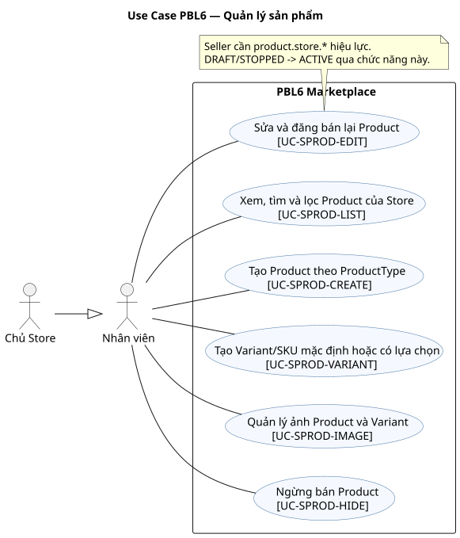

### UC-SPROD-LIST — Xem, tìm và lọc Product của Store

- **Actor chính:** Seller/Owner. **Actor phụ:** không có actor ngoài hệ thống. **Phạm vi:** PBL6 Marketplace. **Nền tảng:** Portal. **Service:** M1.
- **Mục tiêu:** Xem, tìm và lọc Product của Store. **Trigger:** Seller/Owner mở danh sách Product của Store membership hiện hành.
- **Tiền điều kiện:** Seller/Owner có membership và quyền đọc Product Store. **Quyền:** kiểm tra User và quyền hiệu lực trong phạm vi thao tác.
- **Hậu điều kiện thành công:** Product nháp/đang bán/ngừng bán của đúng Store được trả theo filter. **Bảo đảm khi thất bại:** Không ghi thay đổi nghiệp vụ của UC này; trả lỗi có mã và giữ dữ liệu đã chốt trước đó.
- **Dữ liệu vào/ra:** filter, trang → Product/Variant. **Yêu cầu:** FR-MPROD-01. **Story:** US-MPROD-01. **Quy tắc:** BR-04/08/38. **OpenAPI operationId:** listOwnStoreProducts. **Dữ liệu:** Product. **AC:** tiêu chí Given–When–Then ở [User Stories](user-stories.md) và các test nhóm MPROD trong [Test Plan](test-plan.md).

Luồng chính:

1. Seller/Owner mở danh sách Product của Store membership hiện hành.
2. M1 kiểm tra quyền Store và lọc theo tên, trạng thái, ProductType với phân trang.
3. M1 trả cả Product nháp/ngừng bán của Store đó kèm Variant và giá hiện hành cần quản lý.
4. Actor chọn Product để sửa, quản lý ảnh/Variant hoặc ngừng bán.
5. Không trả Product của Store khác; catalog công khai chỉ trả Product đang hiển thị.

Luồng thay thế/ngoại lệ:

- Tại bước 2, membership bị khóa/thu hồi hoặc tài nguyên thuộc Store khác: trả 403/404, không ghi thay đổi.
- Tại bước 2, không có quyền/Store khác: 403/404; public list không lộ Product ẩn.

### UC-SPROD-CREATE — Tạo Product theo ProductType

- **Actor chính:** Seller/Owner. **Actor phụ:** không có actor ngoài hệ thống. **Phạm vi:** PBL6 Marketplace. **Nền tảng:** Portal. **Service:** M1.
- **Mục tiêu:** Tạo Product theo ProductType. **Trigger:** Seller/Owner chọn ProductType và nhập tên, mô tả, ảnh, thuộc tính bắt buộc.
- **Tiền điều kiện:** Seller/Owner có quyền, Store hoạt động, ProductType hợp lệ. **Quyền:** kiểm tra User và quyền hiệu lực trong phạm vi thao tác.
- **Hậu điều kiện thành công:** Product DRAFT thuộc Store hiện hành được tạo; chỉ chuyển ACTIVE sau khi có Variant/SKU, giá và các điều kiện bán hợp lệ. **Bảo đảm khi thất bại:** Không ghi Product bán được một phần; trả lỗi theo thuộc tính sai.
- **Dữ liệu vào/ra:** ProductType, định nghĩa thuộc tính, giá trị thuộc tính và Variant tùy chọn → Product DRAFT. **Yêu cầu:** FR-MPROD-02,FR-MPROD-03,FR-MPROD-04,FR-MPROD-08,FR-MPROD-09. **Story:** US-MPROD-02, US-MPROD-03, US-MPROD-04. **Quy tắc:** BR-08/09/36. **OpenAPI operationId:** listProductTypes,createProduct,createVariant. **Dữ liệu:** Product. **AC:** tiêu chí Given–When–Then ở [User Stories](user-stories.md) và các test nhóm MPROD trong [Test Plan](test-plan.md).

Luồng chính:

1. Seller/Owner chọn ProductType; Portal nhận `attribute_definitions` và dựng trường nhập đúng kiểu, tập giá trị và cờ Variant.
2. Actor nhập tên, mô tả và giá trị thuộc tính; có thể khai báo Variant ngay hoặc lưu Product DRAFT trước.
3. M1 kiểm tra Store, quyền membership, thuộc tính bắt buộc và kiểu/giới hạn giá trị.
4. Nếu có Variant, M1 kiểm tra SKU duy nhất trong Store và tổ hợp thuộc tính duy nhất trong Product; Product không có lựa chọn cần SKU mặc định trước khi ACTIVE.
5. M1 lưu Product DRAFT thuộc Store hiện hành; chỉ công khai khi có ít nhất một Variant hợp lệ, giá và tồn theo quy tắc.

Luồng thay thế/ngoại lệ:

- Tại bước 2, membership bị khóa/thu hồi hoặc tài nguyên thuộc Store khác: trả 403/404, không ghi thay đổi.
- Tại bước 3, thuộc tính thiếu/sai kiểu: trả lỗi từng trường, không lưu Product bán được một phần.
- Tại bước 4, SKU/tổ hợp trùng: từ chối Variant; Product DRAFT trước đó vẫn giữ nguyên.

### UC-SPROD-EDIT — Sửa và đăng bán lại Product

- **Actor chính:** Seller/Owner. **Actor phụ:** không có actor ngoài hệ thống. **Phạm vi:** PBL6 Marketplace. **Nền tảng:** Portal. **Service:** M1.
- **Mục tiêu:** Sửa và đăng bán lại Product. **Trigger:** Seller/Owner mở Product của Store để sửa nội dung, giá hoặc trạng thái bán.
- **Tiền điều kiện:** Seller/Owner có quyền trên Product Store, version hiện hành. **Quyền:** kiểm tra User và quyền hiệu lực trong phạm vi thao tác.
- **Hậu điều kiện thành công:** Thông tin/trạng thái bán mới được lưu; Order cũ giữ snapshot. **Bảo đảm khi thất bại:** Không ghi thay đổi nghiệp vụ của UC này; trả lỗi có mã và giữ dữ liệu đã chốt trước đó.
- **Dữ liệu vào/ra:** product_id, version, trường sửa → Product mới. **Yêu cầu:** FR-MPROD-05,FR-MPROD-09. **Story:** US-MPROD-05. **Quy tắc:** BR-08/09/36/38. **OpenAPI operationId:** updateProduct. **Dữ liệu:** Product. **AC:** tiêu chí Given–When–Then ở [User Stories](user-stories.md) và các test nhóm MPROD trong [Test Plan](test-plan.md).

Luồng chính:

1. Seller/Owner mở Product của Store để sửa nội dung, giá hoặc trạng thái bán.
2. M1 kiểm tra membership, version, ProductType và giá/thuộc tính hợp lệ.
3. M1 lưu sửa đổi; Order cũ giữ snapshot Product/Variant và giá.
4. DRAFT hoặc STOPPED → ACTIVE chỉ khi Store hoạt động, có SKU/giá hợp lệ và Product không bị Admin ẩn.
5. Nếu thiếu điều kiện đăng bán, M1 trả lỗi có mã; không đổi trạng thái bán.

Luồng thay thế/ngoại lệ:

- Tại bước 2, membership bị khóa/thu hồi hoặc tài nguyên thuộc Store khác: trả 403/404, không ghi thay đổi.
- Tại bước 2, bị Admin ẩn, thiếu SKU/giá hoặc version cũ: không ACTIVE.

### UC-SPROD-VARIANT — Tạo Variant/SKU mặc định hoặc có lựa chọn

- **Actor chính:** Seller/Owner. **Actor phụ:** không có actor ngoài hệ thống. **Phạm vi:** PBL6 Marketplace. **Nền tảng:** Portal. **Service:** M1.
- **Mục tiêu:** Tạo Variant/SKU mặc định hoặc có lựa chọn. **Trigger:** Seller/Owner mở Product của Store và khai báo tổ hợp thuộc tính tạo biến thể.
- **Tiền điều kiện:** Product thuộc Store và người thao tác có quyền. **Quyền:** kiểm tra User và quyền hiệu lực trong phạm vi thao tác.
- **Hậu điều kiện thành công:** Variant có SKU/giá/tổ hợp thuộc tính duy nhất; SKU mặc định khi không có lựa chọn. **Bảo đảm khi thất bại:** Không ghi thay đổi nghiệp vụ của UC này; trả lỗi có mã và giữ dữ liệu đã chốt trước đó.
- **Dữ liệu vào/ra:** product_id, SKU, thuộc tính, giá → Variant. **Yêu cầu:** FR-MPROD-07,FR-MPROD-10. **Story:** US-MPROD-07. **Quy tắc:** BR-09/36. **OpenAPI operationId:** createVariant. **Dữ liệu:** ProductVariant. **AC:** tiêu chí Given–When–Then ở [User Stories](user-stories.md) và các test nhóm MPROD trong [Test Plan](test-plan.md).

Luồng chính:

1. Seller/Owner mở Product của Store và khai báo tổ hợp thuộc tính tạo biến thể.
2. M1 kiểm tra ProductType, kiểu dữ liệu và giá trị được phép của từng thuộc tính.
3. M1 kiểm tra SKU chưa tồn tại trong Store và tổ hợp chưa có trong Product.
4. M1 lưu Variant với giá bán thực tế, tạo Inventory ban đầu bằng 0.
5. Variant đã xuất hiện trong Order được ngừng bán, không xóa dữ liệu lịch sử.

Luồng thay thế/ngoại lệ:

- Tại bước 2, membership bị khóa/thu hồi hoặc tài nguyên thuộc Store khác: trả 403/404, không ghi thay đổi.
- Tại bước 3, SKU/tổ hợp trùng hoặc giá sai: từ chối, không phá lịch sử OrderItem.

### UC-SPROD-IMAGE — Quản lý ảnh Product và Variant

- **Actor chính:** Seller/Owner. **Actor phụ:** không có actor ngoài hệ thống. **Phạm vi:** PBL6 Marketplace. **Nền tảng:** Portal. **Service:** M1.
- **Mục tiêu:** Quản lý ảnh Product và Variant. **Trigger:** Seller/Owner chọn Product/Variant của Store.
- **Tiền điều kiện:** Product/Variant thuộc Store và người thao tác có quyền. **Quyền:** kiểm tra User và quyền hiệu lực trong phạm vi thao tác.
- **Hậu điều kiện thành công:** Ảnh hợp lệ được gắn/gỡ, ảnh chính sắp thứ tự; Order cũ giữ snapshot. **Bảo đảm khi thất bại:** Không ghi thay đổi nghiệp vụ của UC này; trả lỗi có mã và giữ dữ liệu đã chốt trước đó.
- **Dữ liệu vào/ra:** product_id/variant_id, file, thứ tự → danh sách ảnh. **Yêu cầu:** FR-MPROD-06. **Story:** US-MPROD-06. **Quy tắc:** BR-08/09/36/38. **OpenAPI operationId:** addProductImage. **Dữ liệu:** ProductImage. **AC:** tiêu chí Given–When–Then ở [User Stories](user-stories.md) và các test nhóm MPROD trong [Test Plan](test-plan.md).

Luồng chính:

1. Seller/Owner chọn Product/Variant của Store.
2. Người dùng tải ảnh hoặc đổi ảnh chính/thứ tự.
3. Hệ thống kiểm tra quyền, loại, kích thước và tên file.
4. Danh sách ảnh cập nhật; ảnh Order cũ không bị thay đổi.

Luồng thay thế/ngoại lệ:

- Tại bước 2, membership bị khóa/thu hồi hoặc tài nguyên thuộc Store khác: trả 403/404, không ghi thay đổi.
- Tại bước 2, loại/kích thước file sai hoặc Product khác Store: không nhận upload.

### UC-SPROD-HIDE — Ngừng bán Product

- **Actor chính:** Seller/Owner. **Actor phụ:** không có actor ngoài hệ thống. **Phạm vi:** PBL6 Marketplace. **Nền tảng:** Portal. **Service:** M1.
- **Mục tiêu:** Ngừng bán Product. **Trigger:** Seller/Owner chọn Product của Store đang bán và xác nhận ngừng bán.
- **Tiền điều kiện:** Seller/Owner có quyền trên Product Store. **Quyền:** kiểm tra User và quyền hiệu lực trong phạm vi thao tác.
- **Hậu điều kiện thành công:** Product STOPPED/ngừng bán công khai, Order cũ không đổi. **Bảo đảm khi thất bại:** Không ghi thay đổi nghiệp vụ của UC này; trả lỗi có mã và giữ dữ liệu đã chốt trước đó.
- **Dữ liệu vào/ra:** product_id, version → trạng thái bán. **Yêu cầu:** FR-MPROD-05. **Story:** US-MPROD-05. **Quy tắc:** BR-08/09/36/38. **OpenAPI operationId:** updateProduct. **Dữ liệu:** Product. **AC:** tiêu chí Given–When–Then ở [User Stories](user-stories.md) và các test nhóm MPROD trong [Test Plan](test-plan.md).

Luồng chính:

1. Seller/Owner chọn Product của Store đang bán và xác nhận ngừng bán.
2. M1 kiểm tra membership, version và trạng thái không bị Admin ẩn.
3. M1 đổi trạng thái bán, không xóa Variant, ảnh, OrderItem hay lịch sử.
4. Product biến mất khỏi catalog công khai, AI và checkout mới; Order cũ vẫn xử lý.
5. Nếu cần bán lại, dùng UC-SPROD-EDIT khi không có khóa quản trị.

Luồng thay thế/ngoại lệ:

- Tại bước 2, membership bị khóa/thu hồi hoặc tài nguyên thuộc Store khác: trả 403/404, không ghi thay đổi.
- Tại bước 2, version cũ hoặc khác Store: từ chối; không gỡ trạng thái ẩn do Admin.
## Nhóm 09 — Tồn kho

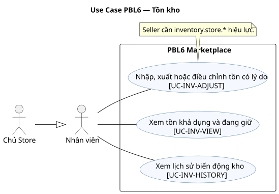

### UC-INV-VIEW — Xem tồn khả dụng và đang giữ

- **Actor chính:** Seller/Owner. **Actor phụ:** không có actor ngoài hệ thống. **Phạm vi:** PBL6 Marketplace. **Nền tảng:** Portal. **Service:** M1.
- **Mục tiêu:** Xem tồn khả dụng và đang giữ. **Trigger:** Seller/Owner mở tồn kho Store.
- **Tiền điều kiện:** Seller/Owner có quyền kho của Store. **Quyền:** kiểm tra User và quyền hiệu lực trong phạm vi thao tác.
- **Hậu điều kiện thành công:** Tồn vật lý, đã giữ và khả dụng của Variant được trả. **Bảo đảm khi thất bại:** Không ghi thay đổi nghiệp vụ của UC này; trả lỗi có mã và giữ dữ liệu đã chốt trước đó.
- **Dữ liệu vào/ra:** variant_id/filter, trang → quantity, reserved, available. **Yêu cầu:** FR-INV-01. **Story:** US-INV-01. **Quy tắc:** BR-10/41. **OpenAPI operationId:** listStoreInventory. **Dữ liệu:** Inventory. **AC:** tiêu chí Given–When–Then ở [User Stories](user-stories.md) và các test nhóm INV trong [Test Plan](test-plan.md).

Luồng chính:

1. Seller/Owner mở tồn kho Store.
2. Hệ thống lọc Inventory theo Variant của Store.
3. Hệ thống tính available = quantity − reserved_quantity.
4. Giao diện hiển thị tồn vật lý, đã giữ và còn bán.

Luồng thay thế/ngoại lệ:

- Tại bước 2, membership bị khóa/thu hồi hoặc tài nguyên thuộc Store khác: trả 403/404, không ghi thay đổi.
- Tại bước 2, store khác: từ chối; số khả dụng không được lưu lệch công thức.

### UC-INV-ADJUST — Nhập, xuất hoặc điều chỉnh tồn có lý do

- **Actor chính:** Seller/Owner. **Actor phụ:** không có actor ngoài hệ thống. **Phạm vi:** PBL6 Marketplace. **Nền tảng:** Portal. **Service:** M1.
- **Mục tiêu:** Nhập, xuất hoặc điều chỉnh tồn có lý do. **Trigger:** Seller/Owner chọn SKU của Store, loại nhập/xuất/điều chỉnh, số lượng và lý do.
- **Tiền điều kiện:** Seller/Owner có quyền kho, Variant thuộc Store. **Quyền:** kiểm tra User và quyền hiệu lực trong phạm vi thao tác.
- **Hậu điều kiện thành công:** Tồn được chỉnh có lý do và StockMovement; bất biến không âm vẫn đúng. **Bảo đảm khi thất bại:** Không ghi thay đổi nghiệp vụ của UC này; trả lỗi có mã và giữ dữ liệu đã chốt trước đó.
- **Dữ liệu vào/ra:** variant_id, delta, reason, version → tồn mới/movement. **Yêu cầu:** FR-INV-02. **Story:** US-INV-02. **Quy tắc:** BR-10. **OpenAPI operationId:** adjustInventory. **Dữ liệu:** StockMovement. **AC:** tiêu chí Given–When–Then ở [User Stories](user-stories.md) và các test nhóm INV trong [Test Plan](test-plan.md).

Luồng chính:

1. Seller/Owner chọn SKU của Store, loại nhập/xuất/điều chỉnh, số lượng và lý do.
2. M1 kiểm tra quyền membership, version và định danh thao tác chống lặp.
3. M1 kiểm tra tồn mới không âm và không nhỏ hơn reserved_quantity.
4. M1 cập nhật quantity cùng StockMovement trong một transaction.
5. M1 trả tồn vật lý, đang giữ và khả dụng sau thay đổi.

Luồng thay thế/ngoại lệ:

- Tại bước 2, membership bị khóa/thu hồi hoặc tài nguyên thuộc Store khác: trả 403/404, không ghi thay đổi.
- Tại bước 2, điều chỉnh làm quantity < reserved hoặc version cũ: từ chối.

### UC-INV-HISTORY — Xem lịch sử biến động kho

- **Actor chính:** Seller/Owner. **Actor phụ:** không có actor ngoài hệ thống. **Phạm vi:** PBL6 Marketplace. **Nền tảng:** Portal. **Service:** M1.
- **Mục tiêu:** Xem lịch sử biến động kho. **Trigger:** Seller/Owner chọn Variant hoặc khoảng thời gian.
- **Tiền điều kiện:** Seller/Owner có quyền kho Store. **Quyền:** kiểm tra User và quyền hiệu lực trong phạm vi thao tác.
- **Hậu điều kiện thành công:** Lịch sử nhập/xuất/giữ/hoàn kho thuộc Store được trả. **Bảo đảm khi thất bại:** Không ghi thay đổi nghiệp vụ của UC này; trả lỗi có mã và giữ dữ liệu đã chốt trước đó.
- **Dữ liệu vào/ra:** variant_id, thời gian, trang → StockMovement. **Yêu cầu:** FR-INV-03. **Story:** US-INV-03. **Quy tắc:** BR-10/41. **OpenAPI operationId:** listStockMovements. **Dữ liệu:** StockMovement. **AC:** tiêu chí Given–When–Then ở [User Stories](user-stories.md) và các test nhóm INV trong [Test Plan](test-plan.md).

Luồng chính:

1. Seller/Owner chọn Variant hoặc khoảng thời gian.
2. Hệ thống kiểm tra Variant thuộc Store.
3. Hệ thống trả StockMovement theo thời gian và trang.
4. Người dùng đối chiếu thao tác, lý do và Order liên quan nếu có.

Luồng thay thế/ngoại lệ:

- Tại bước 2, membership bị khóa/thu hồi hoặc tài nguyên thuộc Store khác: trả 403/404, không ghi thay đổi.
- Tại bước 2, variant khác Store: 403/404; không sửa lịch sử.
## Nhóm 10 — Xử lý đơn và báo cáo Store

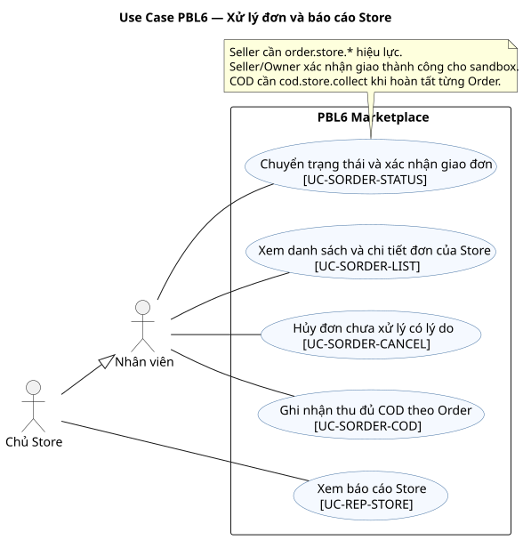

### UC-SORDER-LIST — Xem danh sách và chi tiết đơn của Store

- **Actor chính:** Seller/Owner. **Actor phụ:** không có actor ngoài hệ thống. **Phạm vi:** PBL6 Marketplace. **Nền tảng:** Portal. **Service:** M2.
- **Mục tiêu:** Xem danh sách và chi tiết đơn của Store. **Trigger:** Seller/Owner mở danh sách Order của Store.
- **Tiền điều kiện:** Seller/Owner có quyền xem Order Store. **Quyền:** kiểm tra User và quyền hiệu lực trong phạm vi thao tác.
- **Hậu điều kiện thành công:** Danh sách/chi tiết Order Store kèm trạng thái thanh toán và giao hàng. **Bảo đảm khi thất bại:** Không ghi thay đổi nghiệp vụ của UC này; trả lỗi có mã và giữ dữ liệu đã chốt trước đó.
- **Dữ liệu vào/ra:** filter, trang, order_id → Order/OrderItem. **Yêu cầu:** FR-SORDER-01. **Story:** US-SORDER-01, US-SORDER-02. **Quy tắc:** BR-24/25/39. **OpenAPI operationId:** listStoreOrders,getStoreOrder. **Dữ liệu:** Order. **AC:** tiêu chí Given–When–Then ở [User Stories](user-stories.md) và các test nhóm SORDER trong [Test Plan](test-plan.md).

Luồng chính:

1. Seller/Owner mở danh sách Order của Store.
2. Hệ thống lọc theo store_id của membership hiệu lực.
3. Người dùng chọn Order để xem item snapshot, giao hàng và Payment.
4. Giao diện hiển thị thao tác trạng thái được phép cho Order đó.

Luồng thay thế/ngoại lệ:

- Tại bước 2, membership bị khóa/thu hồi hoặc tài nguyên thuộc Store khác: trả 403/404, không ghi thay đổi.
- Tại bước 2, không thuộc Store: 404; Seller không được xem báo cáo tổng.

### UC-SORDER-STATUS — Chuyển trạng thái và xác nhận giao đơn

- **Actor chính:** Seller/Owner. **Actor phụ:** không có actor ngoài hệ thống. **Phạm vi:** PBL6 Marketplace. **Nền tảng:** Portal. **Service:** M2.
- **Mục tiêu:** Chuyển trạng thái và xác nhận giao đơn. **Trigger:** Seller/Owner mở Order thuộc Store và chọn bước trạng thái kế tiếp.
- **Tiền điều kiện:** Seller/Owner có quyền; Order ở trạng thái chuyển hợp lệ. **Quyền:** kiểm tra User và quyền hiệu lực trong phạm vi thao tác.
- **Hậu điều kiện thành công:** Order chuyển trạng thái với version và lịch sử; COD chỉ Completed khi thu đủ. **Bảo đảm khi thất bại:** Không ghi thay đổi nghiệp vụ của UC này; trả lỗi có mã và giữ dữ liệu đã chốt trước đó.
- **Dữ liệu vào/ra:** order_id, status, version → Order/lịch sử. **Yêu cầu:** FR-SORDER-02,FR-SORDER-03. **Story:** US-SORDER-03. **Quy tắc:** BR-24/39. **OpenAPI operationId:** transitionStoreOrder. **Dữ liệu:** Order. **AC:** tiêu chí Given–When–Then ở [User Stories](user-stories.md) và các test nhóm SORDER trong [Test Plan](test-plan.md).

Luồng chính:

1. Seller/Owner mở Order thuộc Store và chọn bước trạng thái kế tiếp.
2. M2 kiểm tra membership, version và cạnh chuyển trạng thái hợp lệ.
3. Actor xác nhận Pending → Confirmed → Processing → Shipped; với sandbox xác nhận giao thành công để chuyển Completed.
4. M2 ghi Shipment/OrderStatusHistory, thời điểm và actor trong transaction.
5. Order COD chuyển Completed qua UC-SORDER-COD sau khi ghi nhận thu đủ; version cũ trả 409.

Luồng thay thế/ngoại lệ:

- Tại bước 2, membership bị khóa/thu hồi hoặc tài nguyên thuộc Store khác: trả 403/404, không ghi thay đổi.
- Tại bước 2, version cũ hoặc chuyển trạng thái sai: từ chối, không bỏ qua bước.

### UC-SORDER-CANCEL — Hủy đơn chưa xử lý có lý do

- **Actor chính:** Seller/Owner. **Actor phụ:** không có actor ngoài hệ thống. **Phạm vi:** PBL6 Marketplace. **Nền tảng:** Portal. **Service:** M2.
- **Mục tiêu:** Hủy đơn chưa xử lý có lý do. **Trigger:** Seller/Owner mở Order AWAITING_PAYMENT/Pending/Confirmed thuộc Store và nhập lý do hủy.
- **Tiền điều kiện:** Seller/Owner có quyền; Order ở PENDING/CONFIRMED. **Quyền:** kiểm tra User và quyền hiệu lực trong phạm vi thao tác.
- **Hậu điều kiện thành công:** Order bị hủy có lý do; kho/Refund hoặc nghĩa vụ COD được xử lý riêng. **Bảo đảm khi thất bại:** Giữ trạng thái/operation ID để retry hoặc đối soát đúng Order; không tạo đơn, thu tiền hay hoàn tiền lặp.
- **Dữ liệu vào/ra:** order_id, reason, version → Order/Refund nếu có. **Yêu cầu:** FR-SORDER-02,FR-ORDER-05. **Story:** US-SORDER-03. **Quy tắc:** BR-24/25/26/39. **OpenAPI operationId:** cancelStoreOrder. **Dữ liệu:** Order. **AC:** tiêu chí Given–When–Then ở [User Stories](user-stories.md) và các test nhóm SORDER trong [Test Plan](test-plan.md).

Luồng chính:

1. Seller/Owner mở Order AWAITING_PAYMENT/Pending/Confirmed thuộc Store và nhập lý do hủy.
2. M2 kiểm tra quyền Store, status và version hiện tại.
3. M2 chuyển CANCELLED, ghi lịch sử rồi release tồn chưa bán hoặc hoàn kho đã consume bằng mã chống lặp.
4. Order trả trước tạo Refund mock riêng; COD xóa nghĩa vụ thu của Order.
5. M2 trả Order và Refund độc lập; Order khác cùng purchase_group_id giữ nguyên.

Luồng thay thế/ngoại lệ:

- Tại bước 2, membership bị khóa/thu hồi hoặc tài nguyên thuộc Store khác: trả 403/404, không ghi thay đổi.
- Tại bước 2, thiếu lý do, PROCESSING trở đi hoặc version cũ: từ chối.

### UC-SORDER-COD — Ghi nhận thu đủ COD theo Order

- **Actor chính:** Seller/Owner. **Actor phụ:** không có actor ngoài hệ thống. **Phạm vi:** PBL6 Marketplace. **Nền tảng:** Portal. **Service:** M2.
- **Mục tiêu:** Ghi nhận thu đủ COD theo Order. **Trigger:** Seller/Owner mở Order COD của Store ở Shipped.
- **Tiền điều kiện:** Seller/Owner có quyền; Order COD đã giao. **Quyền:** kiểm tra User và quyền hiệu lực trong phạm vi thao tác.
- **Hậu điều kiện thành công:** Ghi thu đủ đúng số tiền Order; Payment COD SUCCEEDED và Order có thể Completed. **Bảo đảm khi thất bại:** Không ghi thay đổi nghiệp vụ của UC này; trả lỗi có mã và giữ dữ liệu đã chốt trước đó.
- **Dữ liệu vào/ra:** order_id, amount, version → CODCollection/Payment. **Yêu cầu:** FR-PAY-04. **Story:** US-COD-02. **Quy tắc:** BR-17/32. **OpenAPI operationId:** collectCod. **Dữ liệu:** CODCollection. **AC:** tiêu chí Given–When–Then ở [User Stories](user-stories.md) và các test nhóm PAY trong [Test Plan](test-plan.md).

Luồng chính:

1. Seller/Owner mở Order COD của Store ở Shipped.
2. M2 kiểm tra quyền Store, version và số tiền cần thu.
3. Actor xác nhận đã giao và thu đủ đúng số tiền Order.
4. M2 ghi CODCollection và chuyển Order Completed.
5. Payment của chính Order chuyển SUCCEEDED; các Order cùng purchase_group_id không đổi.

Luồng thay thế/ngoại lệ:

- Tại bước 2, membership bị khóa/thu hồi hoặc tài nguyên thuộc Store khác: trả 403/404, không ghi thay đổi.
- Tại bước 3, thu thiếu/trùng hoặc Order khác Store: không ghi SUCCEEDED lần hai.

### UC-REP-STORE — Xem báo cáo Store

- **Actor chính:** Owner. **Actor phụ:** không có actor ngoài hệ thống. **Phạm vi:** PBL6 Marketplace. **Nền tảng:** Portal. **Service:** M2.
- **Mục tiêu:** Xem báo cáo Store. **Trigger:** Owner chọn khoảng thời gian báo cáo.
- **Tiền điều kiện:** Owner thuộc Store. **Quyền:** kiểm tra User và quyền hiệu lực trong phạm vi thao tác.
- **Hậu điều kiện thành công:** Báo cáo Store tách doanh thu hàng Completed, tiền đã thu/hoàn và phí. **Bảo đảm khi thất bại:** Không ghi thay đổi nghiệp vụ của UC này; trả lỗi có mã và giữ dữ liệu đã chốt trước đó.
- **Dữ liệu vào/ra:** from/to, DAY/MONTH → chỉ số Store, chuỗi doanh thu, Product bán chạy, Variant tồn thấp. **Yêu cầu:** FR-REP-01,FR-REP-02,FR-REP-03. **Story:** US-REP-01, US-REP-02, US-REP-03. **Quy tắc:** BR-32. **OpenAPI operationId:** getStoreReport. **Dữ liệu:** Report. **AC:** tiêu chí Given–When–Then ở [User Stories](user-stories.md) và các test nhóm REP trong [Test Plan](test-plan.md).

Luồng chính:

1. Owner chọn khoảng thời gian và cách nhóm theo ngày hoặc tháng.
2. M2 lấy Store từ membership hiệu lực và lọc Order của đúng Store trong kỳ.
3. M2 tính riêng số Order, doanh thu hàng Completed, tiền đã thu, hoàn, phí và chuỗi doanh thu; lấy Variant tồn thấp từ M1 qua contract.
4. Dashboard hiển thị Product bán chạy và từng chỉ số, không cộng Payment của Store khác.

Luồng thay thế/ngoại lệ:

- Tại bước 2, membership bị khóa/thu hồi hoặc tài nguyên thuộc Store khác: trả 403/404, không ghi thay đổi.
- Tại bước 1, ngày kết thúc không sau ngày bắt đầu: trả 422, không chạy báo cáo.
- Tại bước 3, M1 không trả được tồn thấp: báo phần báo cáo chưa sẵn sàng, không đưa mảng rỗng như số liệu thật.
## Nhóm 11 — Quản trị nền tảng

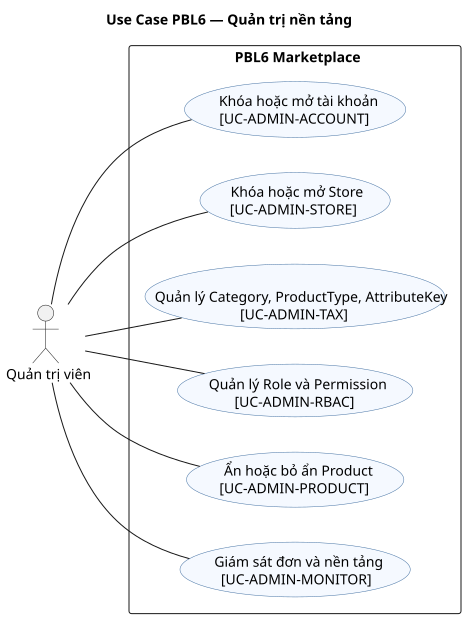

### UC-ADMIN-ACCOUNT — Khóa hoặc mở tài khoản

- **Actor chính:** Admin. **Actor phụ:** không có actor ngoài hệ thống. **Phạm vi:** PBL6 Marketplace. **Nền tảng:** Portal. **Service:** M3.
- **Mục tiêu:** Khóa hoặc mở tài khoản. **Trigger:** Admin chọn User và hành động khóa/mở.
- **Tiền điều kiện:** Admin đang hoạt động. **Quyền:** kiểm tra User và quyền hiệu lực trong phạm vi thao tác.
- **Hậu điều kiện thành công:** User bị khóa/mở với lý do và audit; khóa chặn request mới. **Bảo đảm khi thất bại:** Không ghi thay đổi nghiệp vụ của UC này; trả lỗi có mã và giữ dữ liệu đã chốt trước đó.
- **Dữ liệu vào/ra:** user_id, action, reason, version → User/trạng thái. **Yêu cầu:** FR-ADMIN-02. **Story:** US-ADMIN-02. **Quy tắc:** BR-04/34/38. **OpenAPI operationId:** listUsers,updateUserState. **Dữ liệu:** User. **AC:** tiêu chí Given–When–Then ở [User Stories](user-stories.md) và các test nhóm ADMIN trong [Test Plan](test-plan.md).

Luồng chính:

1. Admin chọn User và hành động khóa/mở.
2. Admin nhập lý do, gửi version đang xem.
3. Hệ thống kiểm tra quyền, cập nhật trạng thái và ghi audit.
4. Request mới của User bị khóa không còn quyền truy cập.

Luồng thay thế/ngoại lệ:

- Tại bước 2, admin bị khóa/mất quyền hoặc đối tượng không tồn tại: trả 403/404, không ghi thay đổi.
- Tại bước 2, không có lý do/version cũ hoặc tự khóa gây mất quản trị: từ chối.

### UC-ADMIN-STORE — Khóa hoặc mở Store

- **Actor chính:** Admin. **Actor phụ:** không có actor ngoài hệ thống. **Phạm vi:** PBL6 Marketplace. **Nền tảng:** Portal. **Service:** M3.
- **Mục tiêu:** Khóa hoặc mở Store. **Trigger:** Admin chọn Store và hành động khóa/mở.
- **Tiền điều kiện:** Admin đang hoạt động. **Quyền:** kiểm tra User và quyền hiệu lực trong phạm vi thao tác.
- **Hậu điều kiện thành công:** Store khóa/mở có audit; hàng công khai bị ẩn khi khóa, Order cũ vẫn xử lý. **Bảo đảm khi thất bại:** Không ghi thay đổi nghiệp vụ của UC này; trả lỗi có mã và giữ dữ liệu đã chốt trước đó.
- **Dữ liệu vào/ra:** store_id, action, reason, version → Store/trạng thái. **Yêu cầu:** FR-STORE-04,FR-STORE-08. **Story:** US-ADMIN-STORE-01. **Quy tắc:** BR-04/34/38. **OpenAPI operationId:** listStores,updateStoreState. **Dữ liệu:** Store. **AC:** tiêu chí Given–When–Then ở [User Stories](user-stories.md) và các test nhóm ADMIN trong [Test Plan](test-plan.md).

Luồng chính:

1. Admin chọn Store và hành động khóa/mở.
2. Admin nhập lý do, gửi version đang xem.
3. Hệ thống lưu trạng thái và audit; cập nhật hiển thị Product công khai.
4. Order cũ vẫn được xử lý theo quyền vận hành hiện hành.

Luồng thay thế/ngoại lệ:

- Tại bước 2, admin bị khóa/mất quyền hoặc đối tượng không tồn tại: trả 403/404, không ghi thay đổi.
- Tại bước 2, thiếu lý do/version cũ: không đổi Store.

### UC-ADMIN-TAX — Quản lý Category, ProductType, AttributeKey

- **Actor chính:** Admin. **Actor phụ:** không có actor ngoài hệ thống. **Phạm vi:** PBL6 Marketplace. **Nền tảng:** Portal. **Service:** M1.
- **Mục tiêu:** Quản lý Category, ProductType, AttributeKey. **Trigger:** Admin chọn Category, ProductType hoặc AttributeDefinition.
- **Tiền điều kiện:** Admin có quyền taxonomy. **Quyền:** kiểm tra User và quyền hiệu lực trong phạm vi thao tác.
- **Hậu điều kiện thành công:** Category/ProductType/AttributeDefinition được tạo/sửa/ngừng dùng mà không phá Product cũ. **Bảo đảm khi thất bại:** Không ghi thay đổi nghiệp vụ của UC này; trả lỗi có mã và giữ dữ liệu đã chốt trước đó.
- **Dữ liệu vào/ra:** entity_id, định nghĩa/giới hạn → taxonomy mới. **Yêu cầu:** FR-PTYPE-01,FR-CATEGORY-ADMIN-01. **Story:** US-CATEGORY-01, US-PTYPE-01, US-PTYPE-02. **Quy tắc:** BR-04/34/38. **OpenAPI operationId:** createCategory,updateCategory,createProductType,updateProductType,createAttributeDefinition,updateAttributeDefinition. **Dữ liệu:** Category. **AC:** tiêu chí Given–When–Then ở [User Stories](user-stories.md) và các test nhóm PTYPE trong [Test Plan](test-plan.md).

Luồng chính:

1. Admin chọn Category, ProductType hoặc AttributeDefinition.
2. Admin nhập kiểu, giới hạn, giá trị, đơn vị hoặc cấu hình mới.
3. Hệ thống kiểm tra ảnh hưởng đến Product đang dùng và lưu version.
4. Danh mục/định nghĩa mới được dùng cho Product tiếp theo.

Luồng thay thế/ngoại lệ:

- Tại bước 2, admin bị khóa/mất quyền hoặc đối tượng không tồn tại: trả 403/404, không ghi thay đổi.
- Tại bước 2, định nghĩa xung đột Product đang dùng: từ chối xóa phá dữ liệu.

### UC-ADMIN-RBAC — Quản lý Role và Permission

- **Actor chính:** Admin. **Actor phụ:** không có actor ngoài hệ thống. **Phạm vi:** PBL6 Marketplace. **Nền tảng:** Portal. **Service:** M3.
- **Mục tiêu:** Quản lý Role và Permission. **Trigger:** Admin chọn Role và tập Permission.
- **Tiền điều kiện:** Admin có quyền quản trị Role/Permission. **Quyền:** kiểm tra User và quyền hiệu lực trong phạm vi thao tác.
- **Hậu điều kiện thành công:** Quyền hệ thống được cập nhật có version và audit; membership Store vẫn giới hạn scope. **Bảo đảm khi thất bại:** Không ghi thay đổi nghiệp vụ của UC này; trả lỗi có mã và giữ dữ liệu đã chốt trước đó.
- **Dữ liệu vào/ra:** role_id, permission_ids, version → Role/quyền. **Yêu cầu:** FR-ADMIN-03. **Story:** US-ADMIN-03. **Quy tắc:** BR-04/34/38. **OpenAPI operationId:** updateRole. **Dữ liệu:** Role. **AC:** tiêu chí Given–When–Then ở [User Stories](user-stories.md) và các test nhóm ADMIN trong [Test Plan](test-plan.md).

Luồng chính:

1. Admin chọn Role và tập Permission.
2. Hệ thống kiểm tra phiên bản và giới hạn quyền.
3. Hệ thống cập nhật gán quyền, ghi audit và làm mới quyền hiệu lực.
4. Request tiếp theo áp dụng quyền mới.

Luồng thay thế/ngoại lệ:

- Tại bước 2, admin bị khóa/mất quyền hoặc đối tượng không tồn tại: trả 403/404, không ghi thay đổi.
- Tại bước 2, không cho cấp Owner/Admin qua lời mời Seller; version cũ giữ bản cũ.

### UC-ADMIN-PRODUCT — Ẩn hoặc bỏ ẩn Product

- **Actor chính:** Admin. **Actor phụ:** không có actor ngoài hệ thống. **Phạm vi:** PBL6 Marketplace. **Nền tảng:** Portal. **Service:** M1.
- **Mục tiêu:** Ẩn hoặc bỏ ẩn Product. **Trigger:** Admin mở Product cần kiểm duyệt hoặc khôi phục.
- **Tiền điều kiện:** Admin có quyền kiểm duyệt Product. **Quyền:** kiểm tra User và quyền hiệu lực trong phạm vi thao tác.
- **Hậu điều kiện thành công:** Product HIDDEN/VISIBLE có lý do/audit; bỏ ẩn không tự chuyển sale status sang ACTIVE. **Bảo đảm khi thất bại:** Không ghi thay đổi nghiệp vụ của UC này; trả lỗi có mã và giữ dữ liệu đã chốt trước đó.
- **Dữ liệu vào/ra:** product_id, action, reason, version → moderation_status. **Yêu cầu:** FR-ADMIN-04. **Story:** US-ADMIN-04. **Quy tắc:** BR-04/34/38. **OpenAPI operationId:** hideProduct,restoreProduct. **Dữ liệu:** Product. **AC:** tiêu chí Given–When–Then ở [User Stories](user-stories.md) và các test nhóm ADMIN trong [Test Plan](test-plan.md).

Luồng chính:

1. Admin mở Product cần kiểm duyệt hoặc khôi phục.
2. M1 kiểm tra quyền Administrator, version và trạng thái kiểm duyệt hiện hành.
3. Admin nhập lý do và chọn ẩn hoặc bỏ ẩn Product.
4. M1 đổi moderation_status và ghi audit; Product.status do Store đặt không đổi.
5. Bỏ ẩn chỉ đưa Product ACTIVE của Store ACTIVE trở lại catalog; Product STOPPED/DRAFT vẫn không bán.

Luồng thay thế/ngoại lệ:

- Tại bước 2, admin bị khóa/mất quyền hoặc đối tượng không tồn tại: trả 403/404, không ghi thay đổi.
- Tại bước 2, thiếu lý do hoặc version cũ: không thay đổi khả năng hiển thị.

### UC-ADMIN-MONITOR — Giám sát đơn và nền tảng

- **Actor chính:** Admin. **Actor phụ:** không có actor ngoài hệ thống. **Phạm vi:** PBL6 Marketplace. **Nền tảng:** Portal. **Service:** M2.
- **Mục tiêu:** Giám sát đơn và nền tảng. **Trigger:** Admin chọn dashboard hoặc bộ lọc Order toàn sàn.
- **Tiền điều kiện:** Admin có quyền giám sát toàn sàn. **Quyền:** kiểm tra User và quyền hiệu lực trong phạm vi thao tác.
- **Hậu điều kiện thành công:** Dashboard/Order toàn sàn được trả, tách giá trị đơn, doanh thu, thu và hoàn. **Bảo đảm khi thất bại:** Không ghi thay đổi nghiệp vụ của UC này; trả lỗi có mã và giữ dữ liệu đã chốt trước đó.
- **Dữ liệu vào/ra:** khoảng thời gian, filter, trang → chỉ số/Order. **Yêu cầu:** FR-ADMIN-01,FR-ADMIN-05. **Story:** US-ADMIN-01, US-ADMIN-05. **Quy tắc:** BR-04/34/38. **OpenAPI operationId:** listAllOrders,getPlatformDashboard. **Dữ liệu:** Report. **AC:** tiêu chí Given–When–Then ở [User Stories](user-stories.md) và các test nhóm ADMIN trong [Test Plan](test-plan.md).

Luồng chính:

1. Admin chọn dashboard hoặc bộ lọc Order toàn sàn.
2. Hệ thống lấy số liệu và Order theo khoảng thời gian/trạng thái.
3. Hệ thống tách giá trị đơn, doanh thu, tiền thu và tiền hoàn.
4. Admin xem chi tiết để đối soát, không sửa Order tại màn giám sát.

Luồng thay thế/ngoại lệ:

- Tại bước 2, admin bị khóa/mất quyền hoặc đối tượng không tồn tại: trả 403/404, không ghi thay đổi.
- Tại bước 2, dữ liệu chưa đối soát hiển thị trạng thái; actor khác không xem toàn sàn.
## Nhóm 12 — Chatbot và gợi ý

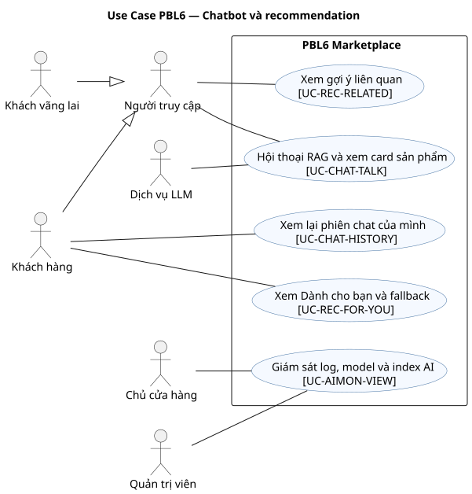

### UC-CHAT-TALK — Hội thoại RAG và xem card sản phẩm

- **Actor chính:** Guest/Customer. **Actor phụ:** Dịch vụ LLM. **Phạm vi:** PBL6 Marketplace. **Nền tảng:** Web/Mobile. **Service:** M4.
- **Mục tiêu:** Hội thoại RAG và xem card sản phẩm. **Trigger:** Guest/Customer nhập nhu cầu mua sắm.
- **Tiền điều kiện:** Guest/Customer gửi câu hỏi trong phiên hợp lệ. **Quyền:** không cần đăng nhập.
- **Hậu điều kiện thành công:** Trả câu trả lời grounded và card Product đã xác minh hiện hành. **Bảo đảm khi thất bại:** Không ghi thay đổi nghiệp vụ của UC này; trả lỗi có mã và giữ dữ liệu đã chốt trước đó.
- **Dữ liệu vào/ra:** session_id, câu hỏi → message, card Product. **Yêu cầu:** FR-AI-01,FR-AI-02,FR-AI-03,FR-AI-04,FR-AI-05,FR-AI-06,FR-AI-07. **Story:** US-CHAT-01, US-CHAT-02, US-CHAT-03, US-CHAT-04, US-CHAT-05, US-CHAT-06. **Quy tắc:** BR-13/14/38. **OpenAPI operationId:** createChatSession,sendChatMessage. **Dữ liệu:** ChatSession. **AC:** tiêu chí Given–When–Then ở [User Stories](user-stories.md) và các test nhóm AI trong [Test Plan](test-plan.md).

Luồng chính:

1. Guest/Customer nhập nhu cầu mua sắm.
2. M4 truy xuất Product context, kiểm tra trạng thái/giá hiện hành qua M1.
3. M4 thêm preference hợp lệ của Customer rồi gọi LLM.
4. M4 chỉ trả card/link Product đã xác thực và câu trả lời grounded.
5. Thiếu context/LLM lỗi: nêu giới hạn, không bịa sản phẩm.

Luồng thay thế/ngoại lệ:

- Tại bước 2, truy xuất không có Product còn hợp lệ: không tạo card sản phẩm, hỏi thêm nhu cầu hoặc nêu giới hạn.
- Tại bước 4, LLM lỗi hoặc trả Product/giá không khớp dữ liệu hiện hành: dùng câu trả lời fallback, không hiển thị card sai.

### UC-CHAT-HISTORY — Xem lại phiên chat của mình

- **Actor chính:** Customer. **Actor phụ:** không có actor ngoài hệ thống. **Phạm vi:** PBL6 Marketplace. **Nền tảng:** Web/Mobile. **Service:** M4.
- **Mục tiêu:** Xem lại phiên chat của mình. **Trigger:** Customer mở danh sách phiên chat của mình.
- **Tiền điều kiện:** Customer đăng nhập và sở hữu ChatSession. **Quyền:** kiểm tra User và quyền hiệu lực trong phạm vi thao tác.
- **Hậu điều kiện thành công:** Lịch sử phiên/message của Customer được trả theo trang. **Bảo đảm khi thất bại:** Không ghi thay đổi nghiệp vụ của UC này; trả lỗi có mã và giữ dữ liệu đã chốt trước đó.
- **Dữ liệu vào/ra:** filter, trang, session_id → chat/message. **Yêu cầu:** FR-AI-08. **Story:** US-CHAT-07. **Quy tắc:** BR-13/14/38. **OpenAPI operationId:** listOwnChatSessions. **Dữ liệu:** ChatSession. **AC:** tiêu chí Given–When–Then ở [User Stories](user-stories.md) và các test nhóm AI trong [Test Plan](test-plan.md).

Luồng chính:

1. Customer mở danh sách phiên chat của mình.
2. Hệ thống lọc ChatSession theo user_id hiện hành.
3. Customer chọn phiên để xem các message theo thứ tự.
4. Giao diện chỉ hiển thị lịch sử của mình.

Luồng thay thế/ngoại lệ:

- Tại bước 2, user bị khóa hoặc tài nguyên không thuộc Customer hiện hành: trả 403/404, không lộ dữ liệu người khác.
- Tại bước 2, session người khác hoặc Guest key không khớp: 404.

### UC-REC-FOR-YOU — Xem Dành cho bạn và fallback

- **Actor chính:** Customer. **Actor phụ:** không có actor ngoài hệ thống. **Phạm vi:** PBL6 Marketplace. **Nền tảng:** Web/Mobile. **Service:** M4.
- **Mục tiêu:** Xem Dành cho bạn và fallback. **Trigger:** Customer mở mục Dành cho bạn; M4 kiểm consent rồi mới đọc tín hiệu cá nhân nếu được phép.
- **Tiền điều kiện:** Customer đăng nhập; trạng thái consent được xác định. **Quyền:** kiểm tra User và quyền hiệu lực trong phạm vi thao tác.
- **Hậu điều kiện thành công:** Có consent: trả gợi ý cá nhân còn bán; thiếu consent: chỉ gợi ý chung. **Bảo đảm khi thất bại:** Không ghi thay đổi nghiệp vụ của UC này; trả lỗi có mã và giữ dữ liệu đã chốt trước đó.
- **Dữ liệu vào/ra:** user context, trang → Product gợi ý, Product đã xem gần đây còn hợp lệ, nguồn model/fallback. **Yêu cầu:** FR-REC-01,FR-REC-02,FR-REC-03,FR-REC-04,FR-REC-06,FR-REC-07,FR-REC-09,FR-REC-10,FR-REC-11. **Story:** US-REC-01, US-REC-02, US-REC-04, US-REC-05. **Quy tắc:** BR-12/20/38. **OpenAPI operationId:** getForYou. **Dữ liệu:** Recommendation. **AC:** tiêu chí Given–When–Then ở [User Stories](user-stories.md) và các test nhóm REC trong [Test Plan](test-plan.md).

Luồng chính:

1. Customer mở mục Dành cho bạn; M4 kiểm consent và phiên bản model đang phục vụ.
2. M4 xếp hạng bằng baseline/model được duyệt hoặc fallback khi thiếu tín hiệu/model lỗi.
3. M4 loại Product không còn công khai theo dữ liệu M1 hiện hành; khi có consent, lọc thêm event view gần đây thành danh sách riêng.
4. M4 trả danh sách có nguồn model/fallback và `recently_viewed_product_ids`; thiếu consent thì danh sách đã xem rỗng và chỉ có gợi ý chung.
5. M4 không trình bày metric dự kiến như kết quả đánh giá đã chạy.

Luồng thay thế/ngoại lệ:

- Tại bước 2, user bị khóa hoặc tài nguyên không thuộc Customer hiện hành: trả 403/404, không lộ dữ liệu người khác.
- Tại bước 2, model lỗi/cold-start: baseline rồi bán chạy/mới; Product ẩn bị loại.

### UC-REC-RELATED — Xem gợi ý liên quan

- **Actor chính:** Guest/Customer. **Actor phụ:** không có actor ngoài hệ thống. **Phạm vi:** PBL6 Marketplace. **Nền tảng:** Web/Mobile. **Service:** M4.
- **Mục tiêu:** Xem gợi ý liên quan. **Trigger:** Người dùng mở mục sản phẩm liên quan trên trang Product.
- **Tiền điều kiện:** Product nguồn công khai. **Quyền:** không cần đăng nhập.
- **Hậu điều kiện thành công:** Trả Product liên quan còn bán theo loại/danh mục/giá/Store. **Bảo đảm khi thất bại:** Không ghi thay đổi nghiệp vụ của UC này; trả lỗi có mã và giữ dữ liệu đã chốt trước đó.
- **Dữ liệu vào/ra:** product_id, trang → Product liên quan. **Yêu cầu:** FR-REC-05. **Story:** US-REC-03. **Quy tắc:** BR-11/12/13/20/38. **OpenAPI operationId:** getRelatedProducts. **Dữ liệu:** Recommendation. **AC:** tiêu chí Given–When–Then ở [User Stories](user-stories.md) và các test nhóm REC trong [Test Plan](test-plan.md).

Luồng chính:

1. Người dùng mở mục sản phẩm liên quan trên trang Product.
2. Hệ thống chọn ứng viên cùng loại/danh mục/giá/Store.
3. Hệ thống kiểm tra lại Product và Store còn bán.
4. Giao diện hiển thị danh sách hợp lệ hoặc trạng thái rỗng.

Luồng thay thế/ngoại lệ:

- Tại bước 1, Product nguồn bị ẩn hoặc Store khóa: không mở mục gợi ý công khai.
- Tại bước 3, ứng viên bị ẩn, ngừng bán hoặc Store khóa: loại ứng viên; hết ứng viên thì hiển thị trạng thái rỗng.

### UC-AIMON-VIEW — Xem metric, log, model và index AI theo phạm vi

- **Actor chính:** Owner/Admin. **Actor phụ:** không có actor ngoài hệ thống. **Phạm vi:** PBL6 Marketplace. **Nền tảng:** Portal. **Service:** M4.
- **Mục tiêu:** Xem metric, log, model và index AI theo phạm vi. **Trigger:** Owner mở mục AI của Store hoặc Admin mở dashboard AI toàn sàn.
- **Tiền điều kiện:** Owner có membership Store hiệu lực hoặc Admin có quyền giám sát AI. **Quyền:** Owner chỉ xem số liệu Store của mình; Admin xem toàn sàn; log phải khử PII.
- **Hậu điều kiện thành công:** Trả tình trạng index, training run, model và metric/log trong đúng phạm vi quyền. **Bảo đảm khi thất bại:** Không lộ metric/log Store khác; không thay đổi dữ liệu đánh giá.
- **Dữ liệu vào/ra:** filter, khoảng thời gian → trạng thái/metric. **Yêu cầu:** FR-ADMIN-06,FR-ADMIN-07,FR-REC-08. **Story:** US-AIMON-01, US-REC-06, US-REC-07. **Quy tắc:** BR-13/20. **OpenAPI operationId:** getAiMetrics. **Dữ liệu:** ModelRun. **AC:** tiêu chí Given–When–Then ở [User Stories](user-stories.md) và các test nhóm AI trong [Test Plan](test-plan.md).

Luồng chính:

1. Owner/Admin mở dashboard AI tương ứng với quyền hiện hành.
2. Hệ thống lấy Store ID từ membership của Owner hoặc quyền toàn sàn của Admin, rồi lọc index, training run, model đang phục vụ và lỗi.
3. Hệ thống trả metric đã có kèm version/dataset trong phạm vi cho phép, khử PII trong log.
4. Mục chưa được chạy hiển thị chưa thực thi.

Luồng thay thế/ngoại lệ:

- Tại bước 2, Owner bị khóa/mất membership hoặc yêu cầu Store khác: trả 403/404; Admin mất quyền toàn sàn cũng bị từ chối.
- Tại bước 2, thiếu dữ liệu đánh giá: ghi chưa thực thi, không hiển thị PASS giả.
